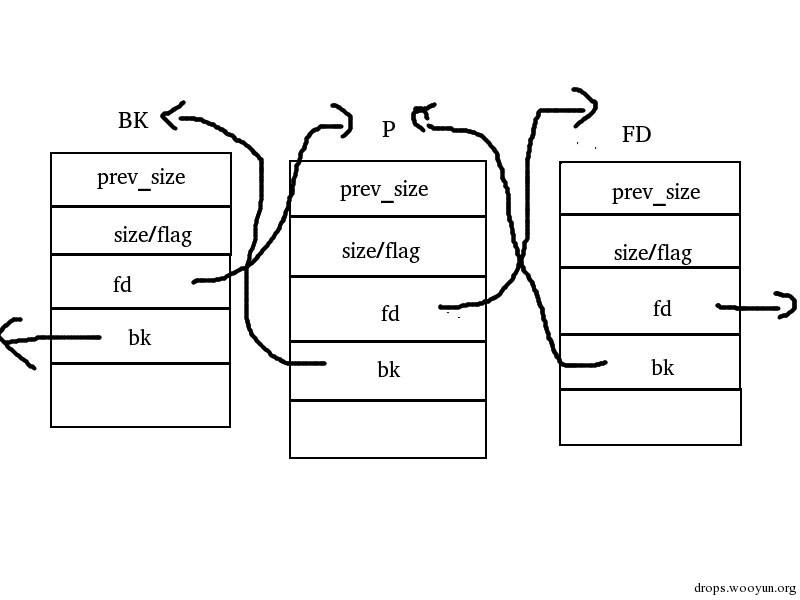

原文 by explorer  
## 0x00 简介

Double Free其实就是同一个指针free两次。虽然一般把它叫做double free，其实只要是free一个指向堆内存的指针都有可能产生可以利用的漏洞。  

double free的原理其实和堆溢出的原理差不多，都是通过unlink这个双向链表删除的宏来利用的。只是double free需要由自己来伪造整个chunk并且欺骗操作系统。  

这里是glibc中有关内存管理的源代码  [malloc.c](http://code.woboq.org/userspace/glibc/malloc/malloc.c.html)  

## 0x01内存管理介绍

这里先简单的介绍一下glibc中内存管理的一些内容，帮助理解漏洞产生的原理。因为没有进行非常深入的研究，欢迎大神们指正补充。为了照顾新手，我写的比较详细，大神们请跳过。  

首先是申请的内存块在内存中的结构。所有malloc等等函数申请的内存都会被系统申请在一个叫做堆的地方，其实也就是一块比较大的内存。当程序需要内存时，系统就会从堆里面找一块还没有被使用的内存出来告诉程序，这一块内存给你用。如果使用了超出你申请范围的内存被系统发现了，会强制结束程序。  

一般的情况，如果程序连续申请内存的话，操作系统会按次序的在堆里码放内存，一块紧挨着一块，中间没有空隙。打个比方吧，就像一座旅馆一样，所有需要的入住的旅客会老板从0号房开始依次安排下去。  

如果申请了一大堆内存块，再将其中的某几块给释放掉的。就像旅店里面有几间房子的人离开了一样，这个时候老板需要知道哪几间房子是空的，以便让新来的人住进去。  

那么操作系统是怎么知道那些内存被释放了呢？先看看内存中chunk的结构吧      

复制自glibc中源码，并翻译了注释  
``` c
struct malloc_chunk {
  INTERNAL_SIZE_T      prev_size;  /* 前一个chunk的大小 (如果前一个已经被free)*/
  INTERNAL_SIZE_T      size;       /* 字节表示的chunk大小，包括chunk头       */
  struct malloc_chunk* fd;         /* 双向链表 -- 只有在被free后才存在       */
  struct malloc_chunk* bk;
};
```
这里的结构是chunk头部分的内容。在内存块free之前，最后两个指针是不存在的，只有前2项的内容。在第二项之后就是可供程序使用的内存了，也就是malloc返回的那个指针指向的地址。而在内存被释放之后，系统在内存块中添加最后的这两个指针。这两个指针的作用是构成双向链表，它们分别指向了前一个和后一个已经被释放的空闲内存。(顺带一提，这是个环形的双向链表，首尾是相接的)  

当程序申请一块内存的时候，系统会遍历这个由空闲内存构成的双向链表。如果有合适(>=)的空闲内存，就会将它（或者一部分，具体没有研究）分配给程序。    

所有空闲的chunk之间的联系就像这样    
    

然后是prev_size和size的作用，prev_size是前一个chunk的大小，值得注意的是如果前一个chunk在使用中，这里会是前一个chunk的payload 部分，唯有前一个chunk已经被释放的情况下这里才会有数值，所以prev_size应该叫前一个空闲堆块的大小。然后是size，这个就是当前chunk的大小，包括给程序使用的和chunk头的大小加在一起。因为所有的chunk的大小都是4字节对齐的，所以size最低3位一定是0，被操作系统拿来当做flag标志位。(最低位：指示前一个chunk是否正在使用；倒数第二位：指示这个chunk是否是通过mmap方式产生的；倒数第三位：这个chunk是否属于一个线程的arena)这里只需要关心最低位的涵义，它指示前一个chunk是否是空闲的。这个flag位加上prev_size一起作为系统判断一块内存是否正在使用，从哪里开始的依据。

要注意的是，只有大小合适的内存才会用这种方法分配，太小的内存会用fastbins的方法管理，有兴趣的可以了解一下。这里给出使用fastbins的阈值。32位操作系统上是0x40，64位操作系统上是0x80，小于这个数值的内存会用fastbins的方法管理。如果chunk的大小大于512个字节之后，系统除了两个指针双向链表指针之外还会再添加2个指针指向下一块较大的内存。然后是chunk头中几个数据的大小，INTERNAL_SIZE_T其实就是unsigned long型的数据，而另外2个是指针不用多说，所以chunk头的大小也和操作系统的位数有关。  

然后再看看在free的时候到底发生了什么。     

先来看看free的源代码吧。在刚才我提供的源代码的3829行开始到4100行结束共200行左右的代码就是free函数的源代码。当然其实只有3978-4040中的代码是实际要看的，其他的都是fastbins和mmap等内存的free，不用关心。  

首先是一大堆的检查，这个咱不管。然后就是各种操作，这里选取最关心的，和堆溢出有关的部分来说（有兴趣的可以慢慢看）。free时的主要操作是这样的，先看看这个被free的内存块的前后2个内存块是否是空闲的。通过当前chunk的flag和下下个chunk的flag来查看上一个和下一个chunk是否是空闲的。如果空闲，会先把他们从空闲链表中删除。从链表中删除的工作是通过一个unlink的宏来完成的。关于这个unkink的宏待会再来说明。  
  
主要的行为操作分别是在4011行和4037行，先看4011行。  
  
`clear_inuse_bit_at_offset(nextchunk, 0);`  
因为是宏，所以先将他宏展开  

`(((mchunkptr) (((char *) (nextchunk)) + (0)))->size &= ~(0x1))`  
这一行的作用就是将当前被free的内存块的下一个内存块的flag的第一位清空为0，指示当前内存块已经被free。  

然后就是4037行的代码    

`set_foot(p, size);`  
宏定义的非常彻底，所以也要宏展开再看  

`(((mchunkptr) ((char *) (p) + (size)))->prev_size = (size))`   
把下一个内存块的prev_size更改为当前内存块，或者是已经合并了的更大内存块的大小。然后就是一些各种各样的别的操作，就不详细解释了。  

最后来仔细看看unlink的宏代码，直接把unlink宏内容贴出来  
``` c
#define unlink(AV, P, BK, FD) {
    FD = P->fd;
    BK = P->bk;
    if (__builtin_expect (FD->bk != P || BK->fd != P, 0))
      malloc_printerr (check_action, "corrupted double-linked list", P, AV);
    else {
        FD->bk = BK;
        BK->fd = FD;
//        if (!in_smallbin_range (P->size)
//          && __builtin_expect (P->fd_nextsize != NULL, 0)) {
//          if (__builtin_expect (P->fd_nextsize->bk_nextsize != P, 0)
//              || __builtin_expect (P->bk_nextsize->fd_nextsize != P, 0))
//            malloc_printerr (check_action,
//                             "corrupted double-linked list (not small)",
//                             P, AV);
//          if (FD->fd_nextsize == NULL) {
//              if (P->fd_nextsize == P)
//                FD->fd_nextsize = FD->bk_nextsize = FD;
//              else {
//                  FD->fd_nextsize = P->fd_nextsize;
//                  FD->bk_nextsize = P->bk_nextsize;
//                  P->fd_nextsize->bk_nextsize = FD;
//                  P->bk_nextsize->fd_nextsize = FD;
//                }
//            } else {
//              P->fd_nextsize->bk_nextsize = P->bk_nextsize;
//              P->bk_nextsize->fd_nextsize = P->fd_nextsize;
//            }
//        }
      }
}
```
当然很多的代码其实是在当内存块的大小过大的时候才会执行的代码（就是被我注释掉的那一部分），在内存块不大的情况下不需要关心，最主要的代码就是下面4行  
``` c
FD = P->fd;
BK = P->bk;
FD->bk = BK;
BK->fd = FD;
```
这里在宏中传入参数FD，BK，P分别是指向后一个，前一个，还有当前的chunk（当然，是从chunk头而不是data段开始的）。很经典的链表节点删除，当然万一被溢出覆盖的的话就糟糕了。不过也是有防止溢出的检测代码存在的，就是这个if判断  
``` c 
if (__builtin_expect (FD->bk != P || BK->fd != P, 0))
   malloc_printerr (check_action, "corrupted double-linked list", P, AV);
``` 
当前内存块的上一块内存中指向下一块内存指针和当前内存块的下一块内存块的指向上一块内存块的指针如果不是指向当前内存块的话，程序就会崩溃退出，直接看代码比解释简单。  

## 0x02 漏洞的原理

要利用Double Free的漏洞。我们就要让系统进行unlink的操作，达到篡改指针的目的。但是一般的情况下，我们两次释放同一块内存会被操作系统给检测出来，怎么欺骗过操作系统才是最重要的。  

我们结合实际的情况来讲解会比较好。这里我自己写了个demo程序，代码发比较长，所以我放在[gitcafe](https://gitcafe.com/zh_explorer/zh_explorer/blob/master/heap.c)上。    
因为是自己写自己玩的demo程序，所以这程序是堆漏洞大礼包。用Double Free，heap corruption，use after free这3种方法都各拿了一次shell，这里我们用Double Free，其他漏洞一律不使用。  

这个程序在free的时候很明显的没有检验指针的有效性，且没有在free之后将野指针清零。而且可以任意的指定每一个chunk的大小，所以可以很容易的构造double free。我们首先构造一个野指针： 
```
>malloc(504)
>malloc(512)
```
然后释放这2块内存，这样子我们就可以在距离第一个指针偏移量为0x200的地方有了一个野指针。  
  

我们留下了一个野指针p指向偏移为0x200的地方。然后我们需要做的就是伪造chunk，再free野指针p。首先是申请一块更大的内存，大小应该等于我们刚才申请的内存的总和。  

`>malloc(768)`  
最好和刚才2块内存大小总和一样，如果不一样大也可以，就是待会伪造第二块内存块的大小的时候，要让伪造的大小等于我们申请的chunk的大小，否则会无法绕过检查，会被系统检查出double free。  

然后这是我在第二次申请的内存中填入的内容。  

`>0x0 + 0x1f9 + 0x0804bfc0 - 0xc + 0x0804bfc0 - 0x8 + 'a'*(0x200-24) + 0x000001f8 + 0x108`  
现在的chunk就是这个样子了  
      

可以看到现在我们在内存中伪造了出了2个chunk，它们的结构就像图中我们看到的样子。首先是第一个chunk的chunk头部分，我们分别填上了0x0和0x1f9代表了前一个chunk正在使用，当前chunk的大小是1f8。然后就是伪造的双向链表指针了，为了绕过unlink中的检查，这里需要稍微构造一下这个双向链表的指针了。payload中的0x0804bfc0位置其实就是存放在.data段中的指针ptr，这样子就可以绕过保护了。  
``` c
if (__builtin_expect (FD->bk != P || BK->fd != P, 0))
   malloc_printerr (check_action, "corrupted double-linked list", P, AV);
```
结合源代码，可以看到现在FD->bk的值正好也是指向我们伪造的chunk的头部分，然后我们在野指针p 的前面又伪造了一个chunk头。prev_size部分填0x1f8正好是前一个伪造chunk的大小，然后size部分填的是0x108，这样的话两个chunk正将我们申请的空间填满。然后第二个伪造chunk的size中最低位的flag置为0，这样free指针p 的时候，就会将前一个伪造的chunk给unlink。  

现在，只要在free一次指针p，就可以触发漏洞了。这时候，我们的操作系统不会报错，而且我们本来正常的指针ptr已经变成了ptr-0xc。这要如果我们如果调用Edit函数来修改这个chunk的话，就可以干各种各样的事情了。  

我把完整利用的poc也放在了gitcafe上，如果需要的话可以看看，最终通过ret2kibc的方法拿到的shell，所以只要把几个函数的地址稍微修改一下，可以在随意的一台机器上使用。PS：没有开PIE保护的。 [poc传送门](https://gitcafe.com/zh_explorer/zh_explorer/blob/master/heap.py)  