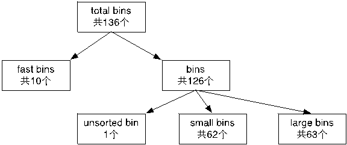
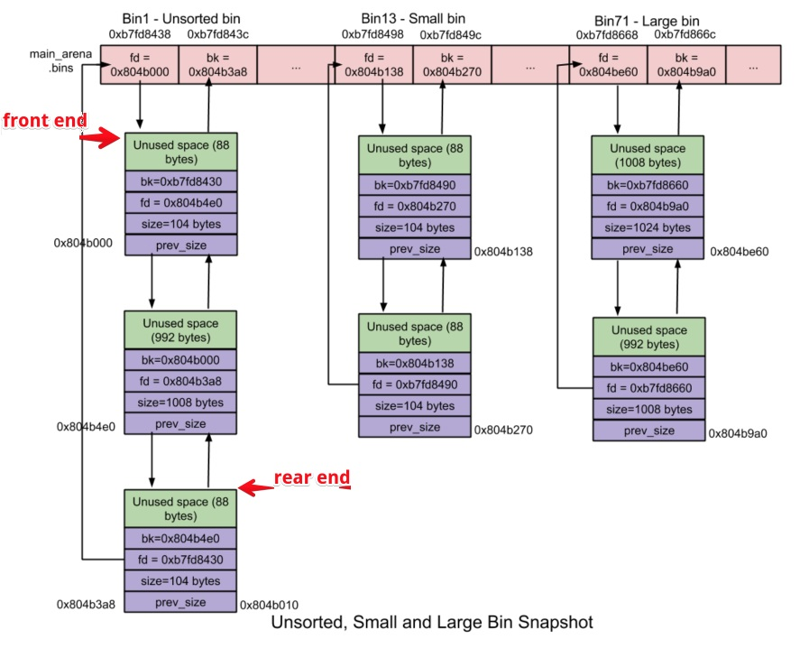

原文 by 走位@阿里聚安全    

## 0 前言回顾

在上一篇文章中，详细介绍了堆内存管理中涉及到的基本概念以及相互关系，同时也着重介绍了堆中chunk分配和释放策略中使用到的隐式链表技术。通过前面的介绍，我们知道使用隐式链表来管理内存chunk总会涉及到内存的遍历，效率极低。对此glibc malloc引入了显式链表技术来提高堆内存分配和释放的效率。  


所谓的显式链表就是我们在数据结构中常用的链表，而链表本质上就是将一些属性相同的“结点”串联起来，方便管理。在glibc malloc中这些链表统称为bin，链表中的“结点”就是各个chunk，结点的共同属性就是：1)均为free chunk；2)同一个链表中各个chunk的大小相等(有一个特例，详情见后文)。  


## 1 bin介绍

如前文所述，bin是一种记录free chunk的链表数据结构。系统针对不同大小的free chunk，将bin分为了4类：1) Fast bin; 2) Unsorted bin; 3) Small bin; 4) Large bin。  


在glibc中用于记录bin的数据结构有两种，分别如下所示：  
**fastbinsY**: 这是一个数组，用于记录所有的fast bins；  
**bins**: 这也是一个数组，用于记录除fast bins之外的所有bins。事实上，一共有126个bins，分别是：  
bin 1 为unsorted bin;  
bin 2 到63为small bin;  
bin 64到126为large bin。  
其中具体数据结构定义如下：   
``` c
struct malloc_state
{
  ……
  /* Fastbins */
  mfastbinptr fastbinsY[NFASTBINS];
  ……
  /* Normal bins packed as described above */
  mchunkptr bins[NBINS * 2 - 2];  // #define NBINS    128
  ……
};
```
这里mfastbinptr的定义：`typedef struct malloc_chunk *mfastbinptr;`  
mchunkptr的定义：`typedef struct malloc_chunk* mchunkptr;`  
 
画图更直观：  
  

图1-1 bins分类  
 
那么处于bins中个各个free chunk是如何链接在一起的呢？回顾malloc_chunk的数据结构：  
``` c
struct malloc_chunk {
  /* #define INTERNAL_SIZE_T size_t */
  INTERNAL_SIZE_T      prev_size;  /* Size of previous chunk (if free).  */
  INTERNAL_SIZE_T      size;       /* Size in bytes, including overhead. */
  struct malloc_chunk* fd;         /* 这两个指针只在free chunk中存在*/
  struct malloc_chunk* bk;
 
  /* Only used for large blocks: pointer to next larger size.  */
  struct malloc_chunk* fd_nextsize; /* double links -- used only if free. */
  struct malloc_chunk* bk_nextsize;
};
``` 
其中的fd和bk指针就是指向当前chunk所属的链表中forward或者backward chunk。  
 
## 2 Fast bin

既然有fast bin，那就肯定有fast chunk——chunk size为16到80字节的chunk就叫做fast chunk。为了便于后文描述，这里对chunk大小做如下约定：  
1) 只要说到chunk size，那么就表示该malloc_chunk的实际整体大小；  
2) 而说到chunk unused size，就表示该malloc_chunk中刨除诸如prev_size, size, fd和bk这类辅助成员之后的实际可用的大小。因此，对free chunk而言，其实际可用大小总是比实际整体大小少16字节。  


在内存分配和释放过程中，fast bin是所有bin中操作速度最快的。下面详细介绍fast bin的一些特性：  
1.  fast bin的个数——10个  
2.  每个fast bin都是一个单链表(**只使用fd指针**)。为什么使用单链表呢？因为在fast bin中无论是添加还是移除fast chunk，都是对“**链表头**”进行操作，而不会对某个中间的fast chunk进行操作。更具体点就是LIFO(后入先出)算法：添加操作(free内存)就是将新的fast chunk加入链表头，删除操作(malloc内存)就是将链表头部的fast chunk删除。需要注意的是，为了实现LIFO算法，fastbinsY数组中每个fastbin元素均指向了该链表的front end（头结点），而头结点通过其fd指针指向前一个结点，依次类推，如图2-1所示。  
3.  chunk size：10个fast bin中所包含的fast chunk size是按照步进8字节排列的，即第一个fast bin中所有fast chunk size均为16字节，第二个fast bin中为24字节，依次类推。在进行malloc初始化的时候，最大的fast chunk size被设置为80字节(chunk unused size为64字节)，因此默认情况下大小为16到80字节的chunk被分类到fast chunk。详情如图2-1所示。  
4.  不会对free chunk进行合并操作。鉴于设计fast bin的初衷就是进行快速的**小内存**分配和释放，因此系统将属于fast bin的chunk的P(未使用标志位)总是设置为1，这样即使当fast bin中有某个chunk同一个free chunk相邻的时候，系统也不会进行自动合并操作，而是保留两者。虽然这样做可能会造成额外的碎片化问题，但瑕不掩瑜。  
5.  malloc(fast chunk)操作：即用户通过malloc请求的大小属于fast chunk的大小范围(注意：用户请求size加上16字节就是实际内存chunk size)。在初始化的时候fast bin支持的最大内存大小以及所有fast bin链表都是空的，所以当最开始使用malloc申请内存的时候，即使申请的内存大小属于fast chunk的内存大小(即16到80字节)，它也不会交由fast bin来处理，而是向下传递交由small bin来处理，如果small bin也为空的话就交给unsorted bin处理：  
``` c
/* Maximum size of memory handled in fastbins.  */
static INTERNAL_SIZE_T global_max_fast;
 
/* offset 2 to use otherwise unindexable first 2 bins */
/*这里SIZE_SZ就是sizeof(size_t)，在32位系统为4，64位为8，fastbin_index就是根据要malloc的size来快速计算该size应该属于哪一个fast bin， 
即该fast bin的索引。因为fast bin中chunk是从16字节开始的，所有这里以8字节为单位(32位系统为例)有减2*8 = 16的操作！*/
#define fastbin_index(sz) \
  ((((unsigned int) (sz)) >> (SIZE_SZ == 8 ? 4 : 3)) - 2)
 
 
/* The maximum fastbin request size we support */
#define MAX_FAST_SIZE     (80 * SIZE_SZ / 4)
 
#define NFASTBINS  (fastbin_index (request2size (MAX_FAST_SIZE)) + 1)
```
 
那么fast bin 是在哪？怎么进行初始化的呢？当我们第一次调用malloc(fast bin)的时候，系统执行_int_malloc函数，该函数首先会发现当前fast bin为空，就转交给small bin处理，进而又发现small bin 也为空，就调用malloc_consolidate函数对malloc_state结构体进行初始化，malloc_consolidate函数主要完成以下几个功能：  
a. 首先判断当前malloc_state结构体中的fast bin是否为空，如果为空就说明整个malloc_state都没有完成初始化，需要对malloc_state进行初始化。  
b. malloc_state的初始化操作由函数malloc_init_state(av)完成，该函数先初始化除fast bin之外的所有的bins(构建双链表，详情见后文small bins介绍)，再初始化fast bins。  

然后当再次执行malloc(fast chunk)函数的时候，此时fast bin相关数据不为空了，就开始使用fast bin(见下面代码中的// 1 部分)：  
``` c
static void *
_int_malloc (mstate av, size_t bytes)
{
  ……
  /*
     If the size qualifies as a fastbin, first check corresponding bin.
     This code is safe to execute even if av is not yet initialized, so we
     can try it without checking, which saves some time on this fast path.
   */
   //第一次执行malloc(fast chunk)时这里判断为false，因为此时get_max_fast ()为0
   if ((unsigned long) (nb) <= (unsigned long) (get_max_fast ()))
    {
      idx = fastbin_index (nb);  // 1
      mfastbinptr *fb = &fastbin (av, idx);
      mchunkptr pp = *fb;
      do
        {
          victim = pp;
          if (victim == NULL)
            break;
        }
      while ((pp = catomic_compare_and_exchange_val_acq (fb, victim->fd, victim))!= victim); // 2
      if (victim != 0)
        {
          if (__builtin_expect (fastbin_index (chunksize (victim)) != idx, 0))
            {
              errstr = "malloc(): memory corruption (fast)";
            errout:
              malloc_printerr (check_action, errstr, chunk2mem (victim));
              return NULL;
            }
          check_remalloced_chunk (av, victim, nb);
          void *p = chunk2mem (victim);
          alloc_perturb (p, bytes);
          return p;
        }
    }
```
得到第一个来自于fast bin的chunk之后，系统就将该chunk从对应的fast bin中移除，并将其地址返回给用户，见上面代码//2 处。  
6. free(fast chunk)操作：这个操作很简单，主要分为两步：先通过chunksize函数根据传入的地址指针获取该指针对应的chunk的大小；然后根据这个chunk大小获取该chunk所属的fast bin，然后再将此chunk添加到该fast bin的链尾即可。整个操作都是在_int_free函数中完成。  
 
在main arena中Fast bins(即数组fastbinsY)的整体操作示意图如下图所示：  
   

图2-1 fast bin示意图  
 
## 3 Unsorted bin

当释放较小或较大的chunk的时候，如果系统没有将它们添加到对应的bins中(为什么，在什么情况下会发生这种事情呢？详情见后文)，系统就将这些chunk添加到unsorted bin中。为什么要这么做呢？这主要是为了让“glibc malloc机制”能够有第二次机会重新利用最近释放的chunk(第一次机会就是fast bin机制)。利用unsorted bin，可以加快内存的分配和释放操作，因为整个操作都不再需要花费额外的时间去查找合适的bin了。  
Unsorted bin的特性如下：  
1. unsorted bin的个数： 1个。unsorted bin是一个由free chunks组成的循环双链表。  
2. Chunk size: 在unsorted bin中，对chunk的大小并没有限制，任何大小的chunk都可以归属到unsorted bin中。这就是前言说的特例了，不过特例并非仅仅这一个，后文会介绍。  
 
## 4 Small bin

小于512字节的chunk称之为small chunk，small bin就是用于管理small chunk的。就内存的分配和释放速度而言，small bin比larger bin快，但比fast bin慢。  
Small bin的特性如下：  
1. small bin个数：62个。每个small bin也是一个由对应free chunk组成的循环双链表。同时Small bin采用FIFO(先入先出)算法：内存释放操作就将新释放的chunk添加到链表的front end(前端)，分配操作就从链表的rear end(尾端)中获取chunk。  
2. chunk size: 同一个small bin中所有chunk大小是一样的，且第一个small bin中chunk大小为16字节，后续每个small bin中chunk的大小依次增加8字节，即最后一个small bin的chunk为16 + 62 * 8 = 512字节。    
3. 合并操作：相邻的free chunk需要进行合并操作，即合并成一个大的free chunk。具体操作见下文free(small chunk)介绍。  
4. malloc(small chunk)操作：类似于fast bins，最初所有的small bin都是空的，因此在对这些small bin完成初始化之前，即使用户请求的内存大小属于small chunk也不会交由small bin进行处理，而是交由unsorted bin处理，如果unsorted bin也不能处理的话，glibc malloc就依次遍历后续的所有bins，找出第一个满足要求的bin，如果所有的bin都不满足的话，就转而使用top chunk，如果top chunk大小不够，那么就扩充top chunk，这样就一定能满足需求了(还记得上一篇文章中在Top Chunk中留下的问题么？答案就在这里)。注意遍历后续bins以及之后的操作同样被large bin所使用，因此，将这部分内容放到large bin的malloc操作中加以介绍。  
那么glibc malloc是如何初始化这些bins的呢？因为这些bin属于malloc_state结构体，所以在初始化malloc_state的时候就会对这些bin进行初始化，代码如下：   
``` c
malloc_init_state (mstate av)
{
  int i;
  mbinptr bin;
 
  /* Establish circular links for normal bins */
  for (i = 1; i < NBINS; ++i)
    {
      bin = bin_at (av, i);
      bin->fd = bin->bk = bin;
}
……
}
```
注意在malloc源码中，将bins数组中的第一个成员索引值设置为了1，而不是我们常用的0(在bin_at宏中，自动将i进行了减1处理…)。从上面代码可以看出在初始化的时候glibc malloc将所有bin的指针都指向了自己——这就代表这些bin都是空的。  
过后，当再次调用malloc(small chunk)的时候，如果该chunk size对应的small bin不为空，就从该small bin链表中取得small chunk，否则就需要交给unsorted bin及之后的逻辑来处理了。    
5. free(small chunk)：当释放small chunk的时候，先检查该chunk相邻的chunk是否为free，如果是的话就进行合并操作：将这些chunks合并成新的chunk，然后将它们从small bin中移除，最后将新的chunk添加到unsorted bin中。  
 
## 5 Large bin
大于512字节的chunk称之为large chunk，large bin就是用于管理这些large chunk的。  
Large bin的特性如下：  
1) large bin的数量：63个。Large bin类似于small bin，只是需要注意两点：一是同一个large bin中每个chunk的大小可以不一样，但必须处于某个给定的范围(特例2) ；二是large chunk可以添加、删除在large bin的任何一个位置。  
在这63个large bins中，前32个large bin依次以64字节步长为间隔，即第一个large bin中chunk size为512~575字节，第二个large bin中chunk size为576 ~ 639字节。紧随其后的16个large bin依次以512字节步长为间隔；之后的8个bin以步长4096为间隔；再之后的4个bin以32768字节为间隔；之后的2个bin以262144字节为间隔；剩下的chunk就放在最后一个large bin中。  
鉴于同一个large bin中每个chunk的大小不一定相同，因此为了加快内存分配和释放的速度，就将同一个large bin中的所有chunk按照chunk size进行从大到小的排列：最大的chunk放在链表的front end，最小的chunk放在rear end。  
2) 合并操作：类似于small bin。  
3) malloc(large chunk)操作：  
初始化完成之前的操作类似于small bin，这里主要讨论large bins初始化完成之后的操作。首先确定用户请求的大小属于哪一个large bin，然后判断该large bin中最大的chunk的size是否大于用户请求的size(只需要对比链表中front end的size即可)。如果大于，就从rear end开始遍历该large bin，找到第一个size相等或接近的chunk，分配给用户。如果该chunk大于用户请求的size的话，就将该chunk拆分为两个chunk：前者返回给用户，且size等同于用户请求的size；剩余的部分做为一个新的chunk添加到unsorted bin中。  
如果该large bin中最大的chunk的size小于用户请求的size的话，那么就依次查看后续的large bin中是否有满足需求的chunk，不过需要注意的是鉴于bin的个数较多(不同bin中的chunk极有可能在不同的内存页中)，如果按照上一段中介绍的方法进行遍历的话(即遍历每个bin中的chunk)，就可能会发生多次内存页中断操作，进而严重影响检索速度，所以glibc malloc设计了Binmap结构体来帮助提高bin-by-bin检索的速度。Binmap记录了各个bin中是否为空，通过bitmap可以避免检索一些空的bin。如果通过binmap找到了下一个非空的large bin的话，就按照上一段中的方法分配chunk，否则就使用top chunk来分配合适的内存。  
4) Free(large chunk)：类似于small chunk。  
 
了解上面知识之后，再结合下图5-1，就不难理解各类bins的处理逻辑了：    
   

## 6 总结
至此glibc malloc中涉及到的所有显式链表技术已经介绍完毕。鉴于篇幅和精力有限，本文没能详细介绍完所有的技术细节，但是我相信带着这些知识点再去研究glibc malloc的话，定能起到事半功倍的效果。  
另外，就我个人所了解到的基于堆溢出攻击而言，掌握以上知识，已经足够理解绝大部分堆溢出攻击技术了。因此，后面的文章将会结合这些知识详细介绍各个攻击技术的实现原理。  
老规矩：如有错误，欢迎斧正！  

## Reference
https://jaq.alibaba.com/community/art/show?spm=a313e.7916648.0.0.yAHEjl&articleid=334