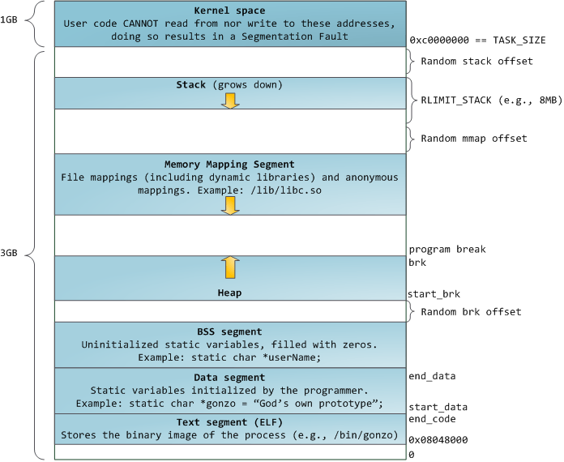

CSysSec注： 本系列文章译自安全自由工作者[Sploitfun](https://sploitfun.wordpress.com/about-2/) 的漏洞利用系列博客，从经典栈缓冲区漏洞利用堆漏洞利用，循序渐进，是初学者不可多得的好材料，本系列所有文章涉及的[源码](https://github.com/sploitfun/lsploits) 可以在这里找到。CSysSec计划在原基础上不断添加相关漏洞利用技术以及相应的Mitigation方法，欢迎推荐或自荐文章。  
转载本文请务必注明，文章出处：《[Linux(X86)漏洞利用系列-Malloc使用的系统调用](http://www.csyssec.org/20170105/mallocsystemcall))》与作者信息：CSysSec出品  

学到这里，你应该已经知道malloc是使用系统调用从操作系统获取内存，正如下图所示，malloc是使用 [brk](http://man7.org/linux/man-pages/man2/sbrk.2.html) 或者 [mmap](http://man7.org/linux/man-pages/man2/mmap.2.html) 系统调用来获得内存分配的。   
  


## 0X01 brk

[brk](http://lxr.free-electrons.com/source/mm/mmap.c?v=3.8#L252) 通过增加程序中断位置([brk](http://lxr.free-electrons.com/source/include/linux/mm_types.h?v=3.8#L365))从内核中获取内存（初始化非0）。一开始堆段的起始([start_brk](http://lxr.free-electrons.com/source/include/linux/mm_types.h?v=3.8#L365))和结束([brk](http://lxr.free-electrons.com/source/include/linux/mm_types.h?v=3.8#L365))都指向同一位置。  

> 当 [ASLR](https://en.wikipedia.org/wiki/Address_space_layout_randomization) 关闭时，start_brk和brk将指向数据段  ([end_data](http://lxr.free-electrons.com/source/include/linux/mm_types.h?v=3.8#L364))的末尾    
> 当ASLR打开时，start_brk和brk指向的位置即为数据段(end_data)的末尾地址加上随机brk偏移地址所指向的位置    

    
 

由上图可知，start_brk即为堆段的初始位置，brk（程序中断）即为堆段的末尾位置   
Example:  

``` c
 /* sbrk and brk example */
#include <stdio.h>
#include <unistd.h>
#include <sys/types.h>
int main()
{
        void *curr_brk, *tmp_brk = NULL;
        printf("Welcome to sbrk example:%d\n", getpid());
        /* sbrk(0) gives current program break location */
        tmp_brk = curr_brk = sbrk(0);
        printf("Program Break Location1:%p\n", curr_brk);
        getchar();
        /* brk(addr) increments/decrements program break location */
        brk(curr_brk+4096);
        curr_brk = sbrk(0);
        printf("Program break Location2:%p\n", curr_brk);
        getchar();
        brk(tmp_brk);
        curr_brk = sbrk(0);
        printf("Program Break Location3:%p\n", curr_brk);
        getchar();
        return 0;
}
```
输出分析:  
在增加程序中断之前：在下面的输出中我们可以看到这没有堆段，因此  

> start_brk=brk=end_data=0x804b000

``` bash
sploitfun@sploitfun-VirtualBox:~/ptmalloc.ppt/syscalls$ ./sbrk 
Welcome to sbrk example:6141
Program Break Location1:0x804b000
...
sploitfun@sploitfun-VirtualBox:~/ptmalloc.ppt/syscalls$ cat /proc/6141/maps
...
0804a000-0804b000 rw-p 00001000 08:01 539624     /home/sploitfun/ptmalloc.ppt/syscalls/sbrk
b7e21000-b7e22000 rw-p 00000000 00:00 0 
...
sploitfun@sploitfun-VirtualBox:~/ptmalloc.ppt/syscalls$
```
增加了程序中断位置之后：在下面的输出中我们可以看到这有堆段了，因此：  

> start_brk=end_data=0x804b000
> brk=0x804c000

```
sploitfun@sploitfun-VirtualBox:~/ptmalloc.ppt/syscalls$ ./sbrk 
Welcome to sbrk example:6141
Program Break Location1:0x804b000
Program Break Location2:0x804c000
...
sploitfun@sploitfun-VirtualBox:~/ptmalloc.ppt/syscalls$ cat /proc/6141/maps
...
0804a000-0804b000 rw-p 00001000 08:01 539624     /home/sploitfun/ptmalloc.ppt/syscalls/sbrk
0804b000-0804c000 rw-p 00000000 00:00 0          [heap]
b7e21000-b7e22000 rw-p 00000000 00:00 0 
...
sploitfun@sploitfun-VirtualBox:~/ptmalloc.ppt/syscalls$
```
在这  
0804b000-0804c000是这个堆段的虚拟地址范围  
rw-p是权限（读，写，不可执行，私有）  
00000000代表文件偏移量——由于它不是从其它文件映射而来，所以就为0  
00:00是主要/次要设备编号——由于它不是从其它文件映射而来，所以这里为0  
0代表Inode编号——由于它不是从其它文件映射而来，所以这里为0  
[heap]堆段  

## 0X02 mmap

malloc使用 [mmap](http://lxr.free-electrons.com/source/mm/mmap.c?v=3.8#L1285) 创建私有匿名映射段。私有匿名映射的主要目的是分配新的内存（零填充），并且这个新的内存将被调用进程独占使用。  
Example:  

``` c
 /* Private anonymous mapping example using mmap syscall */
#include <stdio.h>
#include <sys/mman.h>
#include <sys/types.h>
#include <sys/stat.h>
#include <fcntl.h>
#include <unistd.h>
#include <stdlib.h>
void static inline errExit(const char* msg)
{
        printf("%s failed. Exiting the process\n", msg);
        exit(-1);
}
int main()
{
        int ret = -1;
        printf("Welcome to private anonymous mapping example::PID:%d\n", getpid());
        printf("Before mmap\n");
        getchar();
        char* addr = NULL;
        addr = mmap(NULL, (size_t)132*1024, PROT_READ|PROT_WRITE, MAP_PRIVATE | MAP_ANONYMOUS, -1, 0);
        if (addr == MAP_FAILED)
                errExit("mmap");
        printf("After mmap\n");
        getchar();
        /* Unmap mapped region. */
        ret = munmap(addr, (size_t)132*1024);
        if(ret == -1)
                errExit("munmap");
        printf("After munmap\n");
        getchar();
        return 0;
}
```
输出分析：  
mmap之前：在下面的输出中，我们只能看到属于共享库libc.so和ld-linux.so的内存映射段  
``` bash
sploitfun@sploitfun-VirtualBox:~/ptmalloc.ppt/syscalls$ cat /proc/6067/maps
08048000-08049000 r-xp 00000000 08:01 539691     /home/sploitfun/ptmalloc.ppt/syscalls/mmap
08049000-0804a000 r--p 00000000 08:01 539691     /home/sploitfun/ptmalloc.ppt/syscalls/mmap
0804a000-0804b000 rw-p 00001000 08:01 539691     /home/sploitfun/ptmalloc.ppt/syscalls/mmap
b7e21000-b7e22000 rw-p 00000000 00:00 0 
...
sploitfun@sploitfun-VirtualBox:~/ptmalloc.ppt/syscalls$
```
mmap之后：在下面的输出中，我们可以观察到我们的内存映射段（b7e00000 - b7e21000，大小为132KB）与已有的内存映射段（b7e21000 - b7e22000）结合了   
```
sploitfun@sploitfun-VirtualBox:~/ptmalloc.ppt/syscalls$ cat /proc/6067/maps
08048000-08049000 r-xp 00000000 08:01 539691     /home/sploitfun/ptmalloc.ppt/syscalls/mmap
08049000-0804a000 r--p 00000000 08:01 539691     /home/sploitfun/ptmalloc.ppt/syscalls/mmap
0804a000-0804b000 rw-p 00001000 08:01 539691     /home/sploitfun/ptmalloc.ppt/syscalls/mmap
b7e00000-b7e22000 rw-p 00000000 00:00 0 
...
sploitfun@sploitfun-VirtualBox:~/ptmalloc.ppt/syscalls$
```
在这里    
b7e00000-b7e22000是这个堆段的虚拟地址范围  
rw-p代表权限（读，写，不可执行，私有）  
00000000代表文件偏移量——由于它不是从其它文件映射而来，所以就为0  
00:00是主要/次要设备编号——由于它不是从其它文件映射而来，所以这里为0  
0代表Inode编号——由于它不是从其它文件映射而来，所以这里为0  

munmap之后：在下面的输出中，我们可以看到我们的内存映射段是未映射的，即它的相应的内存被释放到操作系统。  

``` bash
sploitfun@sploitfun-VirtualBox:~/ptmalloc.ppt/syscalls$ cat /proc/6067/maps
08048000-08049000 r-xp 00000000 08:01 539691     /home/sploitfun/ptmalloc.ppt/syscalls/mmap
08049000-0804a000 r--p 00000000 08:01 539691     /home/sploitfun/ptmalloc.ppt/syscalls/mmap
0804a000-0804b000 rw-p 00001000 08:01 539691     /home/sploitfun/ptmalloc.ppt/syscalls/mmap
b7e21000-b7e22000 rw-p 00000000 00:00 0 
...
sploitfun@sploitfun-VirtualBox:~/ptmalloc.ppt/syscalls$
``` 
注意：在我们的示例程序执行过程中ASLR是被关闭的。  

参考文献：  
1. [Anatomy of program in memory](http://duartes.org/gustavo/blog/post/anatomy-of-a-program-in-memory/)  