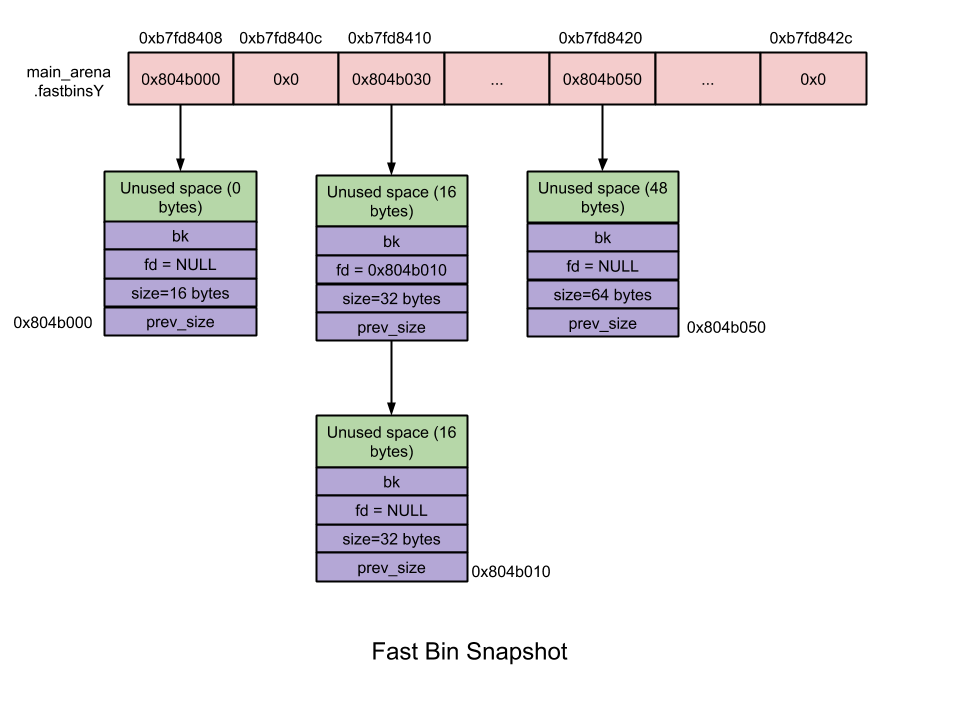
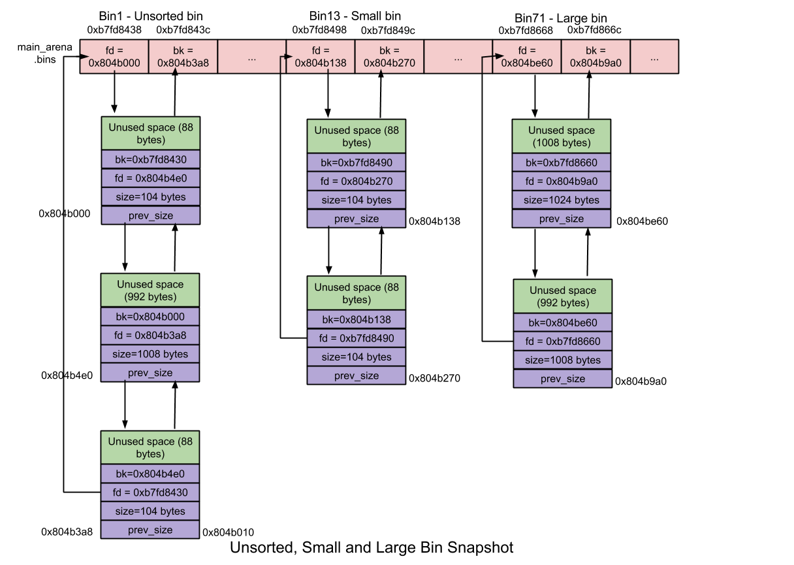

CSysSec注： 本系列文章译自安全自由工作者[Sploitfun](https://sploitfun.wordpress.com/about-2/) 的漏洞利用系列博客，从经典栈缓冲区漏洞利用堆漏洞利用，循序渐进，是初学者不可多得的好材料，本系列所有文章涉及的[源码](https://github.com/sploitfun/lsploits) 可以在这里找到。CSysSec计划在原基础上不断添加相关漏洞利用技术以及相应的Mitigation方法，欢迎推荐或自荐文章。  
转载本文请务必注明，文章出处：《[Linux(X86)漏洞利用系列-深入理解glibc malloc](http://www.csyssec.org/20170104/glibcmalloc))》与作者信息：CSysSec出品  

我一直被堆内存的问题困扰着。比如说像这样的问题：  

堆内存是如何从内核中分配的？  
内存管理效率如何？  
它是由内核、库函数还是应用本身管理？  
堆内存可以被利用吗？  
这几个问题困惑了我好久，直到最近我才有时间去了解它。所以接下来我就给大家谈谈我的研究成果。开源社区提供了很多现成的内存分配器：  

* Dlmalloc – General purpose allocator  
* Ptmalloc2 – glibc  
* Jemalloc – FreeBSD and FireFox  
* Tcmalloc – Google  
* Libumem – Solaris  
…
## 0X01 内存分配器

每一种内存分配器都声称自己快速、可拓展、效率高！但是并不是所有的分配器都适用于我们的应用。内存吞吐量大的应用程序的性能很大程度上都取决于内存分配器的性能。在这篇文章中，我将只谈论“glibc malloc”这个内存分配器。以后我希望可以跟大家分享其它内存分配器的研究成果。为了让大家更好的理解‘glibc malloc’，我将给大家附上它的 [源代码](https://sourceware.org/ml/libc-alpha/2014-09/msg00088.html)。接下来就让我们一起来学习下glibc malloc吧！  

历史：[ptmalloc2](http://www.malloc.de/en/) 是基于 [dlmalloc](http://g.oswego.edu/dl/html/malloc.html) 开发的，另外它还添加了对多线程的支持，并于2006年公布。公布之后，ptmalloc2被整合到glibc源代码中去了，此后，所有的关于ptmalloc2的源代码的修改都是直接到glibc malloc中修改。因此，ptmalloc2的源码和glibc的malloc的源码有很多不一致的地方。  

系统调用：正如在 [这篇文章](https://sploitfun.wordpress.com/2015/02/11/syscalls-used-by-malloc/) 中看到的那样，malloc的内部调用为[brk](http://man7.org/linux/man-pages/man2/sbrk.2.html) 或 [mmap](http://man7.org/linux/man-pages/man2/mmap.2.html) 。   

线程：Linux的早期版本都是使用dlmalloc作为默认的内存分配器，但是后来由于ptmalloc2提供了多线程支持，所以Linux后来又采用ptmalloc2作为默认内存分配器。多线程支持可以提升内存分配器的性能，进而可以提升应用的性能。在dlmalloc中，当有两个线程同时调用malloc时，只有一个线程能够访问临界区（critical section），因为空闲列表数据结构被所有可用线程共享。正是由于这个原因，dlmalloc在多线程应用中比较耗时，从而导致性能下降。而在ptmalloc2中，当有两个线程同时调用malloc时，均会立即得到内存分配，因为每个线程都维护着一个独立的堆段，，因此空闲列表数据结构维护的堆也是独立的。这种为每个线程独立的维护堆和空闲列表数据结构的行为称为**per thread arena**。  

例子：  
``` c
/* Per thread arena example. */
#include <stdio.h>
#include <stdlib.h>
#include <pthread.h>
#include <unistd.h>
#include <sys/types.h>
void* threadFunc(void* arg) {
        printf("Before malloc in thread 1\n");
        getchar();
        char* addr = (char*) malloc(1000);
        printf("After malloc and before free in thread 1\n");
        getchar();
        free(addr);
        printf("After free in thread 1\n");
        getchar();
}
int main() {
        pthread_t t1;
        void* s;
        int ret;
        char* addr;
        printf("Welcome to per thread arena example::%d\n",getpid());
        printf("Before malloc in main thread\n");
        getchar();
        addr = (char*) malloc(1000);
        printf("After malloc and before free in main thread\n");
        getchar();
        free(addr);
        printf("After free in main thread\n");
        getchar();
        ret = pthread_create(&t1, NULL, threadFunc, NULL);
        if(ret)
        {
                printf("Thread creation error\n");
                return -1;
        }
        ret = pthread_join(t1, &s);
        if(ret)
        {
                printf("Thread join error\n");
                return -1;
        }
        return 0;
}
```
输出分析：  

在主线程malloc之前：在如下的输出里我们可以看到，这里还没有堆段，也没有线程栈，因为thread1还没有被创建  

``` bash
sploitfun@sploitfun-VirtualBox:~/ptmalloc.ppt/mthread$ ./mthread 
Welcome to per thread arena example::6501
Before malloc in main thread
...
sploitfun@sploitfun-VirtualBox:~/ptmalloc.ppt/mthread$ cat /proc/6501/maps
08048000-08049000 r-xp 00000000 08:01 539625     /home/sploitfun/ptmalloc.ppt/mthread/mthread
08049000-0804a000 r--p 00000000 08:01 539625     /home/sploitfun/ptmalloc.ppt/mthread/mthread
0804a000-0804b000 rw-p 00001000 08:01 539625     /home/sploitfun/ptmalloc.ppt/mthread/mthread
b7e05000-b7e07000 rw-p 00000000 00:00 0 
...
sploitfun@sploitfun-VirtualBox:~/ptmalloc.ppt/mthread$
```
在主线程malloc之后：  
在下面的输出中，我们可以看到堆段被创建了，并且正好在数据段 0804b000-0806c000之上，这表明堆内存是通过增加程序break位置创建的(比如使用 [brk系统调用](https://github.com/sploitfun/lsploits/blob/master/glibc/malloc/malloc.c#L2458) )。此外，请注意，尽管用户只申请了1000字节的内存，但是实际产生了 [132KB](https://github.com/sploitfun/lsploits/blob/master/glibc/malloc/malloc.c#L2429) 的堆内存，这个连续的堆内存区域被称为arena，因为这个arena是由主线程创建的，所以被称为 [main arena](https://github.com/sploitfun/lsploits/blob/master/glibc/malloc/malloc.c#L1740) ，接下来的申请会继续使用这个arena的空闲空间，直到用尽。[当用尽的时候](https://github.com/sploitfun/lsploits/blob/master/glibc/malloc/malloc.c#L3788) ，可以通过增加程序break位置来创建，在 [扩容](https://github.com/sploitfun/lsploits/blob/master/glibc/malloc/malloc.c#L2521) 之后，top chunk的大小也随之调整以圈进这块额外的空间。相应地，arena也可以在top chunk空间过大时 [缩小](https://github.com/sploitfun/lsploits/blob/master/glibc/malloc/malloc.c#L4044) 。  

注意：top chunk是一个arena中最顶层的chunk。有关top chunk的更多信息见下述“top chunk”部分  

``` bash
sploitfun@sploitfun-VirtualBox:~/ptmalloc.ppt/mthread$ ./mthread 
Welcome to per thread arena example::6501
Before malloc in main thread
After malloc and before free in main thread
...
sploitfun@sploitfun-VirtualBox:~/lsploits/hof/ptmalloc.ppt/mthread$ cat /proc/6501/maps
08048000-08049000 r-xp 00000000 08:01 539625     /home/sploitfun/ptmalloc.ppt/mthread/mthread
08049000-0804a000 r--p 00000000 08:01 539625     /home/sploitfun/ptmalloc.ppt/mthread/mthread
0804a000-0804b000 rw-p 00001000 08:01 539625     /home/sploitfun/ptmalloc.ppt/mthread/mthread
0804b000-0806c000 rw-p 00000000 00:00 0          [heap]
b7e05000-b7e07000 rw-p 00000000 00:00 0 
...
sploitfun@sploitfun-VirtualBox:~/ptmalloc.ppt/mthread$
```
在主线程free之后：  
在如下的输出中我们可以看到，当分配的内存被free掉的时候，其后的内存并不会立即[释放](https://github.com/sploitfun/lsploits/blob/master/glibc/malloc/malloc.c#L4017) 给操作系统。分配的内存区域（1000B）仅仅只是释放给了‘glibc malloc’库，它把这段free掉的区域添加在了main arena bin中。随后当用户请求内存时，‘glibc malloc’就不再从内核中申请新的堆区了，而是尝试在bin中 [找到](https://github.com/sploitfun/lsploits/blob/master/glibc/malloc/malloc.c#L3376) 空闲区块，除非实在找不到。  

``` bash
sploitfun@sploitfun-VirtualBox:~/ptmalloc.ppt/mthread$ ./mthread 
Welcome to per thread arena example::6501
Before malloc in main thread
After malloc and before free in main thread
After free in main thread
...
sploitfun@sploitfun-VirtualBox:~/lsploits/hof/ptmalloc.ppt/mthread$ cat /proc/6501/maps
08048000-08049000 r-xp 00000000 08:01 539625     /home/sploitfun/ptmalloc.ppt/mthread/mthread
08049000-0804a000 r--p 00000000 08:01 539625     /home/sploitfun/ptmalloc.ppt/mthread/mthread
0804a000-0804b000 rw-p 00001000 08:01 539625     /home/sploitfun/ptmalloc.ppt/mthread/mthread
0804b000-0806c000 rw-p 00000000 00:00 0          [heap]
b7e05000-b7e07000 rw-p 00000000 00:00 0 
...
sploitfun@sploitfun-VirtualBox:~/ptmalloc.ppt/mthread$
```
在thread1 malloc之前：  
在如下的输出中我们可以看到此时并没有thread1的堆段，但是thread1的每个线程栈已经创建。  

``` bash
sploitfun@sploitfun-VirtualBox:~/ptmalloc.ppt/mthread$ ./mthread 
Welcome to per thread arena example::6501
Before malloc in main thread
After malloc and before free in main thread
After free in main thread
Before malloc in thread 1
...
sploitfun@sploitfun-VirtualBox:~/ptmalloc.ppt/mthread$ cat /proc/6501/maps
08048000-08049000 r-xp 00000000 08:01 539625     /home/sploitfun/ptmalloc.ppt/mthread/mthread
08049000-0804a000 r--p 00000000 08:01 539625     /home/sploitfun/ptmalloc.ppt/mthread/mthread
0804a000-0804b000 rw-p 00001000 08:01 539625     /home/sploitfun/ptmalloc.ppt/mthread/mthread
0804b000-0806c000 rw-p 00000000 00:00 0          [heap]
b7604000-b7605000 ---p 00000000 00:00 0 
b7605000-b7e07000 rw-p 00000000 00:00 0          [stack:6594]
...
sploitfun@sploitfun-VirtualBox:~/ptmalloc.ppt/mthread$
```
在thread1 malloc之后：  
在如下的输出结果中我们可以看到thread1的堆段已经被创建了，并且被建立在内存映射段区域（b75000000-b7521000,132KB），这也表明堆内存是使用mmap调用产生的，不像主线程使用sbrk调用产生的。同样的，尽管用户只申请了1000字节，[1MB](https://github.com/sploitfun/lsploits/blob/master/glibc/malloc/arena.c#L546https://github.com/sploitfun/lsploits/blob/master/glibc/malloc/arena.c#L546) 的堆内存空间还是被映射到了进程地址空间，在这1MB的中，只有 [132KB](https://github.com/sploitfun/lsploits/blob/master/glibc/malloc/arena.c#L573) 被设置了读写权限并成为该线程的堆内存，这段连续的内存区域（132KB）被称为 [thread arena](https://github.com/sploitfun/lsploits/blob/master/glibc/malloc/arena.c#L736) 。

注意：当用户请求内存大小超过128KB并且此时arena中没有足够的空间来满足用户的请求时，不论请求是来自main thread还是thread arena，都将通过mmap系统调用来分配内存。

``` bash
ploitfun@sploitfun-VirtualBox:~/ptmalloc.ppt/mthread$ ./mthread 
Welcome to per thread arena example::6501
Before malloc in main thread
After malloc and before free in main thread
After free in main thread
Before malloc in thread 1
After malloc and before free in thread 1
...
sploitfun@sploitfun-VirtualBox:~/ptmalloc.ppt/mthread$ cat /proc/6501/maps
08048000-08049000 r-xp 00000000 08:01 539625     /home/sploitfun/ptmalloc.ppt/mthread/mthread
08049000-0804a000 r--p 00000000 08:01 539625     /home/sploitfun/ptmalloc.ppt/mthread/mthread
0804a000-0804b000 rw-p 00001000 08:01 539625     /home/sploitfun/ptmalloc.ppt/mthread/mthread
0804b000-0806c000 rw-p 00000000 00:00 0          [heap]
b7500000-b7521000 rw-p 00000000 00:00 0 
b7521000-b7600000 ---p 00000000 00:00 0 
b7604000-b7605000 ---p 00000000 00:00 0 
b7605000-b7e07000 rw-p 00000000 00:00 0          [stack:6594]
...
sploitfun@sploitfun-VirtualBox:~/ptmalloc.ppt/mthread$
```
在thread1 free之后：  
在如下的输出中我们可以看到在free掉分配了的内存区域的时候并不会把堆内存直接归还给操作系统，而是仅仅 [释放](https://github.com/sploitfun/lsploits/blob/master/glibc/malloc/malloc.c#L4017) 给了‘glibc malloc’，然后把它添加在thread arena bin中。  

``` bash
sploitfun@sploitfun-VirtualBox:~/ptmalloc.ppt/mthread$ ./mthread 
Welcome to per thread arena example::6501
Before malloc in main thread
After malloc and before free in main thread
After free in main thread
Before malloc in thread 1
After malloc and before free in thread 1
After free in thread 1
...
sploitfun@sploitfun-VirtualBox:~/ptmalloc.ppt/mthread$ cat /proc/6501/maps
08048000-08049000 r-xp 00000000 08:01 539625     /home/sploitfun/ptmalloc.ppt/mthread/mthread
08049000-0804a000 r--p 00000000 08:01 539625     /home/sploitfun/ptmalloc.ppt/mthread/mthread
0804a000-0804b000 rw-p 00001000 08:01 539625     /home/sploitfun/ptmalloc.ppt/mthread/mthread
0804b000-0806c000 rw-p 00000000 00:00 0          [heap]
b7500000-b7521000 rw-p 00000000 00:00 0 
b7521000-b7600000 ---p 00000000 00:00 0 
b7604000-b7605000 ---p 00000000 00:00 0 
b7605000-b7e07000 rw-p 00000000 00:00 0          [stack:6594]
...
sploitfun@sploitfun-VirtualBox:~/ptmalloc.ppt/mthread$
``` 
## 0X02 Arena

Arena的数量：
在以上的这些例子中，我们可以看到主线程包含main arena而thread1包含它自有的thread arena。所以在不计线程的数量的时候，在线程和arena之间是否存在一对一的映射关系？当然不存在，部分极端的应用甚至运行比处理器核心的数量还多的线程，在这种情况下，每个线程都拥有一个arena开销过高且意义不大。因此，[应用的Arena数量限制是基于系统的核心数的](https://github.com/sploitfun/lsploits/blob/master/glibc/malloc/arena.c#L847)。  
```
For 32 bit systems:
    Number of arena = 2 * number of cores + 1.
For 64 bit systems:
    Number of arena = 8 * number of cores + 1.
Multiple Arena：
```
举例: 让我们来看一个运行在单核且操作系统为32位的计算机上的多线程应用（4线程=1个主线程+3个用户线程）的例子，这里线程的数量（4）>内核数量的2倍（2），因此在这种情况下，‘glibc malloc’认定multiple arenas 被所有可用线程共享，但是它是如何共享的呢？  

* 当主线程第一次调用malloc时，[已经建立的main arena](https://github.com/sploitfun/lsploits/blob/master/glibc/malloc/malloc.c#L1740) 会被无竞争的使用  
* 当线程1和线程2第一调用malloc时，[一块新的arena会被建立](https://github.com/sploitfun/lsploits/blob/master/glibc/malloc/arena.c#L870) 并被没有竞争的使用，此时线程和arena之间有着一对一的映射关系  
* 当线程3第一次调用malloc时，arena的限制数量会被 [计算](https://github.com/sploitfun/lsploits/blob/master/glibc/malloc/arena.c#L847) 出来，这里超过了arena的数量限制，所以就会尝试复用已经存在的arena（main arena，arena1或者arena2）  
* 复用:  
 1. [一旦遍历出](https://github.com/sploitfun/lsploits/blob/master/glibc/malloc/arena.c#L810) 可用arena，就开始自旋申请该arena的锁。  
 2. 如果上锁成功（比如说main arena上锁成功），就将该arena [返回给用户](https://github.com/sploitfun/lsploits/blob/master/glibc/malloc/arena.c#L826)。
 3. 如果查无可用arena，thread 3的malloc操作 [阻塞](https://github.com/sploitfun/lsploits/blob/master/glibc/malloc/arena.c#L819)，直到有可用的arena为止。
* 当thread 3第二次调用malloc时，malloc会 [尝试使用](https://github.com/sploitfun/lsploits/blob/master/glibc/malloc/malloc.c#L2884) 上一次使用的arena（main arena）。当main arena可用时就用，否则thread 3就一直阻塞直至main arena被free掉。因此现在main arena实际上是被main thread和thread 3所共享。  

## 0X03 多个堆

在‘glibc malloc’源码中主要发现了以下三种数据结构：

[Heap_info](https://github.com/sploitfun/lsploits/blob/master/glibc/malloc/arena.c#L59) —Heap Header – 一个thread arena可以有多个堆，每个堆都有它自己的堆头，为什么需要多个堆？一开始每个thread arena都只有一个堆，但是当这个堆段空间被耗尽时，新的堆(非连续区域)就会被mmap到这个arena。  

[Malloc_state](https://github.com/sploitfun/lsploits/blob/master/glibc/malloc/malloc.c#L1671) – Arena Header—-一个线程可以有多个堆，但是这所有的堆都只有一个arena header。Arena header包含一些关于bins，top chunk和last remainder chunk等等的信息。  

[Malloc_chunk–chunk header](https://github.com/sploitfun/lsploits/blob/master/glibc/malloc/malloc.c#L1108) –一个堆根据用户请求被划分为多个chunks。每个chunks都有它自己的chunk header。  

注意：  
Main arena没有多个堆，因此也没有heap_info这个数据结构，当main arena耗尽空间时，就拓展sbrk’d堆段（连续区域）直至碰到内存mapping区域为止  
不像thread arena一样，mainarena的arena header并不是sbrk’d堆段的一部分，它是一个 [全局变量](https://github.com/sploitfun/lsploits/blob/master/glibc/malloc/malloc.c#L1740) ，因此它可以在libc.so的数据段中被找到。  
main arena和thread arena的图示如下（单堆段）：  
  

thread arena的图示如下（多堆段）：  
  


## 0X04 Chunk

堆段中能找到的chunk类型如下：  

* Allocated chunk  
* Free chunk  
* Top chunk  
* Last Remainder chunk  
* Allocated chunk  
已分配的chunk    
   

[prev_size](https://github.com/sploitfun/lsploits/blob/master/glibc/malloc/malloc.c#L1110) ：若上一个chunk可用，则此结构成员赋值为上一个chunk的大小；否则若上一个chunk被分配，此结构成员赋值为上一个chunk的用户数据大小。  
[size](https://github.com/sploitfun/lsploits/blob/master/glibc/malloc/malloc.c#L1111) ：此结构成员赋值为已分配chunk大小，其最后三位包含标志(flag)信息。  

[PREV_INUSE (P)](https://github.com/sploitfun/lsploits/blob/master/glibc/malloc/malloc.c#L1267)  – 置“1”表示上一个chunk被分配；  
[IS_MMAPPED (M)](https://github.com/sploitfun/lsploits/blob/master/glibc/malloc/malloc.c#L1274)  – 置“1”表示这一个chunk被nmap’d；  
[NON_MAIN_ARENA (N)](https://github.com/sploitfun/lsploits/blob/master/glibc/malloc/malloc.c#L1283) – 置“1”表示这一个chunk属于一个thread arena。  
注意：  
malloc_chunk 中的其余结构成员，如fd、 bk不用于已分配的chunk，因此它们被拿来存储用户数据；  
用户请求的大小被转换为可用大小（内部显示大小），因为需要一些额外的空间存储malloc_chunk，此外还需要考虑对齐的因素，它经常是以这样一种方式进行 [转换](https://github.com/sploitfun/lsploits/blob/master/glibc/malloc/malloc.c#L1254)，可用大小的最后三位不设置值，用于存储标志信息。  

空闲chunk：  
    

[prev_size](https://github.com/sploitfun/lsploits/blob/master/glibc/malloc/malloc.c#L1110)：两个空闲的chunks不能毗连，当有两个chunks都空闲的时候，他们会合并成一个空闲的chunk，因此前一个chunk和这一个空闲chunk都会被分配，此时prev_size中保存上一个chunk的用户数据。
[size](https://github.com/sploitfun/lsploits/blob/master/glibc/malloc/malloc.c#L1111)：该结构成员保存本空闲chunk的大小。
[fd](https://github.com/sploitfun/lsploits/blob/master/glibc/malloc/malloc.c#L1113) ：Forward pointer - 指向同一bin中的下一个chunk（而非物理内存中下一块）。
[bk](https://github.com/sploitfun/lsploits/blob/master/glibc/malloc/malloc.c#L1114)：Backward pointer – 指向同一bin中的上一个chunk（而非物理内存中上一块）。

## 0X05 Bins

Bins就是空闲列表数据结构。它们用以保存空闲chunk。基于chunk的大小，可分为下列几种bins：

* Fast bin  
* Unsorted bin  
* Small bin  
* Large bin  

[fastbinsY](https://github.com/sploitfun/lsploits/blob/master/glibc/malloc/malloc.c#L1680)：这个数组用以保存fast bins。  
[bins](https://github.com/sploitfun/lsploits/blob/master/glibc/malloc/malloc.c#L1689) ：这个数组用以保存unsorted、small以及large bins，共计126个：  

* Bin 1 – unsorted bin  
* Bin 2 to Bin 63 – small bin  
* Bin 64 to Bin 126 – large bin 
 
Fast Bin：  
大小为[16](https://github.com/sploitfun/lsploits/blob/master/glibc/malloc/malloc.c#L1249) 字节到[80](https://github.com/sploitfun/lsploits/blob/master/glibc/malloc/malloc.c#L1600) 字节的chunk被称为fast chunk，用于保存fast chunk的bins被称为fast bins，在所有的bins中，fast bins分配内存和释放内存的速度都相对较快。  

* bins的数量 - [10](https://github.com/sploitfun/lsploits/blob/master/glibc/malloc/malloc.c#L1680)  
 - 每个fast bin都包含一条free chunk的单链表（称为binlist） ，采用单链表是出于fast bin中chunk不会被从链表的中间移除的特点，增删 chunk都发生在链表的前端。 -LIFO  

* chunk大小 - [8字节递增](https://github.com/sploitfun/lsploits/blob/master/glibc/malloc/malloc.c#L1595)  
 - fast bins 包含着大小以8字节递增的bin链表。也即，fast bin(index 0)包含着大小为16字节的chunk的binlist、fast bin(index 1)包含着大小为24字节的chunk的binlist 依次类推……  
 - 指定fast bin中所有chunk大小均相同。  

* [在malloc初始化过程中](https://github.com/sploitfun/lsploits/blob/master/glibc/malloc/malloc.c#L1778)，最大的fast bin的大小被 [设置](https://github.com/sploitfun/lsploits/blob/master/glibc/malloc/malloc.c#L1795) 为64而非80字节。因此默认情况下大小16~64字节的chunk被分类为fast chunk。  

* 不能合并 - 两个毗连的空闲chunk并不会被合并成一个空闲chunk。不合并可能会导致碎片化问题，但是却可以大大加速释放的过程！  

* malloc(fast chunk)  
 - 初始情况下fast bin[最大内存容量](https://github.com/sploitfun/lsploits/blob/master/glibc/malloc/malloc.c#L1765) 以及 [指针域](https://github.com/sploitfun/lsploits/blob/master/glibc/malloc/malloc.c#L1680) 均未初始化，因此即使用户请求fast chunk，服务的也将是 [small bin code](https://github.com/sploitfun/lsploits/blob/master/glibc/malloc/malloc.c#L3330) 而非fast bin code。  
 - 当它非空后，fast bin索引将被 [计算](https://github.com/sploitfun/lsploits/blob/master/glibc/malloc/malloc.c#L3332) 以检索对应的binlist。   
 - binlist中被检索的第一个chunk将被摘除并返回给用户。  

* free(fast chunk)  
 - fast bin索引被计算以索引相应binlist。  
 - free掉的chunk将被添加在索引到的binlist的前端。  
   


Unsorted Bin：  
当小的或者是大的chunk被释放了，它们并不会被添加到它们各自的bins里面，而会被添加到unsorted bin中，这种方式就给予了‘glibc malloc’第二次机会去复用最近被free的chunks，这样寻找合适bin的时间开销就被抹掉了，因此内存分配和释放都会变得快一点。  

* 数量—1  
unsorted bin包括一个用于保存空闲chunk的双向循环链表（又名binlist）。  
* 大小—没有大小限制，任何大小的chunk都可以添加进这个bin  
   
 

Small Bin：  
小于512字节的chunk被称为small chunk，保存了small chunk的bins被称为small bins。Small bins的内存分配和释放速度都比large bins快（但是比fast bins慢）  

* 数量—62  
 - 每个small bin都包含一个用于保存空闲chunk的双向循环链表，之所以用双向链表是由于在small bin中chunk不能直接从链表的中间位置链接到，free掉的chunk从链表的尾端移除，增加的chunk从链表的链表的前端插入  
* 大小—8字节递增  
 - samll bins 记录着大小以8字节递增的bin链表。也即，第一个small bin(Bin 2)记录着大小为16字节的chunk的binlist、small bin(Bin 3)记录着大小为24字节的chunk的binlist 依次类推……  
 - 指定samll bin中所有chunk大小均相同，因此无需排序。  
* 合并 - 两个毗连的空闲chunk会被合并成一个空闲chunk。合并消除了碎片化的影响但是减慢了free的速度。  
* malloc（small chunk）  
 - 初始情况下，small bin都会是NULL，因此尽管用户请求small chunk，提供服务的将是 unsorted bin code 而不是 small bin code。  
 - 同样地，在第一次调用malloc期间，在malloc_state找到的samll bin和large bin数据结构被初始化，bin都会指向它们本身以表示binlist为空。  
 - 此后当samll bin非空后，相应的bin会摘除binlist中最后一个chunk并返回给用户。  
* free（small chunk）  
 - 在free一个chunk的时候，检查其前或其后的chunk是否空闲，若是则合并，也即把它们从所属的链表中摘除并合并成一个新的chunk，新chunk会添加在unsorted bin链表的前端。  

Large Bin：  
大小大于等于512字节的chunk被称为large chunk，保存large chunk的bins被称为large bins，large bins的内存分配和释放速度都比small bins的慢。  

* 数量—63
 - 每个large bin都包括一个空闲chunk的双向循环链表（也称binlist）。free掉的chunk添加在链表的前端，而所需chunk则从链表后端摘除。-FIFO
 - 超过63个bin之后
  	1. 前32个bin记录着大小以64字节递增的bin链表，也即第一个large bin(Bin 65)记录着大小为512字节~568字节的chunk的binlist、第二个large bin(Bin 66)记录着大小为576字节到632字节的chunk的binlist，依次类推……
 	 2. 后16个bin记录着大小以512字节递增的bin链表。
 	 3. 后8个bin记录着大小以4096字节递增的bin链表。
 		 -后4个bin记录着大小以32768字节递增的bin链表。
  		 -后2个bin记录着大小以262144字节递增的bin链表。
  		 -最后1个bin记录着大小为剩余大小的chunk。
 - 不像small bin，large bin 里面的chunk都是大小不一，因此它们需要递减保存，最大的chunk保存在binlist的最前端，最小的chunk保存在最尾端。
* 合并 - 两个毗连的空闲chunk会被合并成一个空闲chunk。
malloc（large chunk）
 - 初始情况下，large bin都会是NULL，因此尽管用户请求large chunk，提供服务的将是 next largetst bin code 而不是 large bin code。
 - 同样地，在第一次调用malloc期间，在malloc_state找到的samll bin和large bin数据结构被初始化，bin都会指向它们本身以表示binlist为空。
 - 此后当samll bin非空后，当最大chunk大小（在相应binlist中的）大于用户所请求的大小时，binlist就从顶部遍历到底部以找到一个大小最接近用户需求的chunk。一旦找到，相应chunk就会分成两块
User chunk（用户请求大小）-返回给用户。
Remainder chunk（剩余大小） -添加到unsorted bin。
 - 当最大chunk大小（在相应binlist中的）小于用户所请求的大小时，尝试在Next largest bin中查到到所需的chunk以响应用户请求。Next largest bin code会扫描binmaps以找到下一个最大非空bin，如果这样的bin找到了，就从其中的binlist中检索到合适的chunk并返回给用户；反之就使用top chunk以响应用户请求。
* free（large chunk）—类似于small trunk。

Top Chunk:
位于arena最顶端的chunk被成为top chunk，它不属于任何一个bin，当所有的bin都没有空闲块的时候，top chunk才会响应用户的请求，如果top chunk的大小大于用户请求的大小，那么top chunk就会被划分成两部分：

* User chunk（用户请求大小）
* Remainder chunk（剩余大小）
Remainder chunk就变成了新的top chunk，如果top chunk的大小小余用户请求的大小，那么top chunk就会使用sbrk或者mmap系统调用来扩容

Last Remainder Chunk：
最后一次small request中因分割而得到的remainder chunk，Last Remainder Chunk有助于改进引用的局部性，也即连续的对small chunk的malloc请求可能最终导致各chunk被分配得彼此贴近。

但是除了在一个 arena 里可用的的诸chunk，哪些chunk有资格成为Last Remainder Chunk呢？

当一个用户请求small chunk，但是却没有得到small bin和unsorted bin的服务时，binmaps就会去扫描下一个最大的非空bin，正如之前所说，如果这样的bin找到了，它就会分割成两部分，其中user chunk会被返回给用户，而remainder chunk会被添加到unsorted bin里，此外，它就成为了最新的last remainder chunk。

那么引用的局部性是如何实现的呢？

当用户随后请求一个small chunk的时候，如果last remainder chunk是unsorted bin里面唯一的一个chunk，那么这个last remainder chunk就会分割成两部分，其中user chunk返回给用户，remainder chunk添加到unsorted bin中，此外，它就成为了最新的last remainder chunk，因此随后的内存分配最终导致各chunk被分配得彼此贴近。


